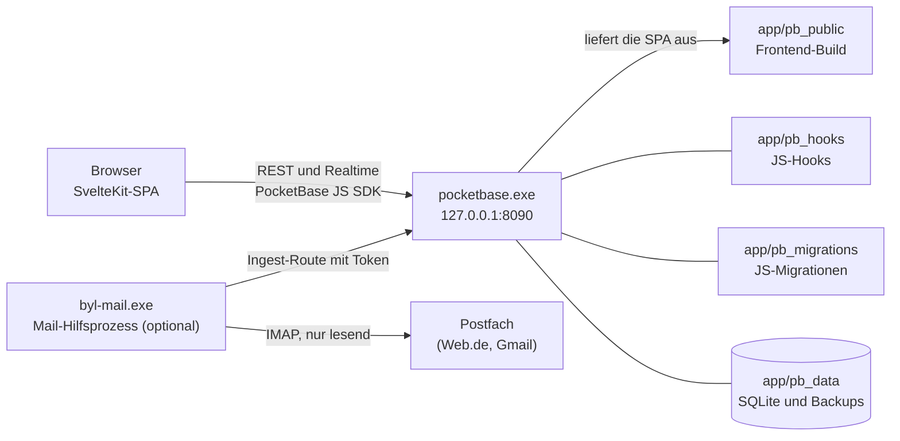

<div align="center">


<p>&nbsp;</p>

[](https://github.com/Labushuya/becauseyoulovejira/actions/workflows/ci.yml)
[](LICENSE)
[-5FA04E?style=flat-square&logo=nodedotjs&logoColor=white)](https://nodejs.org)
[](https://pocketbase.io)
[](https://svelte.dev)
[](https://www.microsoft.com/windows)
[](#roadmap)

**Ein schlankes, lokal laufendes Ticket-Dashboard im Jira-Stil, ohne dessen Prozesslast.**

</div>

---

## Was ist becauseyoulovejira?

Ein privates, lokal laufendes Ticket-Dashboard für Windows 10: Ticket-Handling im Stil von Linear oder Jira mit Keys wie `HAUS-12`, Status-Pillen, Detailpanel, Kommentaren und Verlauf, aber ohne Epics, Sprints, Story Points und Ticket-Typen ([ADR-0012](docs/adr/0012-plain-ticketing.md)). Bedient wird es im Desktop-Browser (Chrome, Firefox, Opera GX).

- **Lokal:** Keine Cloud. Der Server lauscht ausschließlich auf `127.0.0.1`.
- **Portabel:** Die komplette Installation ist der Ordner `app/`: Start per Doppelklick, Sicherung und Umzug per Ordnerkopie.
- **Ohne Internet lauffähig:** Keine externen CDNs, Schriften werden lokal ausgeliefert.

**Inhalt:** [Features](#features-nach-etappe) · [Architektur und Stack](#architektur-und-stack) · [Quickstart](#quickstart-windows) · [Betrieb](#betrieb) · [Bedienung](#bedienung) · [Entwicklung und Tests](#entwicklung-und-tests) · [Roadmap](#roadmap) · [Lizenz und Marken](#lizenz-und-marken)

---

## Features nach Etappe

| Etappe | Inhalt | Stand |
|---|---|---|
| **E0 Gerüst** | Repo, PocketBase 0.40.4 (SHA256-geprüfter Download), SvelteKit-SPA, Build- und Testskripte | fertig |
| **E1 Datenmodell, Auth, Hooks** | Datenmodell mit privaten Scopes und Nummernkreisen (`TASK-1`, `<CODE>-<NR>`), API-Regeln je Nutzer, gesperrte Selbstregistrierung, Hooks für Keys, Erledigt-Zeitpunkt und Verlauf, automatische Backups, Start-, Stopp-, Autostart- und Admin-Reset-Skripte | fertig ([Plan](docs/plan/e1.md)) |
| **E2 Liste und Detail** | Liste „Alle Tickets“ mit Standard-Reihenfolge, Abhaken mit „Rückgängig“, „Erledigte anzeigen“, Detailpanel mit Inline-Bearbeitung, Anlegen, Löschen mit Sicherheitsabfrage, Markdown (sanitisiert), Kommentare, Verlauf, Live-Aktualisierung über Realtime | fertig ([Plan und Bilanz](docs/plan/e2.md)) |
| **E3 Übersicht und Ordnung** | Seitenaufbau nach Task-Board-Vorbild ([ADR-0010](docs/adr/0010-layout-nach-task-board.md)): Kennzahlen, Filterleiste, sortierbare Tabelle, Gruppierung, Projekte mit Projektansicht, Tags, Suche: Kopfzeile mit Zähler und „Neues Ticket“, Kennzahlen-Kacheln, Filterleiste mit Suche und Zustand in der Adresse, Tabelle „Aufgaben“ mit relativen Fälligkeitslabels, Sortierung per Spaltenkopf und Gruppierung, Projekt und Tags im Panel und bei der Anlage, Projektansicht mit Projekt- und Tag-Verwaltung, Sperre für neue Tickets in archivierten Projekten, Live-Katalog für Projekte und Tags | fertig ([Plan und Bilanz](docs/plan/e3.md)) |
| **E4 Eingang und Kanäle** | Eingang, aus dem jedes Workload-Objekt per Klick zum Ticket wird (mit Rückverweis und Duplikaterkennung), „Neu“-Markierung, manuelle Erfassung mit Vorlagen, Schnellerfassung (`c`, `Strg+K`, Kurzsyntax), Zwischenablage, Bookmarklet, `.eml` und `.ics` per Drag & Drop, Web.de und Gmail per IMAP (Hilfsprogramm), Proton als `.eml`, Google Calendar, WhatsApp-Export, Telegram-Bot, Stichwörter pro Kanal, Postfach-Auswahl, Quelle als Filter, Gruppierung und Symbol, Inhalt verworfener Einträge nach 30 Tagen gelöscht | fertig ([Plan und Bilanz](docs/plan/e4.md)) |
| **E5 Wiederkehrende Aufgaben** | Regeln mit festem Rhythmus (täglich, wöchentlich an Wochentagen, monatlich am Tag oder am letzten Tag, jährlich, jeweils „alle n …“) oder „n Tage/Wochen/Monate/Jahre nach Erledigung“, Vorlauf pro Regel, höchstens ein offenes Ticket je Regel, Erzeugung beim Erledigen, stündlich und beim Start ohne Stapel und Duplikate, „Wiederholen…“ am Ticket mit „Rückgängig“, Übersicht „Wiederholungen“ mit Pausieren, Fortsetzen und Löschen, Vorschläge aus der `RRULE` von Serien aus `.ics` und Google Calendar | fertig ([Plan und Bilanz](docs/plan/e5.md), Browser-Prüfung offen) |
| **E6 Feinschliff** | Papierkorb, Spaltenauswahl, Vollansicht, Tastaturkürzel, Hilfe, Theme-Umschalter; vorgezogen: einheitliches Overlay-System (Modal, Bestätigung, Popover, Seitenpanel, Vollansicht, Flags), Theme-Umschalter und angeglichene Projekt-UI ([ADR-0025](docs/adr/0025-ui-konsistenz-overlay-system.md)) | UI-Konsistenz umgesetzt ([Plan](docs/plan/e6-ui.md), manuelle Prüfungen offen); Einstellungen, Kanal-Karten, Assistenten, Hinweise, Hilfe, „Erste Schritte“ und Tour umgesetzt ([ADR-0026](docs/adr/0026-einstellungsbereich-und-hinweis-bausteine.md), [Plan](docs/plan/e6-einstellungen.md)); Rest geplant |
| **E7 Haushalt und Mehrgeräte** | gemeinsame Tickets im Haushalt, Zugriff von mehreren Geräten über Tailscale (HTTPS, Server bleibt auf `127.0.0.1`), siehe [ADR-0001](docs/adr/0001-betriebsmodell-lokal-mehrgeraete-spaeter.md) | geplant, Start nach Freigabe |

Externe Kanäle kommen nur mit eigener ADR und Freigabe ([ADR-0011](docs/adr/0011-roadmap-e3-bis-e7.md)); für E4 beschreibt sie [ADR-0016](docs/adr/0016-kanal-architektur-und-mail.md). Notion ist vorerst zurückgestellt. Später, nach ausdrücklicher Freigabe (Stufe 2, Datenmodell vorbereitet): Sub-Tickets mit Fortschritt, Abhängigkeiten mit Entsperr-Automation, Board-Ansicht, Browser-Benachrichtigungen, Anhänge.

---

## Architektur und Stack



- **Ein Prozess, eine Origin:** PocketBase liefert die gebaute SPA selbst aus und stellt API und Realtime-Abos bereit. Node.js wird nur zum Bauen und Testen gebraucht, nicht für den Betrieb.
- **Mail-Hilfsprozess (optional):** PocketBase-Hooks können kein IMAP. Postfächer holt deshalb `app\byl-mail.exe` ab, ein eigenständiges Programm mit eingebettetem Node.js ([Single Executable Application](https://nodejs.org/docs/latest-v24.x/api/single-executable-applications.html), etwa 90 MB), das `start.bat` nur bei einer eingeschalteten Postfach-Verbindung startet. Es liest nur (IMAP `EXAMINE`, `BODY.PEEK`) und liefert Mails mit Stichwort über eine Ingest-Route mit Token an PocketBase ([ADR-0016](docs/adr/0016-kanal-architektur-und-mail.md)).
- **Serverlogik** nur in JS-Hooks (Ticket-Keys, Erledigt-Zeitpunkt, Verlauf, Schutzregeln); mehrteilige Schreibvorgänge laufen in einer Transaktion. Reine Hilfsmodule liegen unter `app/pb_hooks/lib/` und sind ohne PocketBase testbar.
- **Schema** nur über handgeschriebene Migrationen (`--automigrate=false`); die Zugriffsregeln je Nutzer und Scope sind per Negativtests belegt.
- **Frontend** in Schichten: `web/src/lib/domain` (reine Logik), `web/src/lib/data` (Datenzugriff und Realtime über das SDK), `web/src/lib/stores` (geteilter Zustand in `.svelte.ts` mit Runes), `web/src/lib/components` und `web/src/routes`. Details: [ADR-0006](docs/adr/0006-frontend-zustand-und-datenzugriff.md), [ADR-0007](docs/adr/0007-realtime-und-sitzungspflege.md).

| Komponente | Technologie | Warum |
|---|---|---|
| **Backend** | [PocketBase 0.40.4](https://pocketbase.io) (Windows-Binary, unverändert) | Alles in einem: SQLite, Admin-UI, JS-Hooks, Realtime |
| **Frontend** | [SvelteKit 2](https://kit.svelte.dev) + [Svelte 5](https://svelte.dev) (Runes) + [TypeScript](https://www.typescriptlang.org) (strict), `adapter-static` im SPA-Modus | geringer JS-Footprint, native Reaktivität |
| **Datenbank** | [SQLite](https://www.sqlite.org) (in PocketBase) | Einzeldatei, keine separate Datenbank nötig |
| **Markdown** | markdown-it und DOMPurify | Ausgabe wird sanitisiert ([ADR-0008](docs/adr/0008-markdown-rendering-und-sanitizing.md)) |
| **Styling** | CSS-Custom-Properties, Inter und JetBrains Mono lokal über `@fontsource-variable` | offline lauffähig, Petrol als einzige Akzentfarbe |
| **Tests** | [Vitest](https://vitest.dev), [Testing Library](https://testing-library.com/docs/svelte-testing-library/intro) und jsdom | Hook-Integration gegen Wegwerf-Instanzen, Domänenlogik, Komponenten |
| **Mail-Hilfsprozess** | [imapflow](https://imapflow.com) und [postal-mime](https://github.com/postalsys/postal-mime), gebündelt mit esbuild als Node-24-SEA `byl-mail.exe` | IMAP nur lesend, derselbe Mail-Parser wie für `.eml`-Dateien |
| **Dev-Werkzeug** | [Node.js](https://nodejs.org) ≥ 24, Windows PowerShell 5.1 | Build und Test; zur Laufzeit nur eingebettet in `byl-mail.exe` |

### Repo-Struktur

```
becauseyoulovejira/
  app/                    Portabler Laufzeitordner (wird kopiert/gesichert)
    pocketbase.exe        Binary (gitignored, via scripts/fetch-pocketbase.ps1)
    byl-mail.exe          Mail-Hilfsprozess (gitignored, via scripts/build-mail-helper.ps1)
    pb_hooks/             *.pb.js Hooks, lib/*.js reine CommonJS-Module
    pb_migrations/        Handgeschriebene JS-Migrationen
    pb_public/            Frontend-Build (gitignored)
    pb_data/              Daten und Backups (gitignored, niemals committen)
    logs/                 Server-Ausgabe des letzten Starts (gitignored)
    start.bat             Starten (öffnet den Browser)
    start-hidden.vbs      Starten ohne Fenster (Ziel der Autostart-Verknüpfung)
    stop.bat              Beenden (nur die eigene Instanz)
    admin-zuruecksetzen.bat  Admin-Konto anlegen oder Admin-Passwort neu setzen (Notfall)
    autostart-an.bat      Autostart einrichten
    autostart-aus.bat     Autostart entfernen
    byl-control.ps1       Logik hinter den Skripten (byl-functions.ps1: testbare Funktionen)
  web/                    SvelteKit-Quellcode (Build → ../app/pb_public), Tests unter src/**/*.test.ts
  helpers/mail/           Mail-Hilfsprozess in TypeScript (Build → ../../app/byl-mail.exe), Tests unter src/*.test.ts
  scripts/                Build-/Setup-Skripte (PowerShell)
  tests/                  Vitest-Tests (Hooks, Regeln, Login- und SPA-Integration)
  docs/                   ADRs, Etappenpläne, Test-Manifest, README-Assets
  .github/                CI-Workflow, Dependabot, Issue- und PR-Vorlagen, Sicherheitsrichtlinie
```

---

## Quickstart (Windows)

**Voraussetzungen:** Windows 10, [Node.js](https://nodejs.org) ≥ 24 (nur zum Bauen), Windows PowerShell 5.1, Git.

```powershell
git clone https://github.com/Labushuya/becauseyoulovejira.git
cd becauseyoulovejira

# 1. PocketBase laden (gepinnte Version 0.40.4, SHA256-geprüft)
powershell -ExecutionPolicy Bypass -File scripts\fetch-pocketbase.ps1

# 2. Abhängigkeiten installieren, prüfen, Frontend bauen und testen
powershell -ExecutionPolicy Bypass -File scripts\build.ps1

# 3. Starten (öffnet den Browser)
.\app\start.bat
```

`build.ps1` erwartet `node` (≥ 24) und `npm` im `PATH` und bricht sonst mit einem Hinweis ab. Beim allerersten Start legst du ein Admin- und ein App-Konto an, siehe [Erster Start](#erster-start). Danach ist `app\` eigenständig: Der Ordner lässt sich auf einen anderen Windows-Rechner kopieren und dort ohne Node.js starten.

---

## Betrieb

### Erster Start

Beim allerersten Start gibt es noch kein Konto. Zugangsdaten stehen bewusst nirgends im Repo ([ADR-0002](docs/adr/0002-erststart-und-superuser.md)); du legst zwei Konten an: ein **Admin-Konto** (PocketBase-Superuser, verwaltet den Server) und ein **App-Konto** (damit meldest du dich in der App an, ihm gehören die Tickets).

1. `app\start.bat` doppelklicken. Das Fenster meldet „Erster Start: …“, zeigt den Einrichtungslink und wartet auf eine Taste. Es öffnet sich **nur ein** Browser-Tab: die PocketBase-Einrichtung (`http://127.0.0.1:8090/_/#/pbinstall/…`), nicht die App.
2. Dort das Admin-Konto anlegen (E-Mail und Passwort frei wählbar). Der Einrichtungslink ist **30 Minuten** gültig. Ist er abgelaufen oder hat sich kein Browser geöffnet: `app\stop.bat`, dann `app\start.bat` – jeder Start ohne Admin-Konto erzeugt einen neuen Link (er steht auch in `app\logs\pocketbase.err.log` bzw. `pocketbase.out.log`).
3. Nach der Einrichtung bist du im Admin-Bereich (`http://127.0.0.1:8090/_/`). Unter **Collections → users → New record** das App-Konto anlegen: E-Mail, Passwort und Passwort-Bestätigung, dann speichern. Selbstregistrierung ist gesperrt; neue Konten entstehen nur hier.
4. `http://127.0.0.1:8090/` öffnen (oder `app\start.bat` erneut ausführen; die laufende App wird erkannt und nur der Browser geöffnet).
5. Mit dem App-Konto anmelden. Das Admin-Konto funktioniert in der App nicht (getrennte Konten, siehe [Konten verwalten](#konten-verwalten)).

Ab jetzt öffnet `start.bat` direkt die App.

**Einrichtung verpasst?** Der Tab wurde geschlossen oder übersehen, der Link ist abgelaufen, oder es hat sich kein Browser geöffnet:

- Läuft die App noch und ist der Link jünger als 30 Minuten, genügt `app\start.bat`. Es erkennt die offene Einrichtung, zeigt den Link an, öffnet ihn erneut (statt der App) und wartet auf eine Taste.
- Sonst `app\stop.bat` und danach `app\start.bat` ausführen. Jeder Start ohne Admin-Konto erzeugt einen neuen Link.
- Oder `app\admin-zuruecksetzen.bat` ausführen. Es legt das Admin-Konto direkt an, ohne Daten zu löschen, und ein offener Einrichtungslink wird damit ungültig. Danach in der Verwaltung `http://127.0.0.1:8090/_/` mit diesem Konto anmelden und mit Schritt 3 weitermachen.

Grenzen der Erkennung: `start.bat` meldet eine offene Einrichtung nur, wenn der Link aus dem aktuellen Serverlauf stammt (Log in `app\logs\`), noch nicht abgelaufen ist und noch funktioniert. Einen funktionierenden Link gibt es nur, solange kein Admin-Konto existiert. Nach erfolgreicher Einrichtung erscheint deshalb kein Hinweis mehr. Ist der Link älter als 30 Minuten, meldet `start.bat` nichts mehr, auch wenn die Einrichtung noch offen ist. Dann hilft einer der beiden letzten Wege. Antwortet der Server auf die Prüfung unerwartet, erscheint der Hinweis vorsichtshalber trotzdem.

### Starten und Beenden

| Skript | Verhalten |
|---|---|
| `app\start.bat` | Startet PocketBase ohne sichtbares Fenster mit den Daten in `app\pb_data`, wartet, bis `/api/health` antwortet (höchstens 30 s), und öffnet dann genau einmal `http://127.0.0.1:8090/`. Läuft die App schon, öffnet es nur den Browser. Ist dort die Einrichtung noch offen, öffnet es stattdessen den Einrichtungslink (siehe oben). Ist Port 8090 von einem anderen Programm belegt, bricht es mit einer Meldung ab. Bei Fehlern und Einrichtungshinweisen bleibt das Fenster offen, bis eine Taste gedrückt wird. Bei einem normalen Start schließt es sich von selbst. Details stehen in `app\logs\`. |
| `app\stop.bat` | Beendet nur die eigene Instanz (`pocketbase.exe` aus diesem Ordner, gestartet mit `serve` auf `127.0.0.1:8090` und `app\pb_data`) und den eigenen Mail-Hilfsprozess (`byl-mail.exe` aus diesem Ordner mit `run --url=http://127.0.0.1:8090`). Andere Prozesse, etwa Testinstanzen, bleiben unberührt. Die Erfolgsmeldung bleibt 5 Sekunden stehen (eine Taste schließt sofort), eine Fehlermeldung bis zu einem Tastendruck. |
| `app\admin-zuruecksetzen.bat` | Legt ein Admin-Konto an oder setzt das Admin-Passwort neu, ohne Daten zu löschen. Siehe [Konten verwalten](#konten-verwalten). |
| `app\autostart-an.bat` / `app\autostart-aus.bat` | Legt die Verknüpfung `becauseyoulovejira.lnk` im Windows-Autostart-Ordner an bzw. entfernt sie. Sie startet `start-hidden.vbs`: Die App startet bei der Anmeldung still im Hintergrund, **ohne** Browser. Hinweise (Erststart) und Fehler erscheinen dann als Meldungsfenster. Nach dem Verschieben von `app\` einfach `autostart-an.bat` erneut ausführen. |

`start.bat` startet nach PocketBase auch `app\byl-mail.exe`, wenn die Datei da ist und es mindestens eine eingeschaltete Postfach-Verbindung gibt (auch wenn die App schon läuft und nur der Hilfsprozess fehlt). Beim ersten Mal legt es dafür die Benutzervariable `BYL_INGEST_TOKEN` an (24 Zufallsbytes), die nur PocketBase und der Hilfsprozess kennen. Das Protokoll des Hilfsprozesses steht in `app\logs\byl-mail.log`.

Die Skripte sind dünne Hüllen um `app\byl-control.ps1` und rufen es mit `powershell -NoProfile -ExecutionPolicy Bypass` auf; eine gesperrte Skriptausführung stört also nicht.

`stop.bat` beendet den Server hart (wie ein Absturz). Für die Daten ist das unkritisch: SQLite (WAL-Modus) behält jede abgeschlossene Änderung, eine gerade laufende wird beim nächsten Start zurückgerollt. Nur während eines laufenden Backups solltest du nicht stoppen, sonst bleibt ein unvollständiges ZIP zurück.

**Bindung:** `127.0.0.1:8090` (nur lokal, nicht im Netz erreichbar – vorerst; Mehrgerätezugriff über Tailscale ist geplant, siehe [ADR-0001](docs/adr/0001-betriebsmodell-lokal-mehrgeraete-spaeter.md))

### Konten verwalten

Es gibt zwei Arten von Konten:

- **Admin-Konto** (PocketBase-Superuser): nur für die Verwaltung unter `http://127.0.0.1:8090/_/` (Konten, Einstellungen, Backups). In der App funktioniert es nicht.
- **App-Konto** (Collection `users`): Damit meldest du dich in der App an. Ihm gehören die Tickets.

Admin- und App-Konto dürfen dieselbe E-Mail-Adresse haben. Es bleiben trotzdem zwei getrennte Konten mit eigenem Passwort; ein neues Passwort für das eine ändert das andere nicht.

| Aufgabe | So geht's |
|---|---|
| Weiteren Nutzer anlegen | In der Verwaltung `http://127.0.0.1:8090/_/` unter **Collections → users → New record** E-Mail, Passwort und Passwort-Bestätigung eintragen, dann speichern. Selbstregistrierung ist gesperrt; neue App-Konten entstehen nur hier. |
| Passwort eines App-Kontos ändern | In der Verwaltung unter **Collections → users** das Konto öffnen, neues Passwort und Bestätigung eintragen, speichern. Danach das neue Passwort der betroffenen Person mitteilen. |
| Admin-Passwort vergessen, Admin-Konto fehlt oder Einrichtung verpasst | `app\admin-zuruecksetzen.bat` doppelklicken (siehe unten). |

**`admin-zuruecksetzen.bat`** fragt die E-Mail-Adresse des Admin-Kontos ab und zweimal verdeckt das neue Passwort (mindestens 10 Zeichen, keine Anführungszeichen `"`).

- Gibt es zu der E-Mail schon ein Admin-Konto, bekommt es das neue Passwort. Sonst wird ein neues Admin-Konto angelegt.
- Tickets, App-Konten und Einstellungen bleiben unverändert.
- Das Skript funktioniert auch, während die App läuft. Meldet es eine gesperrte Datenbank, erst `stop.bat` ausführen und es dann erneut versuchen.
- Angezeigt wird nur Erfolg oder Fehler, das Passwort nie.
- **Restrisiko:** PocketBase nimmt das Passwort nur als Programmargument an. Für den Bruchteil einer Sekunde, den der Aufruf dauert, steht es deshalb in der Kommandozeile des `pocketbase.exe`-Prozesses. Andere Programme unter deinem Windows-Konto könnten es in diesem Moment auslesen. Begründung und Abwägung: [ADR-0002](docs/adr/0002-erststart-und-superuser.md).

**Kein E-Mail-Versand:** becauseyoulovejira hat keinen Mailserver. Mail-Funktionen wie „Passwort vergessen“, E-Mail-Bestätigung, E-Mail-Änderung per Bestätigungsmail und Einmal-Codes können deshalb nicht funktionieren. Der Server weist sie ab („E-Mail-Versand ist nicht eingerichtet …“), statt Erfolg vorzutäuschen. Ohne diese Sperre würde PocketBase „Mail verschickt“ melden, obwohl nie eine ankommt.

- Der Link **„Forgotten password“** auf der Anmeldeseite der Verwaltung gehört fest zur PocketBase-Oberfläche und bleibt sichtbar. Er ist aber wirkungslos und führt nur zu dieser Fehlermeldung. Ein vergessenes Admin-Passwort setzt `admin-zuruecksetzen.bat` neu, ein App-Passwort die Verwaltung (siehe Tabelle).
- Warnmails bei Anmeldungen von neuen Geräten sind aus demselben Grund abgeschaltet.

### Backup und Wiederherstellung

Details und Begründung: [ADR-0003](docs/adr/0003-pb-data-und-backups.md).

- **Automatisch:** Alle 4 Stunden zur vollen Stunde (Cron in **UTC**, `0 */4 * * *`), solange der Server läuft. Die letzten **12** automatischen Backups werden aufbewahrt, als ZIP in `app\pb_data\backups\`. Ein Backup ist im laufenden Betrieb konsistent.
- **Manuell:** Im Admin-Bereich `http://127.0.0.1:8090/_/` unter **Settings → Backups → Initialize new backup**, etwa vor Updates. Dort lassen sich Backups auch herunterladen.
- **Wichtig:** Die Backups liegen auf derselben Platte wie die Daten. Kopiere `app\pb_data\backups\` regelmäßig zusätzlich an einen anderen Ort (externe Platte, Cloud-Ordner).
- **Umzug:** `stop.bat`, dann den ganzen Ordner `app\` kopieren; die Backups wandern mit.

**Wiederherstellen (nur manuell):** Die Wiederherstellung über das Admin-UI unterstützt PocketBase unter Windows nicht. Manuelle Schritte, PowerShell im Ordner `app` (Datum und Backup-Namen anpassen):

```powershell
# 1. Server beenden
.\stop.bat

# 2. Aktuelle Daten beiseitelegen (nichts wird gelöscht)
Rename-Item -LiteralPath .\pb_data -NewName pb_data.vor-restore-2026-09-24

# 3. Backup-ZIP in ein neues pb_data entpacken
Expand-Archive -LiteralPath .\pb_data.vor-restore-2026-09-24\backups\<backup>.zip -DestinationPath .\pb_data

# 4. Ältere Backups wieder mitnehmen
Copy-Item -LiteralPath .\pb_data.vor-restore-2026-09-24\backups -Destination .\pb_data -Recurse

# 5. Wieder starten
.\start.bat
```

Danach anmelden und die Daten prüfen; es gelten die Konten und Passwörter zum Zeitpunkt des Backups. Erst wenn alles stimmt, `pb_data.vor-restore-…` löschen. Schritt 3 ist durch den Integrationstest `tests/integration/backup-restore.test.mjs` belegt (Backup per API, `Expand-Archive` in einen neuen Datenordner, Start, Ticket, Key und Login vorhanden).

### Kanäle und Zugangsdaten

Google Calendar und Telegram holt die App selbst ab, Postfächer der Mail-Hilfsprozess `byl-mail.exe`, solange die App läuft. Eingerichtet werden sie unter **Einstellungen → Kanäle** (Zahnrad oben rechts, `http://127.0.0.1:8090/einstellungen/kanaele`); in den Anleitungen unten steht dafür kurz **Kanäle**. Jede Verbindung ist dort eine Karte mit ihrem Zustand (**Eingerichtet**, **Nicht eingerichtet**, **Fehler**, **Pausiert**, **Wird abgerufen**), dem letzten Abruf und den Stichwörtern; **Bearbeiten** ändert Stichwörter und Schalter, das Menü **…** pausiert, setzt fort oder löscht. Neue Verbindungen kommen über **Kanal hinzufügen**: Für Google Calendar, Telegram, Web.de und Gmail führt ein **Einrichtungsassistent** in sechs Schritten durch Verbindung, Variable, Neustart, Stichwörter und ersten Abruf und prüft unterwegs, was die App sehen kann; die Adresse `?einrichten=<art>&verbindung=<id>` öffnet ihn nach dem Neustart an der richtigen Stelle, ebenso **Einrichtung fortsetzen** an der Karte. Für Proton gibt es eine kurze Anleitung über `.eml`-Dateien. Im Schritt „Variable setzen“ kannst du den Wert optional in ein Feld einsetzen und den fertigen Befehl kopieren: Der Wert bleibt im Browserfenster, wird nie gespeichert oder gesendet und nach dem Kopieren geleert. Windows merkt sich Kopiertes im Zwischenablage-Verlauf (Win+V), falls er eingeschaltet ist; der Weg über die Systemsteuerung (zweiter Reiter) kommt ohne Zwischenablage aus. Die Abschnitte unten beschreiben dieselben Schritte zum Nachlesen. Details: [ADR-0016](docs/adr/0016-kanal-architektur-und-mail.md), [ADR-0018](docs/adr/0018-secrets.md).

- **Zugangsdaten nur als Windows-Variable:** Geheime Kalenderadresse, Bot-Token und erlaubte IDs stehen als Umgebungsvariablen deines Windows-Kontos, deren Name mit `BYL_` beginnt (Großbuchstaben, Ziffern, `_`). Die App speichert nur den Namen, nie den Wert. So stehen die Werte weder in `pb_data` noch in Backups oder Kopien von `app\`.
- **Variable setzen:** Eingabeaufforderung öffnen (Windows-Taste, `cmd`) und `setx NAME "Wert"` eingeben, etwa `setx BYL_TELEGRAM_TOKEN "123456789:AA…"`. Alternativ: Windows-Taste, „Umgebungsvariablen“, dann **Umgebungsvariablen für dieses Konto bearbeiten** → **Benutzervariablen** → **Neu…**.
- **Danach neu starten:** `stop.bat`, dann `start.bat`. `start.bat` liest alle `BYL_*`-Variablen frisch aus deinem Benutzerkonto und gibt sie an den Server weiter. Die Verbindung zeigt dann „Zugangsdaten gesetzt.“, sonst nennt sie die fehlende Variable.
- **Ändern oder entfernen:** `setx` mit neuem Wert bzw. die Variable in der Systemsteuerung löschen (oder `reg delete HKCU\Environment /v NAME /f`), dann neu starten.
- **Umzug:** Auf einem anderen Rechner fehlen die Variablen; lege sie dort neu an.
- **In der App:** Dieselbe Erklärung steht unter **Einstellungen → Hilfe → Kanäle und Zugangsdaten**; die Seite **Kanäle** verlinkt sie mit „Wie funktionieren die Zugangsdaten?“.
- Fehlermeldungen einer Verbindung zeigen nie den Wert. Adressen werden auf Schema und Rechner gekürzt, Tokens durch `***` ersetzt.

**Stichwörter** ([ADR-0020](docs/adr/0020-stichwoerter-pro-kanal.md)): Jede Verbindung hat eine eigene Liste. Automatisch kommt nur in den Eingang, was ein Stichwort trifft; ohne Stichwörter übernimmt eine Verbindung nichts und zeigt eine Warnung.

- Groß-/Kleinschreibung egal, Umlaute auch („prüfen“, „pruefen“ und „prufen“ finden einander). Gesucht wird am Wortanfang: „todo“ trifft „Todo-Liste“, nicht „Fotodoku“. Bindestriche und Punkte gehören zum Stichwort, und vor dem Wortanfang darf auch ein `@` oder `.` stehen: „beispiel-shop“ trifft „Beispiel-Shop“, „beispiel-shop.de“ und „info@beispiel-shop.de“. Mehrere Wörter wie „zu erledigen“ sind erlaubt.
- Gesucht wird beim Kalender in Titel und Beschreibung, bei Telegram im Text bzw. in der Bildunterschrift, bei Postfächern in Betreff und Absender, also Name und Adresse, mit dem Schalter **Betreff, Absender, Kopfzeilen und Text durchsuchen** auch in den Kopfzeilen (An, Cc, Antwort an, Sender, Liste, Organisation) und im ganzen Text samt HTML-Teil.
- **Eingabe:** Komma oder Enter übernimmt das Getippte als Stichwort und leert das Feld; eine eingefügte, durch Kommas oder Zeilen getrennte Liste wird auf einmal übernommen. Die Rücktaste im leeren Feld holt das letzte Stichwort zum Bearbeiten ins Feld zurück (weitere Rücktasten löschen dann Zeichen). Das gilt für alle Stichwortlisten: Verbindungen, Assistent und Datei-Importe.
- „Vorschläge übernehmen“ trägt todo, aufgabe, erledigen, ticket und #byl ein.
- Was kein Stichwort trifft, wird nicht gespeichert, auch nicht als verworfen. Neue Stichwörter gelten bei Telegram erst für neue Nachrichten; beim Kalender für alle Termine, die beim nächsten Abruf im Fenster liegen.
- Das Stichwort, das gegriffen hat, steht im Panel des Eintrags.

#### Google Calendar

Die App liest den Kalender über seine **geheime iCal-Adresse** (nur lesend) und übernimmt alle 15 Minuten die Termine von heute bis 30 Tage im Voraus in den Eingang, solange sie läuft. „Jetzt abrufen“ unter **Kanäle** holt sofort ab.

1. [Google Calendar](https://calendar.google.com) im Browser öffnen, links unter **Meine Kalender** beim Kalender auf **⋮** → **Einstellungen und Freigabe**.
2. Ganz unten unter **Kalender integrieren** die **Privatadresse im iCal-Format** kopieren (beginnt mit `https://calendar.google.com/calendar/ical/`, endet auf `/basic.ics`).
3. Eingabeaufforderung: `setx BYL_GOOGLE_CALENDAR_URL "<kopierte Adresse>"`.
4. `stop.bat`, dann `start.bat`.
5. Die Verbindung mit der Variablen `BYL_GOOGLE_CALENDAR_URL` anlegen (im Assistenten Schritt 1; er lässt sich in jeder Reihenfolge durchgehen).
6. Stichwörter eintragen, dann **Jetzt abrufen**.

- Derselbe Termin aus Feed und `.ics`-Datei ergibt einen Eintrag (Duplikatmerkmal `UID` plus `RECURRENCE-ID`). Eine Serie ist ein Eintrag, solange sie läuft.
- Ändert sich ein Termin, zieht sein Eintrag nach, solange er noch **neu** ist. Verworfene und umgewandelte Einträge bleiben unverändert und kommen nicht wieder.
- Anfragen brechen nach 30 Sekunden ab. Antworten über 20 MB werden verworfen, und zwei Abrufe derselben Verbindung laufen nie gleichzeitig. Fehler stehen bereinigt an der Verbindung.
- **Widerrufen:** In denselben Google-Einstellungen bei der Privatadresse auf **Zurücksetzen** klicken. Danach die neue Adresse per `setx` eintragen und die App neu starten. Wer die alte Adresse kennt, kann den Kalender damit nicht mehr lesen.

#### Telegram-Bot

Du schreibst deinem eigenen Bot, was in den Eingang soll. Die App fragt jede Minute per `getUpdates` nach neuen Nachrichten (kein Webhook, der Server bleibt aus dem Internet unerreichbar). Nur Nachrichten aus freigegebenen Chats mit einem Stichwort der Verbindung werden gespeichert, und jede beantwortet der Bot mit **„Im Eingang gespeichert“**. Auf Nachrichten ohne Stichwort antwortet er **„Kein Stichwort erkannt – nicht gespeichert“**; das lässt sich an der Verbindung abschalten. Text und Bildunterschriften werden übernommen, Bilder und Dateien nicht.

Der Assistent (**Kanäle** → **Kanal hinzufügen** → **Telegram-Bot** → **Einrichten**) führt durch diese Schritte:

1. In Telegram **@BotFather** öffnen, `/newbot` senden, Namen und Benutzernamen (endet auf „bot“) wählen.
2. Den Token aus der Antwort setzen: `setx BYL_TELEGRAM_TOKEN "123456789:AA…"`, dazu vorläufig `setx BYL_TELEGRAM_ALLOWED_IDS "0"`.
3. Die Verbindung mit `BYL_TELEGRAM_TOKEN` und `BYL_TELEGRAM_ALLOWED_IDS` anlegen.
4. `stop.bat`, dann `start.bat`; der Assistent prüft, ob die App beide Variablen sieht.
5. **Chat freigeben:** Dem Bot schreiben und **Jetzt abrufen**. Die App liest die Chat-ID aus dem Hinweis „Nachricht aus einem nicht freigegebenen Chat (Chat-ID …)“ und zeigt den fertigen Befehl, etwa `setx BYL_TELEGRAM_ALLOWED_IDS "424242"` (mehrere IDs durch Komma; eine Gruppe beginnt mit `-100`). Befehl ausführen, noch einmal `stop.bat`, dann `start.bat`, erneut **Jetzt abrufen**: Dann meldet die App keinen fremden Chat mehr.
6. Stichwörter eintragen, „todo Test“ an den Bot schicken, **Jetzt abrufen**.

- Der Offset rückt erst weiter, wenn eine Nachricht gespeichert ist; ein erneuter Abruf legt nichts doppelt an. Nachrichten fremder Chats werden nicht gespeichert, nur ihre Chat-ID erscheint als Hinweis an der Verbindung.
- Telegram hält Nachrichten für den Bot höchstens **24 Stunden**. Läuft die App länger nicht, gehen sie verloren. Fehlt die Antwort „Im Eingang gespeichert“, ist die Nachricht nicht angekommen.
- In Gruppen sieht ein Bot normalerweise nur Befehle und Antworten an ihn. Soll er alles lesen, bei BotFather `/setprivacy` auf **Disable** stellen.
- **Widerrufen:** Bei BotFather `/revoke` (neuer Token, dann `setx` und Neustart) oder `/deletebot`.
- Optional: `BYL_TELEGRAM_API_BASE` zeigt auf einen eigenen [Telegram Bot API Server](https://core.telegram.org/bots/api#using-a-local-bot-api-server) statt `https://api.telegram.org`. Die Tests nutzen die Variable für ihren lokalen Fake-Server.

#### Web.de-Postfach

Der Mail-Hilfsprozess `app\byl-mail.exe` holt den Posteingang alle 5 Minuten ab, solange die App läuft. In den Eingang kommen nur **neue** Mails, die **nach dem ersten Abruf** der Verbindung ankommen, und nur, wenn **Betreff oder Absender** (Name und Adresse) ein **Stichwort** der Verbindung enthalten; auf Wunsch auch Kopfzeilen und der ganze Text. Mails, die beim ersten Abruf schon im Posteingang liegen, holst du über **Aus dem Postfach wählen**. **Jetzt abrufen** an der Karte holt sofort ab, ohne die 5 Minuten abzuwarten; die Karte zeigt unter „Hilfsprozess“, ob `byl-mail.exe` läuft, und unter „Ergebnis“, was der letzte Abruf gebracht hat. Er liest nur: Gelesen-Status, Markierungen und Ordner bleiben unverändert, er löscht, verschiebt und verschickt nichts.

1. Bei [Web.de](https://web.de) anmelden, oben auf die Initialen → **E-Mail-Einstellungen** → unter „E-Mail empfangen“ **POP3/IMAP** → Schalter **POP3- und IMAP-Zugriff erlauben** einschalten und die Sicherheitsabfrage bestätigen.
2. Mit Zwei-Faktor-Anmeldung: **Account verwalten** → **Login & Sicherheit** → **Anwendungsspezifische Passwörter verwalten** → neues Passwort erstellen (Name etwa „becauseyoulovejira“); es wird nur einmal angezeigt. Ohne Zwei-Faktor-Anmeldung gilt das normale Web.de-Passwort.
3. Eingabeaufforderung: `setx BYL_WEBDE_PASSWORD "<Passwort>"`.
4. Im Assistenten (**Kanäle** → **Kanal hinzufügen** → **Web.de** → **Einrichten**) die Verbindung anlegen: deine E-Mail-Adresse, Variable `BYL_WEBDE_PASSWORD`. Stichwörter eintragen.
5. `stop.bat`, dann `start.bat`. Beim ersten Mal legt `start.bat` die Variable `BYL_INGEST_TOKEN` an (nichts zu tun) und startet `byl-mail.exe`.
6. Nach spätestens 5 Minuten zeigt die Verbindung „Letzter Abruf“ und den Hinweis „Erster Abruf“ (der Assistent zeigt das ohne Neuladen; **Hilfsprozess prüfen** fragt auf Klick, ob `byl-mail.exe` läuft): Ältere Mails bleiben im Postfach, ab jetzt kommen neue Mails mit Stichwort.

- **Einmal pro Mail:** Die Message-ID ist das Duplikatmerkmal. Dieselbe Mail als `.eml`-Datei oder ein zweiter Abruf ergibt keinen zweiten Eintrag. Die Originalmail hängt am Eintrag („Originaldatei herunterladen“).
- **Abschaltung durch Web.de:** Web.de schaltet den POP3/IMAP-Abruf nach längerer Nichtnutzung aus. Die Verbindung meldet dann „Anmeldung bei Web.de abgelehnt.“ mit einem Hinweis auf den Schalter; wieder einschalten genügt.
- **Ausfälle:** Ohne Internet oder bei beendetem PocketBase versucht es der Hilfsprozess beim nächsten Intervall erneut. Er merkt sich die zuletzt geprüfte Mail an der Verbindung (`UIDVALIDITY:UID`) und macht dort weiter. Nummeriert Web.de den Posteingang neu, beginnt er bei den neuesten Mails und meldet das als Hinweis.
- **Erster Start:** SmartScreen oder ein Virenscanner können bei `byl-mail.exe` nachfragen, weil die Datei nicht signiert ist.
- **Aus dem Postfach wählen:** An der Verbindung listet dieser Knopf die letzten 50 (bis 200) Mails des Posteingangs mit Datum, Absender, Betreff und Stichwort. Mails mit Stichwort in Betreff oder Absender sind vorausgewählt, Mails, die schon im Eingang sind, gesperrt. Übernommen wird nur, was du auswählst, auch ohne Stichwort und aus der Zeit vor der Einrichtung. Das ist der einzige Weg für ältere Mails. Die App fragt dafür den Hilfsprozess über `127.0.0.1:8091` (anderer Port per `BYL_MAIL_HELPER_PORT`) mit dem Token; der Browser spricht ihn nie direkt an. Läuft `byl-mail.exe` nicht, sagt die Ansicht das.
- **Protokoll:** `app\logs\byl-mail.log` (Anzahlen und bereinigte Fehler, keine Zugangsdaten, keine Betreffs oder Inhalte).
- **Widerrufen:** das anwendungsspezifische Passwort unter **Login & Sicherheit** löschen bzw. den POP3/IMAP-Zugriff ausschalten; die Variable `BYL_WEBDE_PASSWORD` entfernen und neu starten.

#### Gmail

Gmail holt derselbe Hilfsprozess ab wie Web.de, mit denselben Regeln: nur der Posteingang, nur neue Mails **nach dem ersten Abruf** mit **Stichwort in Betreff oder Absender** (auf Wunsch auch in Kopfzeilen und ganzem Text), nur lesend, dazu **Aus dem Postfach wählen** für ältere Mails. IMAP ist bei Gmail immer eingeschaltet. Angemeldet wird mit einem **App-Passwort**, nicht mit dem normalen Google-Passwort; ein App-Passwort gibt es nur mit der **Bestätigung in zwei Schritten**.

1. Unter [myaccount.google.com](https://myaccount.google.com) → **Sicherheit** prüfen, ob die **Bestätigung in zwei Schritten** (2-Faktor-Authentifizierung) eingeschaltet ist; sonst dort einschalten.
2. [myaccount.google.com/apppasswords](https://myaccount.google.com/apppasswords) öffnen, einen Namen wie „becauseyoulovejira“ eingeben und **Erstellen** klicken. Das App-Passwort (16 Buchstaben in Vierergruppen) wird nur einmal angezeigt.
3. Eingabeaufforderung: `setx BYL_GMAIL_PASSWORD "<App-Passwort ohne Leerzeichen>"`.
4. Im Assistenten (**Kanäle** → **Kanal hinzufügen** → **Gmail** → **Einrichten**; er schlägt `BYL_GMAIL_PASSWORD` vor und entfernt im Feld „Wert hier einsetzen“ die Leerzeichen des App-Passworts) die Verbindung mit deiner Gmail-Adresse anlegen. Stichwörter eintragen.
5. `stop.bat`, dann `start.bat`. Nach spätestens 5 Minuten zeigt die Verbindung „Letzter Abruf“ und den Hinweis „Erster Abruf“.

- **Anmeldung abgelehnt:** Die Verbindung meldet „Anmeldung bei Gmail abgelehnt.“ mit dem Hinweis **„App-Passwort nötig (Bestätigung in zwei Schritten)“**. Meist steht in der Variablen das normale Google-Passwort oder ein widerrufenes App-Passwort. Neues App-Passwort per `setx` setzen und neu starten.
- **Kein App-Passwort möglich:** Mit „Erweitertem Schutz“, nur mit Sicherheitsschlüssel oder bei manchen Arbeitskonten bietet Google keine App-Passwörter an. Dann bleibt der Weg über `.eml`-Dateien (Mail öffnen → **⋮** → **Nachricht herunterladen**).
- **Einmal pro Mail:** Wie bei Web.de ist die Message-ID das Duplikatmerkmal; dieselbe Mail als `.eml`-Datei und aus dem Postfach ergibt einen Eintrag.
- **Widerrufen:** Unter [myaccount.google.com/apppasswords](https://myaccount.google.com/apppasswords) das App-Passwort entfernen und die Variable `BYL_GMAIL_PASSWORD` löschen, dann neu starten. Ändert sich das Google-Passwort, verfallen alle App-Passwörter.

#### Dateien hereinziehen und Proton Mail

Mail-Dateien (`.eml`), Kalenderdateien (`.ics`) und WhatsApp-Exporte (`.txt`, `.zip`) zieht man in die Eingangsansicht oder wählt sie mit **Datei wählen**. Es öffnet sich eine **Auswahl** ([ADR-0020](docs/adr/0020-stichwoerter-pro-kanal.md)):

- Einträge mit einem Stichwort der Kanalart sind vorausgewählt, alle anderen kannst du dazuwählen. Die Listen stehen unter **Einstellungen → Datei-Importe** (`/einstellungen/datei-importe`), getrennt für Mail-Dateien (Betreff und Absender, auf Wunsch auch Kopfzeilen und der ganze Text), Kalenderdateien (Titel und Beschreibung) und WhatsApp-Export (Nachricht).
- Was schon im Eingang ist (auch verworfen oder umgewandelt), steht in der Auswahl, lässt sich aber nicht wählen.
- Nur die ausgewählten Einträge kommen in den Eingang; das Stichwort steht dann im Panel des Eintrags.

**Proton Mail** hat im Free-Tarif keinen automatischen Abruf (Proton Mail Bridge setzt einen bezahlten Tarif voraus). Mails aus Proton kommen deshalb als Datei (dieselben Schritte stehen unter **Kanäle** → **Proton Mail** → **Anleitung** und unter **Einstellungen → Datei-Importe**, dort auch der Weg für Gmail, Kalenderdateien und WhatsApp):

1. [mail.proton.me](https://mail.proton.me) öffnen und die Mail öffnen.
2. Unter den Absenderangaben auf das Symbol mit den drei Punkten (**Mehr**) klicken und **Exportieren** wählen (englische Oberfläche: **Export**).
3. Die `.eml`-Datei speichern und in die Eingangsansicht ziehen.

Das Exportieren einzelner Mails geht laut [Proton-Hilfe](https://proton.me/support/export-import-emails) in jedem Tarif.

---

## Bedienung

### Kopfzeile und Tabelle „Aufgaben“

- Die **Kopfzeile** zeigt neben dem App-Namen die Zahl der nicht erledigten Tickets und rechts den Knopf **„Neues Ticket“**. Der App-Name führt zurück zu „Aufgaben“.
- **Einstellungen:** Das Zahnrad rechts in der Kopfzeile öffnet den Einstellungsbereich (`/einstellungen`, zuerst **Kanäle**). Links stehen die Seiten (**Kanäle**, **Datei-Importe**, **Tags**, **Darstellung**, **Konto**, **Hilfe**) und ganz oben **„← Zurück zu …“**: Er führt zur zuletzt offenen Ansicht zurück, mit Filtern, Suche, Gruppierung und offenem Panel (gemerkt pro Tab). Oben stehen der Pfad „Einstellungen › …“ und, wie in den Ansichten, der Umschalter „Aufgaben | Projekte | Eingang“. Auf schmalen Fenstern stehen die Seiten als Zeile über dem Inhalt. **Konto** zeigt, mit welchem App-Konto du angemeldet bist, und wo Konten verwaltet werden (Verwaltung unter `/_/` mit dem Admin-Konto, siehe [Konten verwalten](#konten-verwalten)); ein Passwort ändert man dort, nicht in der App.
- **Hilfe:** Das Menü **?** neben dem Zahnrad öffnet **Tastaturkürzel** (auch mit der Taste `?`), die Seite **Hilfe** oder **Kanäle** und startet die **Kurze Einführung**: fünf Schritte (Schnellerfassung, Eingang, Filterleiste, Projekte als Liste oder Kacheln, Kanäle), dafür wechselt sie die Seite. „Weiter“, „Zurück“, × oder `Esc`; danach steht der Fokus wieder auf dem Knopf. Sie startet nie von selbst.
- **Darstellung:** Der Symbolknopf rechts in der Kopfzeile (Sonne, Mond oder Bildschirm; Name „Darstellung: …“) öffnet ein Menü mit **Hell**, **Dunkel** und **Wie System**. Die Wahl gilt sofort, in allen offenen Tabs und nach dem Neuladen ohne Aufblitzen; sie bleibt nur auf diesem Gerät (Browser-Speicher, Schlüssel `byl-theme`). „Wie System“ folgt der Einstellung von Windows auch später. Eine ältere Wahl unter `td-theme` wird einmal übernommen. Dieselbe Wahl gibt es als drei Kacheln unter **Einstellungen → Darstellung**; Menü und Seite zeigen immer dasselbe.
- **Farbe:** Unter dem Modus bietet dasselbe Menü den Abschnitt **Farbe** mit vier Akzentfarben, jede mit einem Farbfeld:
  - **Petrol** (Blaugrün, Standard)
  - **Rubin** (tiefes, edles Rubinrot)
  - **Smaragd** (tiefes Smaragd- bis Flaschengrün)
  - **Kupfer** (hell Kupferbraun auf Macchiato, dunkel warmes Kupfer auf Espresso)

  Die Farbe gilt für Knöpfe, Links, Auswahl, Fokus und die Status „Offen“ und „In Arbeit“, im hellen wie im dunklen Modus. Modus und Farbe sind unabhängig voneinander. Die Wahl gilt sofort, in allen offenen Tabs und nach dem Neuladen ohne Aufblitzen, nur auf diesem Gerät (Schlüssel `byl-accent`; „Petrol“ entfernt ihn). Unter **Einstellungen → Darstellung** steht dieselbe Wahl als Gruppe **Farbe** mit vier Kacheln (Farbfeld, Name, kurze Beschreibung), bedienbar mit Tab und den Pfeiltasten. Wer früher **Honig** gewählt hatte, bekommt beim nächsten Laden **Kupfer**; **Purpur** gibt es nicht mehr, daraus wird **Petrol**.

  Alle Themes erreichen WCAG AA. Fehler sind rot und tragen immer ein Symbol und einen Text. Im Rubin-Theme ist ihr Rot ziegelfarben, im Kupfer-Theme karminrot, damit es sich jeweils vom Akzent abhebt. Im Kupfer-Theme ist der Status „Wartet“ schiefergrau-blau statt bernsteinfarben. Details: [ADR-0027](docs/adr/0027-akzent-themes.md).
- **Glas-Effekt:** Kopfzeile und Menüs sind halbtransparent und weichgezeichnet wie unter macOS, dahinter liegt ein dezenter Verlauf in der gewählten Farbe; Tabellen, Kacheln und Texte bleiben undurchsichtig. Der Schalter **Glas-Effekt** unter **Einstellungen → Darstellung → Transparenz** schaltet das ab (sofort, in allen Tabs, nur auf diesem Gerät, Schlüssel `byl-transparency`). Ist unter Windows „Transparenzeffekte“ aus (bzw. „Transparenz reduzieren“ am Mac), ein Kontrastdesign aktiv oder kann der Browser keinen Weichzeichner, bleibt alles undurchsichtig; die Systemeinstellung gewinnt immer. Ruckelt die Oberfläche, etwa über Remote-Desktop, schalte den Glas-Effekt aus. Details: [ADR-0029](docs/adr/0029-glas-materialien.md).
- Darunter stehen alle **nicht erledigten** Tickets in der Tabelle „Aufgaben“ (mit ihrer Anzahl). Oben die überfälligen und bald fälligen (bis 7 Tage im Voraus) nach Datum, danach die übrigen nach Priorität (Dringend, Hoch, Mittel, Niedrig); bei gleicher Priorität zuerst die mit Fälligkeit, dann die neuesten.
- Spalten: Key (mit Punkt für „neu“), Priorität, Status, Titel (mit Symbol der Quelle, etwa „aus Mail“, und Symbol für wiederkehrende Tickets), Projekt, Tags, Fällig (relativ: „seit 3 Tagen überfällig“, „gestern“, „heute“, „morgen“, „in 4 Tagen“, ab 8 Tagen das Datum; das Datum steht immer im Tooltip, erledigte zeigen nur das Datum), Erstellt und die Aktionen. Ist der Platz knapp, etwa neben dem Panel, blendet die Tabelle Spalten aus (zuerst Erstellt, dann Tags, Projekt und Fällig); ihre Werte stehen im Panel.
- **Sortieren:** Ein Klick auf einen Spaltenkopf (außer Tags und Aktionen) sortiert in der natürlichen Richtung der Spalte (Priorität: Dringend zuerst, Fällig: früheste zuerst, Erstellt: neueste zuerst, Titel und Projekt: A bis Z, Key: Projektcode, dann Nummer), der zweite dreht um, der dritte kehrt zur Standard-Reihenfolge zurück. Ohne Datum und ohne Projekt stehen immer zuletzt. Die Sortierung steht in der Adresse (`?sort=prio`, `?sort=-faellig`), Zurück stellt die vorige wieder her. Erledigte Tickets bleiben immer „zuletzt erledigte zuerst“.
- **Gruppieren:** Der Knopf **„Gruppieren“** rechts in der Abschnittsleiste öffnet eine Auswahl: Keine, nach Status, Priorität, Projekt, Fälligkeit (Überfällig, Heute, Nächste 7 Tage, Später, Ohne Datum) oder Quelle. Jede Gruppe hat einen Kopf mit Bezeichnung und Anzahl, innerhalb der Gruppe gilt die Sortierung, leere Gruppen fehlen. Der Knopf nennt die aktive Gruppierung („Gruppiert: Projekt“), sie steht in der Adresse (`?gruppe=projekt`). Ein Klick oder Enter übernimmt die Wahl und schließt die Auswahl, die Pfeiltasten übernehmen sie sofort und lassen sie offen, Escape oder ein Klick daneben schließen sie. Die Auswahl steht in allen Browsern rechtsbündig unter dem Knopf (am unteren Fensterrand darüber), beim Öffnen liegt der Fokus auf der aktiven Gruppierung. Der Abschnitt „Erledigt“ wird nicht gruppiert.
- **„Neues Ticket“** öffnet rechts das Anlageformular: Titel (Pflicht), Status, Priorität, Fälligkeit, Projekt, Tags und Beschreibung. Ist die Liste nach einem Projekt gefiltert (`?projekt=<id>`), ist es vorausgewählt. „Anlegen“ oder `Strg+Enter` legt an, den Key vergibt der Server (`TASK-1`, `TASK-2` …).

### Kennzahlen, Filter und Suche

- Die **Kennzahlen** oben zählen immer alle nicht erledigten Tickets, unabhängig von den Filtern: **Nicht erledigt**, **In Arbeit**, **Heute fällig**, **Überfällig** und **Dringend**. Ein Klick auf eine Kachel setzt nur ihren Filter und lässt die übrigen stehen, ein zweiter Klick nimmt ihn wieder heraus; die gewählte Kachel ist hinterlegt und hat ein Häkchen. „Nicht erledigt“ setzt alle Filter zurück.
- Die **Filterleiste** über der Tabelle hat die Gruppen **Status**, **Priorität**, **Fällig** (Überfällig, Heute, Bald = morgen bis in 7 Tagen, Ohne Datum) und **Quelle** (Manuell, Web-Link, Mail, Kalender, Chat; Tickets von vor E4 zählen als „Manuell“) sowie die Auswahlen **Projekt** (mit „Ohne Projekt“, archivierte unter „Archiviert“) und **Tag**. Die beiden Auswahlen öffnen sich wie „Gruppieren“ als Liste unter dem Knopf, der die Wahl nennt („Projekt: Haushalt (HAUS)“); ab zehn Einträgen steht oben ein Suchfeld, Enter darin nimmt den ersten Treffer. Je Gruppe gilt ein Wert, „Alle“ ist der Ausgangswert; die Gruppen wirken zusammen (UND).
- Die **Suche** (Lupe in der Filterleiste) findet Tickets, deren Titel, Beschreibung oder Key den Text enthält, ab 2 Zeichen und kurz nach der letzten Eingabe; sie wirkt mit allen Filtern zusammen, auch im Abschnitt „Erledigt“. Zeichen wie `%`, `_` und `\` gelten wörtlich. Groß- und Kleinschreibung spielt nur bei Buchstaben ohne Umlaut keine Rolle: „miete“ findet „Miete“, aber „äpfel“ findet nicht „Äpfel“ (Grenze von SQLite). Escape leert das Feld. Der Suchtext steht als `?q=` in der Adresse, ohne dass Zurück jeden Buchstaben einzeln durchläuft.
- Die Filter stehen in der Adresse (`?status=open&prio=urgent`). Neuladen, Zurück, Vor und Lesezeichen behalten sie, und das Öffnen eines Tickets auch. **„Zurücksetzen“** leert alle Filter und die Suche, Sortierung, Gruppierung und „Erledigte anzeigen“ bleiben.
- Die Zahl neben „Aufgaben“ zählt die gefilterten Tickets; die Zahl in der Kopfzeile zählt weiter alle nicht erledigten. Passt nichts, steht dort „Keine Tickets für diese Filter“ mit „Filter zurücksetzen“.
- **Leere Listen** sagen, wie es weitergeht: Ohne offene Tickets bietet „Aufgaben“ **Ticket anlegen** und **Schnellerfassung**, der leere Eingang **Erfassen** und **Kanal einrichten**; Panels zeigen „Noch keine Kommentare“ bzw. „Noch kein Verlauf“. Ohne Projekte bietet die Projektansicht **Projekt anlegen**, sind alle archiviert, **Archivierte anzeigen**.
- **Erste Schritte:** Unter „Keine offenen Tickets“ steht eine kurze Liste (erstes Ticket, Schnellerfassung, Kanal, Projekt, Kurze Einführung) mit Fortschritt und je einem Weg dorthin. Sie verschwindet, wenn alles erledigt ist oder du sie mit × ausblendest; das merkt sich nur dieser Browser.
- Der Status **„Erledigt“** zeigt nur den Abschnitt „Erledigt“. Bei einem anderen Status sind erledigte Tickets ausgeblendet, und „Erledigte anzeigen“ ist gesperrt.

### Projekte und Tags

- Der Umschalter **„Aufgaben | Projekte | Eingang | Wiederholungen“** steht in allen vier Ansichten an derselben Stelle, links in der Abschnittsleiste direkt unter der Kopfzeile. Er wechselt zwischen der Tabelle, der **Projektansicht** (`/projekte`), dem Eingang und der Übersicht der [Wiederholungen](#wiederholungen). In der Projektansicht gibt es keine Kennzahlen und keine Filterleiste.
- Die Projekte stehen als **Liste** (Standard) oder als **Kacheln**; die zwei Symbolknöpfe in der Abschnittsleiste schalten um. Die Wahl steht in der Adresse (`?darstellung=kacheln`) und gilt auf diesem Gerät auch beim nächsten Besuch. Die Liste hat die Spalten Code, Name, aktiv, gesamt, neu und archiviert; ein Klick auf einen Spaltenkopf sortiert (erst natürlich, dann umgekehrt, dann wieder nach Name). Das Suchfeld findet Projekte nach Name oder Code. Wird die Ansicht schmal (etwa neben dem Panel), blenden sich erst „archiviert“, dann „neu“, „gesamt“ und „aktiv“ aus.
- Jedes Projekt zeigt Name, Code und **„N aktiv · M gesamt“**: aktiv sind alle nicht erledigten Tickets, gesamt zählt die erledigten mit. Ein Klick auf den Namen in der Liste bzw. auf die Kachel öffnet rechts das **Projekt-Panel** (`/projekte/<id>`) wie ein Ticket neben der Tabelle. Dort stehen die Zahlen, **„Tickets anzeigen“** (die Tabelle mit diesem Projekt als Filter, `/?projekt=<id>`), Name und Code mit „Speichern“, **„Archivieren“** bzw. **„Aus dem Archiv holen“** und oben **„Löschen …“**.
- **„Neues Projekt“** öffnet das Panel `/projekte/neu` mit Name und Code. Der Code hat 2 bis 6 Großbuchstaben (A–Z), `TASK` ist reserviert; die App schlägt ihn aus dem Namen vor („Garten und Haus“ → `GUH`, „Büro“ → `BUER`), der Vorschlag lässt sich ändern. Die Tickets des Projekts heißen dann `GUH-1`, `GUH-2` … Nach „Anlegen“ zeigt das Panel das neue Projekt.
- Der Code bleibt fest, sobald Tickets das Projekt verwenden. **„Löschen …“** gibt es nur für Projekte ohne Tickets und fragt vorher nach. × oder Escape schließen das Panel; sind Name oder Code geändert, fragt die App vorher „Änderungen verwerfen?“. Archivierte Projekte lassen sich keinem Ticket neu zuordnen; ihre Tickets bleiben bearbeitbar. Sie erscheinen nur mit **„Archivierte anzeigen“** (`?archiviert=1`), in der Filterleiste unter „Archiviert“.
- Alle **Tags** stehen unter **Einstellungen → Tags** (`/einstellungen/tags`): **„Umbenennen“** ändert den Namen direkt in der Zeile (Enter speichert, Escape bricht ab; einen Namen, den ein anderer Tag in irgendeiner Schreibweise schon hat, lehnt die App ab). **„Löschen …“** nennt vorher die Zahl der Tickets mit diesem Tag; der Tag verschwindet aus ihnen, und ihr Verlauf zeigt die Änderung als „System“. Neue Tags entstehen im Detailpanel und bei „Neues Ticket“.

### Abhaken und „Erledigte anzeigen“

- Das Kästchen in der Spalte „Aktionen“ setzt ein Ticket auf **Erledigt**. Die Zeile verschwindet sofort, und unten links erscheint eine Meldung mit **„Rückgängig“** (stellt den vorherigen Status wieder her). Sie bleibt 8 Sekunden, länger, solange der Mauszeiger oder der Fokus auf ihr liegt.
- **Meldungen unten links:** Ergebnisse (angelegt, gelöscht, importiert, umgewandelt) und fehlgeschlagene Aktionen in Zeilen erscheinen dort, die neueste oben, höchstens drei. Erfolge verschwinden nach 8 Sekunden (die Zeit steht still, solange Zeiger oder Fokus auf der Meldung liegen, der Tab verborgen oder ein Dialog offen ist), Fehler bleiben, bis man sie mit × schließt. Mit der Tastatur erreicht man sie nach dem Seiteninhalt; der Fokus springt nie dorthin.
- Der Schalter **„Erledigte anzeigen“** blendet unter den offenen Tickets den Abschnitt „Erledigt“ ein: zuletzt erledigte zuerst, 50 auf einmal, mehr über „Weitere laden“. Der Schalter steht in der Adresse (`?erledigte=1`) und übersteht Neuladen und Zurück.
- Wer bei einem erledigten Ticket das Häkchen entfernt, setzt es auf **Offen**.

### Detailpanel

- Ein Klick auf eine Zeile öffnet das Ticket rechts im Panel. Ab 1024 px Fensterbreite steht es wie in Jira als eigene Spalte rechts neben der ganzen Ansicht (von der Kopfzeile bis zum unteren Rand), die Ansicht wird schmaler, und die Tabelle blendet Spalten aus, statt seitlich zu scrollen: zuerst „Erstellt“, dann „Tags“, dann „Projekt“, zuletzt „Fällig“ (die Werte stehen im Panel). Auf schmaleren Fenstern liegt das Panel von rechts über der abgedunkelten Ansicht; ein Klick daneben schließt es. Die Adresse `/tickets/<id>` öffnet nach dem Neuladen dasselbe Ticket.
- **Titel** („Titel bearbeiten“) und **Fälligkeit** speichern mit Enter oder beim Verlassen des Felds, Escape verwirft. **Status**, **Priorität** und **Projekt** speichern sofort bei der Auswahl. Ein anderes Projekt gibt dem Ticket einen neuen Key (`HAUS-4`, ohne Projekt wieder `TASK-n`); die Adresse bleibt gleich, der alte Key steht im Verlauf. Archivierte Projekte sind nicht wählbar. Projekte entstehen in der [Projektansicht](#projekte-und-tags).
- **Tags:** Im Feld „Tags“ tippen, mit den Pfeiltasten einen Vorschlag wählen und Enter drücken; die letzte Option legt einen neuen Tag an („„Steuer“ als neuen Tag anlegen“). Einen Namen, den es in anderer Schreibweise schon gibt, nimmt die App wieder. Jede Änderung speichert sofort; ein Chip verschwindet über „Tag … entfernen“. Escape schließt die Vorschläge, ein zweites Escape leert das Feld. Die **Beschreibung** (Markdown) hat „Bearbeiten“, eine Vorschau und „Speichern“ (`Strg+Enter`).
- Das Panel ist 480 px breit; Kopf (Key, „Löschen …“, × „Panel schließen“) und bei Formularen der Fuß mit den Knöpfen bleiben beim Scrollen stehen. Liegt es über der Ansicht (unter 1024 px), sind Liste und Kopfzeile nicht per Tab erreichbar; unter 576 px füllt es die ganze Breite. Das × oder Escape führt zurück zur Liste. **„Vollansicht öffnen“** (Pfeile im Kopf, `/tickets/<id>/voll`, auch per Mittelklick in einem neuen Tab) zeigt das Ticket groß: links Titel, Beschreibung, Kommentare und Verlauf, rechts die Karten „Details“, „Wiederholung“, „Quelle“ und „Metadaten“. Alles speichert wie im Panel; ×, Escape oder ein Klick daneben führen zurück ins Panel. Ist noch eine Beschreibung, ein Kommentar oder ein getippter Tag-Name ungespeichert, fragt die App vorher „Änderungen verwerfen?“, auch bei einem Klick auf eine andere Zeile, „Neues Ticket“ oder „Zurück“ im Browser. „Weiter bearbeiten“ (oder Escape) bleibt, „Verwerfen“ geht zum Ziel.
- **Rückfragen** (Löschen, Verwerfen) erscheinen in einem Dialog über der abgedunkelten Seite: der Titel ist die Frage, der Fokus steht auf „Abbrechen“ bzw. „Weiter bearbeiten“, Escape, das × oben rechts und ein Klick auf den Schleier brechen ab. Solange der Dialog offen ist, scrollt die Seite dahinter nicht.

### Kommentare und Verlauf

- Unter den Feldern stehen zwei Reiter. **Kommentare:** älteste oben, das Eingabefeld unten (Markdown mit Vorschau, `Strg+Enter` sendet). Eigene Kommentare lassen sich bearbeiten und nach einer Rückfrage löschen; geänderte tragen den Hinweis „bearbeitet“.
- **Verlauf:** jede Änderung mit Zeitpunkt, Urheber („Du“ oder „System“) und Inhalt, die neueste oben. Bei geänderten Beschreibungen lassen sich alter und neuer Text aufklappen.

### Löschen

- **„Löschen …“** oben im Panel fragt nach, bevor etwas passiert. Das Löschen ist **endgültig** und entfernt auch alle Kommentare und den gesamten Verlauf des Tickets. Wiederherstellen lässt es sich nur aus einem Backup (siehe [Backup und Wiederherstellung](#backup-und-wiederherstellung)).

### Live-Aktualisierung

- Änderungen aus einem anderen Tab oder Browserfenster erscheinen ohne Neuladen in der Liste, im offenen Panel, in den Kommentaren, im Verlauf und in der Projektansicht (umbenannte Projekte und Tags auch in allen Zeilen). Wird das offene Ticket woanders gelöscht, zeigt das Panel „Dieses Ticket wurde gelöscht.“. Eine angefangene Eingabe wird dabei nicht überschrieben.

### Eingang

Alles, was nicht direkt als Ticket entsteht, landet zuerst im **Eingang** ([ADR-0014](docs/adr/0014-datenmodell-eingang.md)). Dazu gehören Mails, Termine, Chatnachrichten, Web-Links und Einträge aus der Zwischenablage. Der Umschalter **„Aufgaben | Projekte | Eingang“** zeigt die Zahl der neuen Einträge (`/eingang`).

- **Ansicht:** neueste zuerst mit Art, Titel, Quelle, Quelldatum und Eingang. Die Chips **Quelle** und **Zustand** (Neu, Verworfen, Umgewandelt) filtern die Liste, und ein Klick auf einen Titel öffnet den Eintrag rechts im Panel. Das Panel zeigt Kopfangaben, Text, das greifende Stichwort und **„Originaldatei herunterladen“**.
- **Umwandeln:** öffnet „Neues Ticket“ vorbefüllt mit Titel, Kopfblock (etwa „Von“, „Datum“) und Text. Das Datum beim Absender wird **nie** von selbst zur Fälligkeit; unter dem Feld steht es mit **„Als Fälligkeit übernehmen“**. Das Ticket zeigt danach „Quelle: … · Original ansehen“ und trägt in der Tabelle das Symbol seiner Quelle. Ein Serientermin aus `.ics` oder Google Calendar zeigt zusätzlich seinen Rhythmus, siehe [Wiederholungen](#wiederholungen).
- **Gesammelt umwandeln:** Einträge per Kästchen wählen und Status, Priorität, Projekt und Tags für alle festlegen. Fehler bleiben je Eintrag mit Grund stehen; gesammelt angelegte Tickets sind „neu“.
- **Verwerfen:** Die Zeile verschwindet sofort; die Meldung unten links bietet 8 Sekunden lang **„Rückgängig“**. Unter „Verworfen“ gibt es **„Wiederherstellen“**. Ein verworfener Eintrag kommt über keinen Kanal wieder, auch nicht über die Postfach-Auswahl. Nach **30 Tagen** verliert er Text, Originaldatei und Zusatzangaben, der Titel wird gekürzt. Titel, Quelle, Datum und das Duplikatmerkmal bleiben, und Wiederherstellen geht weiter. Das erledigt einmal am Tag ein Job um 11:30 UTC, solange die App läuft.
- **Duplikate:** Dieselbe Mail, derselbe Termin oder derselbe Link wird nur einmal angenommen („schon im Eingang“, „schon verworfen“, „schon Ticket HAUS-12“). Hat ein Eintrag denselben Titel wie ein offenes Ticket, steht ein Hinweis mit **„Dem Ticket … zuordnen“** darunter.
- **Alle Kanäle jetzt abrufen:** Der Knopf in der Abschnittsleiste des Eingangs ruft alle eingeschalteten Kanäle nacheinander sofort ab, Postfächer über `byl-mail.exe`. Daneben steht, welcher Kanal gerade dran ist. Danach meldet unten links eine Meldung „2 Kanäle abgerufen: 3 neue.“ bzw. „keine neuen“; neue Einträge erscheinen ohne Neuladen. Scheitert ein Kanal, führt **„Zur Karte …“** in der Meldung zu seiner Karte unter **Kanäle**.

### Wiederholungen

Eine **Regel** erzeugt Tickets nach einem Rhythmus ([ADR-0021](docs/adr/0021-regelmodell-wiederkehrende-aufgaben.md) bis [ADR-0024](docs/adr/0024-serien-aus-kalendern.md)). Von jeder Regel ist höchstens ein Ticket offen. Das nächste erscheint erst, wenn das aktuelle erledigt ist und sein Termin näher rückt.

- **„Wiederholen…“** im Panel eines offenen Tickets öffnet einen Dialog. Zur Wahl stehen **Fester Rhythmus** (täglich, wöchentlich an gewählten Wochentagen, monatlich an einem Tag oder am letzten Tag, jährlich, jeweils „alle n …“) oder **Nach Erledigung** („3 Tage nach Erledigung“). Dazu kommen **Beginnt am** und **Vorlauf (Tage)**, Standard 3. Die Vorschau „Nächste Termine“ rechnet bei jeder Änderung neu. Hat das Ticket keine Fälligkeit, nennt der Dialog den ersten Termin, den es bekommt. Das Ticket ist danach die erste Instanz; das Panel zeigt „Wiederholt sich: jeden Montag · Nächstes Ticket am 28.09.“ mit **Regel bearbeiten**, **Pausieren** bzw. **Fortsetzen** und **Aus der Serie lösen**. In der Tabelle trägt es das Symbol „wiederkehrend“ mit dem Rhythmus als Namen.
- **Vorlauf:** Das nächste Ticket entsteht so viele Tage vor seiner Fälligkeit, mit Vorlauf 0 erst am Tag selbst. Bei „nach Erledigung“ steht der Folgetermin fest, sobald du erledigst.
- **Erledigen:** Liegt der Folgetermin im Vorlauf, steht das nächste Ticket sofort da. „Rückgängig“ im Flag unten links nimmt es wieder weg, solange es unberührt ist. Wurde es schon bearbeitet, lehnt die App das Wiedereröffnen mit dem Key des offenen Tickets ab.
- **Wann Tickets entstehen:** beim Erledigen, stündlich und beim Start der App. War der PC tagelang aus, entsteht **ein** Ticket mit dem jüngsten verpassten Termin, kein Stapel. Beim ersten Start nach einem Update mit neuen Migrationen holt der stündliche Lauf das spätestens nach gut einer Stunde nach.
- **Übersicht** (`/wiederholungen`, im Umschalter): alle Regeln als Tabelle, aktive zuerst, dann nach nächstem Ticket, mit Rhythmus, nächstem Ticket, offenem Ticket, Projekt und Zustand. **„Neue Regel“** legt eine Regel ohne Ticket an (Vorlage mit Titel, Beschreibung, Projekt, Tags und Priorität). Ein Klick auf den Titel öffnet die Regel rechts im Panel. Eine Änderung der Vorlage gilt nur für künftige Tickets. **Pausieren** erzeugt nichts mehr, **Fortsetzen** holt die Pause nicht nach. **Löschen** fragt „Regel löschen? Bestehende Tickets bleiben erhalten.“; die Tickets bleiben und verlieren das Symbol. Ist das Projekt der Vorlage archiviert, pausiert die Regel mit einem neutralen Hinweis.
- **Aus dem Kalender:** Beim Umwandeln eines Serientermins aus `.ics` oder Google Calendar steht unter dem Quelldatum „Dieser Termin wiederholt sich: jeden Dienstag.“ mit **„Als Wiederholung übernehmen“**. Erst dieser Klick öffnet den Abschnitt „Wiederholung“ mit den Werten der Serie; ohne Klick entsteht keine Regel und keine Fälligkeit. Liegt der Beginn der Serie in der Vergangenheit, beginnt die Regel am nächsten Termin ab heute. Serien mit Ende, „jeden 2. Montag“ oder mehreren Terminen am Tag bekommen nur einen Hinweis mit dem Grund; „Wiederholen…“ am Ticket geht trotzdem. Scheitert die Regel nach dem Anlegen, bleibt das Ticket, und sein Panel bietet „Wiederholen…“ mit denselben Werten an. Bei einem schon umgewandelten Serientermin führt **„Wiederholung für TASK-12 anlegen…“** im Panel des Eintrags zum Ticket und öffnet dort „Wiederholen…“.

### Erfassen, Schnellerfassung und Zwischenablage

- **„Erfassen“** in der Abschnittsleiste des Eingangs (`/eingang/neu`) bietet Vorlagen mit festen Feldern: To-do, Anruf, Einkauf (Artikel als Checkliste), Termin (Datum als Quelldatum, nicht als Fälligkeit), Projektaufgabe und Web-Link. Standardmäßig entsteht direkt ein Ticket. Der Schalter „In den Eingang statt direkt als Ticket“ oder `Alt+Enter` legt stattdessen einen Eingangseintrag an; Web-Links gehen immer in den Eingang.
- **Schnellerfassung:** `c` oder `Strg+K` (oder der Knopf in der Kopfzeile) öffnet eine Zeile mit Kurzsyntax, etwa `Zahnarzt anrufen @PRIV !hoch #anruf`.
  - `@CODE` setzt ein aktives Projekt.
  - `!niedrig`, `!mittel`, `!hoch`, `!dringend` bzw. `!1` bis `!4` (`!1` = niedrig) setzen die Priorität.
  - `#tag` nimmt einen Tag oder legt ihn an.
  - Was die App nicht erkennt, bleibt im Titel, und eine Vorschau zeigt, was erkannt wurde.
  - Enter legt ein Ticket an, `Alt+Enter` einen Eingangseintrag.
  - Ist noch getippter Text im Feld, fragen Escape, das × und „Abbrechen“ erst „Änderungen verwerfen?“; ein Klick neben den Dialog tut dann nichts.
- **Dialoge** (Schnellerfassung, Zwischenablage, Datei-, WhatsApp- und Postfach-Auswahl, „Gesammelt umwandeln“, „Wiederholen…“) sehen gleich aus: Titel und × oben, Knöpfe unten, dazwischen scrollt der Inhalt. Der Knopf unten links heißt „Abbrechen“, solange nichts gespeichert ist, und „Schließen“, sobald der Dialog schon etwas angelegt hat. Während „Gesammelt umwandeln“ läuft, hält Escape nach dem aktuellen Eintrag an, statt zu schließen.
- **Zwischenablage:** „Aus Zwischenablage“ im Eingang oder `Strg+V` in der Eingangsansicht öffnet den Text zum Bearbeiten. Die erste Zeile wird Titel, der Rest Text; mit **„Jede Zeile als eigener Eintrag“** wird jede Zeile ein Eintrag (höchstens 100). Verweigert der Browser den Zugriff, hilft `Strg+V`.
- **Bookmarklet** und **Dateien** (`.eml`, `.ics`, WhatsApp-Export): siehe [Kanäle und Zugangsdaten](#kanäle-und-zugangsdaten).

### „Neu“-Markierung

- Tickets, die du noch nicht geöffnet hast, tragen einen **Punkt vor dem Key**. Das betrifft etwa gesammelt umgewandelte Tickets oder Tickets aus einem anderen Fenster ([ADR-0015](docs/adr/0015-neu-markierung-pro-nutzer.md)). Projektkacheln zeigen „N neu“, der Umschalter „Projekte (N neu)“.
- Öffnen im Panel und einzelnes Anlegen gelten als gelesen, in allen Tabs. **„Alle als gelesen markieren“** in der Abschnittsleiste setzt alles zurück. Tickets von vor E4 gelten nicht als neu.

### Tastatur

| Taste | Wirkung |
|---|---|
| `Tab` / `Umschalt+Tab` | durch Kacheln, Filter, Suche, Abschnittsleiste, Tabelle, Häkchen, Panel und Knöpfe |
| `Pfeiltasten` | in einer Filtergruppe den Wert wechseln; in „Gruppieren“ die Gruppierung wechseln (die Auswahl bleibt offen) |
| `Enter` | Zeile öffnen; im Titel- oder Datumsfeld speichern; in „Gruppieren“ die Auswahl schließen; beim Umbenennen eines Tags speichern |
| `Leertaste` | Häkchen setzen oder entfernen |
| `Escape` | im Titel- oder Datumsfeld: Eingabe verwerfen; im Suchfeld: Suche leeren; „Gruppieren“ schließen; außerhalb von Eingabefeldern: Panel schließen; im Formular „Neues Ticket“ (nach Rückfrage), in den Dialogen und beim Umbenennen eines Tags: abbrechen |
| `Strg+Enter` | Beschreibung speichern, Kommentar senden oder speichern, neues Ticket anlegen |
| `c` oder `Strg+K` | Schnellerfassung öffnen (nicht in Eingabefeldern, Dialogen und offenen Auswahlen) |
| `?` (Umschalt+ß) | Tastaturkürzel anzeigen (nicht in Eingabefeldern, Dialogen und offenen Auswahlen) |
| `Enter` / `Alt+Enter` | in der Schnellerfassung: Ticket anlegen / in den Eingang legen; in der Erfassung legt `Alt+Enter` in den Eingang |
| `Strg+V` | in der Eingangsansicht (außerhalb von Feldern): Text aus der Zwischenablage übernehmen |
| `Pfeil links/rechts`, `Pos1`, `Ende` | zwischen den Reitern „Kommentare“ und „Verlauf“ wechseln |

In der App steht dieselbe Liste unter **Einstellungen → Hilfe** (auch über das Menü **?** in der Kopfzeile), zusammen mit der Kurzsyntax, häufigen Fragen und dem Betrieb. Maßgeblich ist die Liste in der App (`web/src/lib/domain/shortcuts.ts`).


---

## Entwicklung und Tests

Qualitäts-Gates (alle über den Root, `scripts\build.ps1` führt sie in dieser Reihenfolge aus):

```powershell
npm run check   # svelte-check / TypeScript
npm run lint    # Prettier + ESLint
npm run build   # Frontend-Build nach app/pb_public
powershell -ExecutionPolicy Bypass -File scripts\build-mail-helper.ps1   # app\byl-mail.exe bauen und ohne Node prüfen
npm test        # Vitest: Unit-, Hilfsprozess- und Integrationstests, danach die web-Tests
```

Die CI ([`.github/workflows/ci.yml`](.github/workflows/ci.yml)) läuft bei jedem Pull Request auf `main`, einmal wöchentlich auf `main` und auf Wunsch per „Run workflow“, jeweils auf einem Windows-Runner: Node.js 24, `scripts\fetch-pocketbase.ps1`, dann `scripts\build.ps1`. Ein neuer Push in denselben PR bricht den laufenden Durchgang ab. PRs, die nur Markdown-Dateien oder Dateien unter `docs/` ändern (außer `docs/test-manifest.html`, das ein Test liest), überspringen den Build; der Pflicht-Check gilt dann als bestanden. Dependabot hält npm-Pakete und Actions aktuell; Major-Sprünge von `typescript` und `@types/node` schlägt er nicht vor, sie werden bewusst separat geprüft.

### Tests

| Ort | Inhalt |
|---|---|
| `tests/unit/` | reine Logik ohne PocketBase: Hook-Module aus `app/pb_hooks/lib`, Start-/Stopp- und Admin-Reset-Logik (`app/byl-functions.ps1` mit gefälschten Prozessen, Sockets, Log-Texten und Eingaben) und statische Prüfungen der Skripte |
| `tests/integration/` | gegen Wegwerf-PocketBase-Instanzen: Migrationen (hin, zurück und Hooks vor der Migration), API-Regeln, Hooks, Login, gesperrte Mail-Abläufe, Admin-Reset, SPA-Fallback, Backup-Wiederherstellung, Datenzugriff und Realtime des Frontends (`web/src/lib/data`), Eingang, Kanäle gegen lokale Fake-Server (Kalender, Telegram), Ingest-Route, Postfach-Auswahl und Bereinigung |
| `web/src/**/*.test.ts` | Frontend: Domänenlogik, Stores, Unit- und Komponententests (jsdom) |
| `helpers/mail/src/*.test.ts` | Mail-Hilfsprozess gegen einen kleinen IMAP-Server im Test (`helpers/mail/test/fake-imap.ts`, nur `127.0.0.1`): nur lesende Befehle, Cursor, Stichwörter, Fehler; dazu `tests/integration/mail-*.test.mjs` mit PocketBase und dem gebauten `byl-mail.exe` ohne Node |

```powershell
npm run test:unit          # nur reine Logik, ohne PocketBase
npm run test:helper        # Mail-Hilfsprozess gegen den Test-IMAP-Server
npm run test:integration   # gegen eine Wegwerf-PocketBase-Instanz
npm run test:web           # Frontend: Unit- und Komponententests (jsdom)
```

**Test-Manifest:** Alle Testfälle stehen in [`docs/test-manifest.html`](docs/test-manifest.html) (lokal im Browser öffnen, funktioniert offline): automatisierte Tests bereichsweise mit Verweis auf die Testdateien, die manuellen Prüfpunkte aus den Plänen zum Abhaken und die geplanten Pakete. Jedes Arbeitspaket pflegt es mit; `tests/unit/test-manifest.test.mjs` prüft, dass es zu den Testdateien passt.

`npm test` im Root führt erst die Root-Tests (Unit und Integration) und danach die web-Tests aus. **Vorher muss der Frontend-Build existieren** (`npm run build` nach `app/pb_public`), sonst schlägt der SPA-Fallback-Test mit einem Hinweis fehl. Die Integrationstests brauchen außerdem `app/pocketbase.exe` (Quickstart, Schritt 1). Die Start-Skripte selbst werden von den Tests nie ausgeführt; die Tests der Start-Logik rufen nur die Funktionen in Windows PowerShell auf (`-NoProfile -ExecutionPolicy Bypass`).

Pro Lauf startet ein Vitest-`globalSetup` eine eigene PocketBase-Instanz in einem frischen Temp-Ordner (`%TEMP%\byl-test-*`), mit zufälligem Superuser und auf einem freien Port (nie 8090). Danach beendet es die Instanz und löscht den Ordner, auch bei fehlschlagenden Tests oder Strg+C. Eine laufende Produktivinstanz und `app/pb_data` bleiben unberührt. Der SPA-Fallback-Test startet nach demselben Muster eine zweite Instanz mit dem Frontend-Build als `publicDir`. Details: [ADR-0004](docs/adr/0004-teststrategie-hooks-migrationen.md).

Für den Vite-Dev-Server (`npm --prefix web run dev`) leitet `web/vite.config.ts` die Pfade `/api` und `/_/` an die laufende Instanz auf `127.0.0.1:8090` weiter; im Betrieb liefert PocketBase die App selbst aus (gleiche Origin).

**Beiträge:** Jede Änderung läuft über einen kurzlebigen Branch (`feat/…`, `fix/…`, `chore/…`) und einen Pull Request in `main`. Gemergt wird nur bei grüner CI, per Squash-Merge mit einem Titel nach Conventional Commits (`feat:`, `fix:`, `docs:`, `test:`, `refactor:`, `chore:`, `ci:`); direkte Pushes auf `main` gibt es nicht. Ein Ruleset schützt `main` ([`.github/rulesets/main.json`](.github/rulesets/main.json)): nur per Pull Request, nur Squash-Merge, Pflicht-Check „Check, lint, build and test“, kein Force-Push, kein Löschen, keine Pflicht-Reviews. Die [PR-Vorlage](.github/pull_request_template.md) enthält die Checkliste. Sicherheitslücken bitte privat melden, siehe [SECURITY.md](.github/SECURITY.md).

---

## Roadmap

- [x] **E0:** Gerüst (Repo, PocketBase, SvelteKit, README)
- [x] **E1:** Datenmodell, Authentifizierung, Hooks, Start-/Stopp-Skripte – [docs/plan/e1.md](docs/plan/e1.md), [ADR-0002](docs/adr/0002-erststart-und-superuser.md) bis [ADR-0005](docs/adr/0005-zeitzone-europe-berlin.md)
- [x] **E2:** Listen-View, Detail-View, CRUD, Kommentare, Verlauf, Realtime – [docs/plan/e2.md](docs/plan/e2.md), [ADR-0006](docs/adr/0006-frontend-zustand-und-datenzugriff.md) bis [ADR-0009](docs/adr/0009-fehlerfarbe.md)
- [x] **E3 Übersicht & Ordnung:** Task-Board-Layout ([ADR-0010](docs/adr/0010-layout-nach-task-board.md)), Projekte mit Projektansicht, Tags, Filter, Suche, Sortierung, Gruppierung ([ADR-0013](docs/adr/0013-filter-suche-sortierung-gruppierung.md)) – [docs/plan/e3.md](docs/plan/e3.md)
- [x] **E4 Eingang & Kanäle:** Eingang mit Umwandeln zum Ticket, Rückverweis, Duplikaterkennung und Bereinigung nach 30 Tagen ([ADR-0014](docs/adr/0014-datenmodell-eingang.md)), „Neu“-Markierung ([ADR-0015](docs/adr/0015-neu-markierung-pro-nutzer.md)); manuelle Erfassung, Schnellerfassung und Zwischenablage, Bookmarklet, `.eml` (auch Proton), `.ics`, WhatsApp-Export, Google Calendar, Telegram, Web.de und Gmail über `byl-mail.exe` mit Postfach-Auswahl, Stichwörter pro Kanal; Notion zurückgestellt ([ADR-0016](docs/adr/0016-kanal-architektur-und-mail.md) bis [ADR-0020](docs/adr/0020-stichwoerter-pro-kanal.md)) – [docs/plan/e4.md](docs/plan/e4.md)
- [x] **E5 Wiederkehrende Aufgaben:** Kalender- und Nach-Erledigung-Regeln (RRULE-Teilmenge) mit Vorlauf, Erzeugung beim Erledigen, per Cron und beim Start ohne Duplikate, „Wiederholen…“ am Ticket, Übersicht „Wiederholungen“, Vorschläge aus der `RRULE` von Terminen aus `.ics` und Google Calendar ([ADR-0021](docs/adr/0021-regelmodell-wiederkehrende-aufgaben.md) bis [ADR-0024](docs/adr/0024-serien-aus-kalendern.md)) – [docs/plan/e5.md](docs/plan/e5.md)
- [ ] **E6 Feinschliff:** Papierkorb, Spalten, Vollansicht, Tastatur, Hilfe, Theme-Umschalter. Vorgezogen und umgesetzt: UI-Konsistenz mit einem Overlay-System, Theme-Umschalter und Projekt-Panel ([ADR-0025](docs/adr/0025-ui-konsistenz-overlay-system.md)) – [docs/plan/e6-ui.md](docs/plan/e6-ui.md). Ebenfalls umgesetzt (manuelle Prüfungen offen): Einstellungsbereich mit Rückweg, Kanal-Karten, Einrichtungsassistent, einheitliche Hinweise, Hilfe, „Erste Schritte“ und eine optionale Tour mit driver.js ([ADR-0026](docs/adr/0026-einstellungsbereich-und-hinweis-bausteine.md)) – [docs/plan/e6-einstellungen.md](docs/plan/e6-einstellungen.md)
- [ ] **E7 Haushalt & Mehrgeräte:** gemeinsame Tickets im Haushalt, Zugriff über Tailscale (`tailscale serve` mit HTTPS, Superuser nur lokal), ohne Datenmigration – [ADR-0001](docs/adr/0001-betriebsmodell-lokal-mehrgeraete-spaeter.md)
- [ ] **Plattformen** (geplant, [ADR-0028](docs/adr/0028-plattform-strategie.md), [docs/plan/plattformen.md](docs/plan/plattformen.md)): Grundlagen mit SemVer-Releases, installierbare Web-App für Windows und Browser, Server als Container auf einem Raspberry Pi (HTTPS über Traefik oder Tailscale), Zugriff von mehreren Geräten, Android-APK mit Capacitor (Sideload aus dem GitHub Release, In-App-Updater), Windows mit Tray-Symbol und Installer als Option; Erinnerungen, iOS und macOS später

Etappenfolge und Begründung: [ADR-0011](docs/adr/0011-roadmap-e3-bis-e7.md). Ohne Ticket-Typen, Epics, Sprints und Story Points: [ADR-0012](docs/adr/0012-plain-ticketing.md). Alle Architekturentscheidungen: [docs/adr/](docs/adr/README.md); Umsetzungspläne: [docs/plan/](docs/plan/).

---

## Lizenz und Marken

[MIT](LICENSE) © 2026 [Labushuya](https://github.com/Labushuya)

Jira und Atlassian sind Marken der Atlassian Pty Ltd. becauseyoulovejira ist ein unabhängiges Projekt, steht in keiner Verbindung zu Atlassian und wird von Atlassian weder unterstützt noch gesponsert.

---

<div align="center">

*Privat · Lokal · Portabel*

</div>
