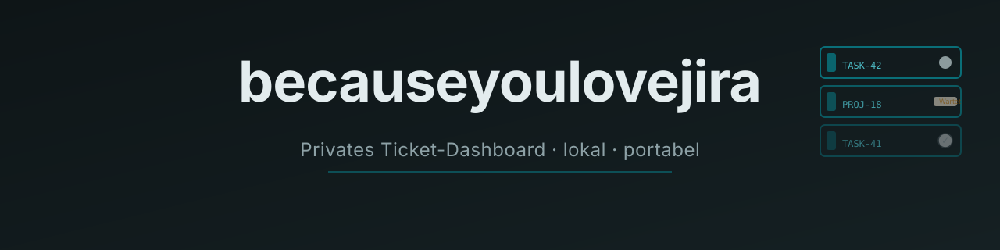
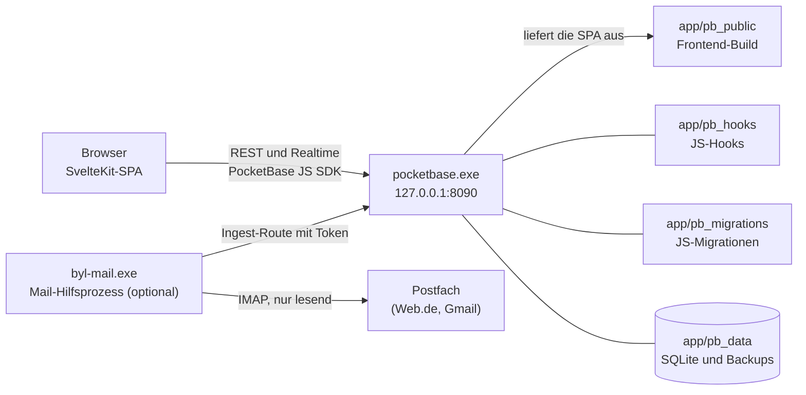

<div align="center">



<p>&nbsp;</p>

[](https://github.com/Labushuya/becauseyoulovejira/actions/workflows/ci.yml)
[](LICENSE)
[-5FA04E?style=flat-square&logo=nodedotjs&logoColor=white)](https://nodejs.org)
[](https://pocketbase.io)
[](https://svelte.dev)
[](https://www.microsoft.com/windows)
[](#roadmap)

**Ein schlankes, lokal laufendes Ticket-Dashboard im Jira-Stil, ohne dessen Prozesslast.**

</div>

---

## Was ist becauseyoulovejira?

Ein privates, lokal laufendes Ticket-Dashboard für Windows 10: Ticket-Handling im Stil von Linear oder Jira mit Keys wie `HAUS-12`, Status-Pillen, Detailpanel, Kommentaren und Verlauf, aber ohne Epics, Sprints, Story Points und Ticket-Typen ([ADR-0012](docs/adr/0012-plain-ticketing.md)). Bedient wird es im Desktop-Browser (Chrome, Firefox, Opera GX).

- **Lokal:** Keine Cloud. Der Server lauscht ausschließlich auf `127.0.0.1`.
- **Portabel:** Die komplette Installation ist der Ordner `app/`: Start per Doppelklick, Sicherung und Umzug per Ordnerkopie.
- **Ohne Internet lauffähig:** Keine externen CDNs, Schriften werden lokal ausgeliefert.

**Inhalt:** [Features](#features-nach-etappe) · [Architektur und Stack](#architektur-und-stack) · [Quickstart](#quickstart-windows) · [Betrieb](#betrieb) · [Bedienung](#bedienung) · [Entwicklung und Tests](#entwicklung-und-tests) · [Roadmap](#roadmap) · [Lizenz und Marken](#lizenz-und-marken)

---

## Features nach Etappe

| Etappe | Inhalt | Stand |
|---|---|---|
| **E0 Gerüst** | Repo, PocketBase 0.40.4 (SHA256-geprüfter Download), SvelteKit-SPA, Build- und Testskripte | fertig |
| **E1 Datenmodell, Auth, Hooks** | Datenmodell mit privaten Scopes und Nummernkreisen (`TASK-1`, `<CODE>-<NR>`), API-Regeln je Nutzer, gesperrte Selbstregistrierung, Hooks für Keys, Erledigt-Zeitpunkt und Verlauf, automatische Backups, Start-, Stopp-, Autostart- und Admin-Reset-Skripte | fertig ([Plan](docs/plan/e1.md)) |
| **E2 Liste und Detail** | Liste „Alle Tickets“ mit Standard-Reihenfolge, Abhaken mit „Rückgängig“, „Erledigte anzeigen“, Detailpanel mit Inline-Bearbeitung, Anlegen, Löschen mit Sicherheitsabfrage, Markdown (sanitisiert), Kommentare, Verlauf, Live-Aktualisierung über Realtime | fertig ([Plan und Bilanz](docs/plan/e2.md)) |
| **E3 Übersicht und Ordnung** | Seitenaufbau nach Task-Board-Vorbild ([ADR-0010](docs/adr/0010-layout-nach-task-board.md)): Kennzahlen, Filterleiste, sortierbare Tabelle, Gruppierung, Projekte mit Projektansicht, Tags, Suche: Kopfzeile mit Zähler und „Neues Ticket“, Kennzahlen-Kacheln, Filterleiste mit Suche und Zustand in der Adresse, Tabelle „Aufgaben“ mit relativen Fälligkeitslabels, Sortierung per Spaltenkopf und Gruppierung, Projekt und Tags im Panel und bei der Anlage, Projektansicht mit Projekt- und Tag-Verwaltung, Sperre für neue Tickets in archivierten Projekten, Live-Katalog für Projekte und Tags | fertig ([Plan und Bilanz](docs/plan/e3.md)) |
| **E4 Eingang und Kanäle** | Eingang, aus dem jedes Workload-Objekt per Klick zum Ticket wird (mit Rückverweis und Duplikaterkennung), „Neu“-Markierung, manuelle Erfassung mit Vorlagen, Schnellerfassung (`c`, `Strg+K`, Kurzsyntax), Zwischenablage, Bookmarklet, `.eml` und `.ics` per Drag & Drop, Web.de und Gmail per IMAP (Hilfsprogramm), Proton als `.eml`, Google Calendar, WhatsApp-Export, Telegram-Bot, Stichwörter pro Kanal, Postfach-Auswahl, Quelle als Filter, Gruppierung und Symbol, Inhalt verworfener Einträge nach 30 Tagen gelöscht | fertig ([Plan und Bilanz](docs/plan/e4.md)) |
| **E5 Wiederkehrende Aufgaben** | Regeln mit festem Rhythmus (täglich, wöchentlich an Wochentagen, monatlich am Tag oder am letzten Tag, jährlich, jeweils „alle n …“) oder „n Tage/Wochen/Monate/Jahre nach Erledigung“, Vorlauf pro Regel, höchstens ein offenes Ticket je Regel, Erzeugung beim Erledigen, stündlich und beim Start ohne Stapel und Duplikate, „Wiederholen…“ am Ticket mit „Rückgängig“, Übersicht „Wiederholungen“ mit Pausieren, Fortsetzen und Löschen, Vorschläge aus der `RRULE` von Serien aus `.ics` und Google Calendar | fertig ([Plan und Bilanz](docs/plan/e5.md), Browser-Prüfung offen) |
| **E6 Feinschliff** | Papierkorb, Spaltenauswahl, Vollansicht, Tastaturkürzel, Hilfe, Theme-Umschalter; vorgezogen: einheitliches Overlay-System (Modal, Bestätigung, Popover, Seitenpanel, Vollansicht, Flags), Theme-Umschalter und angeglichene Projekt-UI ([ADR-0025](docs/adr/0025-ui-konsistenz-overlay-system.md)) | UI-Konsistenz umgesetzt ([Plan](docs/plan/e6-ui.md), manuelle Prüfungen offen); Einstellungen, Kanal-Karten, Assistenten, Hinweise, Hilfe, „Erste Schritte“ und Tour umgesetzt ([ADR-0026](docs/adr/0026-einstellungsbereich-und-hinweis-bausteine.md), [Plan](docs/plan/e6-einstellungen.md)); Papierkorb mit Wiederherstellen, „Rückgängig“ nach dem Löschen und Aufbewahrung umgesetzt ([ADR-0037](docs/adr/0037-papierkorb.md), [Plan](docs/plan/papierkorb.md)), endgültig gelöscht nur ohne offene Abhängigkeiten, mit Entscheidungshilfe ([ADR-0047](docs/adr/0047-speicher-und-abhaengigkeiten-beim-loeschen.md), [Plan](docs/plan/speicher.md)); dazu Spalten, Glas, Herkunft, Editor, Unteraufgaben, Unterprojekte, Start und Fenster, Sammelbearbeitung und „Wiederholungen verständlich machen“ ([Plan](docs/plan/wiederholungen-klarheit.md)); erneuter Versuch mit Hinweis bei gescheitertem Realtime-Abo ([E2-Plan](docs/plan/e2.md) §8); eigener Eingang mit Zugangsschlüssel für Skripte und Browser-Erweiterung für WhatsApp Web, die im offenen Tab nur liest ([ADR-0038](docs/adr/0038-eigener-eingang-und-whatsapp-web.md), [Plan](docs/plan/eigener-eingang-whatsapp-web.md)); bestehende Listen aus Notion nur lesend als Kopien übernehmen, aus mehreren Quellen zugleich, auf Wunsch mit Unterseiten, mit Vorschau, Auswahl, „Erneut abrufen“ und „Alle erneut abrufen“ ([ADR-0041](docs/adr/0041-notion-listen-uebernehmen.md), [Plan](docs/plan/notion-import.md)); Tickets und Projekte aus Listen wählen statt eintippen ([ADR-0042](docs/adr/0042-tickets-und-projekte-aus-listen-waehlen.md), [Plan](docs/plan/auswahl-listen.md)); [Tickets duplizieren](#duplizieren) mit Abfrage, auch mit Unteraufgaben, Kommentaren und einer Kopie der Herkunft ([ADR-0045](docs/adr/0045-ticket-duplizieren.md), [Plan](docs/plan/duplizieren.md)); [Menü „•••“](#aktionen-eines-tickets-menü-) im Kopf eines Tickets und in jeder Zeile der Tabelle mit „Link kopieren“, „Duplizieren …“ und „In den Papierkorb …“, in der Zeile auch mit „Im Seitenpanel öffnen“ und „In Vollansicht öffnen“, per Rechtsklick oder Umschalt+F10 auch als Kontextmenü, dazu Zeilenmenüs in Papierkorb, Eingang (auch mit Link der Quelle, Umhängen, Lösen und Seitenkopie), Projekten und Wiederholungen und ein Menü auf jeder Projektkachel ([Plan](docs/plan/aktionsmenues.md)); [offene Tickets](#projekte-und-tags) aufklappbar in jeder Zeile der Projektliste und im Projekt-Panel ([Plan](docs/plan/projekte-tickets.md)). Fertig, die manuellen Browser-Prüfungen sind offen ([Test-Manifest](docs/test-manifest.html)) |
| **E7 Haushalt und Mehrgeräte** | gemeinsame Tickets im Haushalt, Zugriff von mehreren Geräten über Tailscale (HTTPS, Server bleibt auf `127.0.0.1`), siehe [ADR-0001](docs/adr/0001-betriebsmodell-lokal-mehrgeraete-spaeter.md) | geplant, Start nach Freigabe |

Externe Kanäle kommen nur mit eigener ADR und Freigabe ([ADR-0011](docs/adr/0011-roadmap-e3-bis-e7.md)); für E4 beschreibt sie [ADR-0016](docs/adr/0016-kanal-architektur-und-mail.md). Notion dient nur dazu, bestehende Listen als Kopien zu übernehmen: nur lesend, nur auf Anstoß, ohne laufenden Abgleich ([ADR-0041](docs/adr/0041-notion-listen-uebernehmen.md)). Aus Stufe 2 sind die Sub-Tickets als [Unteraufgaben](#unteraufgaben) freigegeben und umgesetzt ([ADR-0033](docs/adr/0033-unteraufgaben.md)); dazu kamen [Unterprojekte](#unterprojekte) als reine Gliederung ([ADR-0034](docs/adr/0034-unterprojekte.md)). Später, nach ausdrücklicher Freigabe (Stufe 2, Datenmodell vorbereitet): Abhängigkeiten mit Entsperr-Automation, Board-Ansicht, Browser-Benachrichtigungen, Anhänge.

---

## Architektur und Stack



- **Ein Prozess, eine Origin:** PocketBase liefert die gebaute SPA selbst aus und stellt API und Realtime-Abos bereit. Node.js wird nur zum Bauen und Testen gebraucht, nicht für den Betrieb.
- **Mail-Hilfsprozess (optional):** PocketBase-Hooks können kein IMAP. Postfächer holt deshalb `app\byl-mail.exe` ab, ein eigenständiges Programm mit eingebettetem Node.js ([Single Executable Application](https://nodejs.org/docs/latest-v24.x/api/single-executable-applications.html), etwa 90 MB), das `start.bat` nur bei einer eingeschalteten Postfach-Verbindung startet. Es liest nur (IMAP `EXAMINE`, `BODY.PEEK`) und liefert Mails mit Stichwort über eine Ingest-Route mit Token an PocketBase ([ADR-0016](docs/adr/0016-kanal-architektur-und-mail.md)).
- **Serverlogik** nur in JS-Hooks (Ticket-Keys, Erledigt-Zeitpunkt, Verlauf, Schutzregeln); mehrteilige Schreibvorgänge laufen in einer Transaktion. Reine Hilfsmodule liegen unter `app/pb_hooks/lib/` und sind ohne PocketBase testbar.
- **Schema** nur über handgeschriebene Migrationen (`--automigrate=false`); die Zugriffsregeln je Nutzer und Scope sind per Negativtests belegt.
- **Frontend** in Schichten: `web/src/lib/domain` (reine Logik), `web/src/lib/data` (Datenzugriff und Realtime über das SDK), `web/src/lib/stores` (geteilter Zustand in `.svelte.ts` mit Runes), `web/src/lib/components` und `web/src/routes`. Details: [ADR-0006](docs/adr/0006-frontend-zustand-und-datenzugriff.md), [ADR-0007](docs/adr/0007-realtime-und-sitzungspflege.md).

| Komponente | Technologie | Warum |
|---|---|---|
| **Backend** | [PocketBase 0.40.4](https://pocketbase.io) (Windows-Binary, unverändert) | Alles in einem: SQLite, Admin-UI, JS-Hooks, Realtime |
| **Frontend** | [SvelteKit 2](https://kit.svelte.dev) + [Svelte 5](https://svelte.dev) (Runes) + [TypeScript](https://www.typescriptlang.org) (strict), `adapter-static` im SPA-Modus | geringer JS-Footprint, native Reaktivität |
| **Datenbank** | [SQLite](https://www.sqlite.org) (in PocketBase) | Einzeldatei, keine separate Datenbank nötig |
| **Markdown** | markdown-it und DOMPurify | Ausgabe wird sanitisiert ([ADR-0008](docs/adr/0008-markdown-rendering-und-sanitizing.md)) |
| **Editor** | [Tiptap 3](https://tiptap.dev) (MIT) auf ProseMirror, `prosemirror-markdown` als Brücke zur markdown-it-Instanz der Anzeige | WYSIWYG wie in Jira, gespeichert wird weiter Markdown; lokal gebündelt und erst beim ersten Bearbeiten geladen ([ADR-0032](docs/adr/0032-editor-tiptap-markdown.md)) |
| **Styling** | CSS-Custom-Properties, Inter und JetBrains Mono lokal über `@fontsource-variable` | offline lauffähig, Petrol als einzige Akzentfarbe |
| **Tests** | [Vitest](https://vitest.dev), [Testing Library](https://testing-library.com/docs/svelte-testing-library/intro) und jsdom | Hook-Integration gegen Wegwerf-Instanzen, Domänenlogik, Komponenten |
| **Mail-Hilfsprozess** | [imapflow](https://imapflow.com) und [postal-mime](https://github.com/postalsys/postal-mime), gebündelt mit esbuild als Node-24-SEA `byl-mail.exe` | IMAP nur lesend, derselbe Mail-Parser wie für `.eml`-Dateien |
| **Dev-Werkzeug** | [Node.js](https://nodejs.org) ≥ 24, Windows PowerShell 5.1 | Build und Test; zur Laufzeit nur eingebettet in `byl-mail.exe` |

### Repo-Struktur

```
becauseyoulovejira/
  app/                    Portabler Laufzeitordner (wird kopiert/gesichert)
    pocketbase.exe        Binary (gitignored, via scripts/fetch-pocketbase.mjs; unter Linux app/pocketbase)
    byl-mail.exe          Mail-Hilfsprozess (gitignored, via scripts/build-mail-helper.ps1)
    byl-backup.exe        Hilfsprogramm der Sicherung, verschlüsselt mit age (gitignored, via scripts/build-backup-helper.ps1)
    pb_hooks/             *.pb.js Hooks, lib/*.js reine CommonJS-Module
    pb_migrations/        Handgeschriebene JS-Migrationen
    pb_public/            Frontend-Build (gitignored)
    pb_data/              Daten und Backups (gitignored, niemals committen)
    logs/                 Server- und Hilfsprozess-Ausgabe, Log der Steuerung (gitignored)
    run/                  Zustand der laufenden Instanz und Adresse für die Landing-Seite (gitignored)
    byl-config.json       Port und Einstellungen der Sicherung, nur wenn geändert (gitignored)
    start.bat             Starten (öffnet den Browser)
    start-hidden.vbs      Starten ohne Fenster (Ziel der Autostart-Verknüpfung)
    becauseyoulovejira.html  Einstieg per Doppelklick (prüft den Server, öffnet die App)
    stop.bat              Beenden, geordnet (nur die eigene Instanz)
    neu-starten.bat       Neu starten, nur wenn nötig (Update, neue Variable, …)
    status.bat            Zeigt, ob die App läuft, Adresse und ob ein Neustart nötig ist
    admin-zuruecksetzen.bat  Admin-Konto anlegen oder Admin-Passwort neu setzen (Notfall)
    wiederherstellen.bat  Eine Sicherung wiederherstellen (mit Prüfung, Sicherheitskopie und Rückweg)
    autostart-an.bat      Autostart einrichten
    autostart-aus.bat     Autostart entfernen
    byl-control.ps1       Steuerskript mit allen Befehlen (byl-functions.ps1: testbare Funktionen)
    byl-problems.ps1      Fehlerkatalog aller Skripte: Problem, Ursache, Schritte, Befehl zum Kopieren
    byl-pruefen.bat       Prüft nach einem Fehler, ob PowerShell das Steuerskript ausführen kann
    erweiterung-whatsapp-web/  Browser-Erweiterung für WhatsApp Web zum entpackten Laden (gitignored)
  web/                    SvelteKit-Quellcode (Build → web/build, veröffentlicht nach ../app/pb_public), Tests unter src/**/*.test.ts
  helpers/mail/           Mail-Hilfsprozess in TypeScript (Build → ../../app/byl-mail.exe), Tests unter src/*.test.ts
  helpers/backup/         Hilfsprogramm der Sicherung in TypeScript (Build → ../../app/byl-backup.exe), Tests unter src/*.test.ts
  extensions/whatsapp-web/  Browser-Erweiterung in TypeScript (Build → ../../app/erweiterung-whatsapp-web), Tests unter src/*.test.ts
  scripts/                Build-/Setup-Skripte (PowerShell unter Windows; PocketBase-Abruf und Binary-Namen in Node)
  tests/                  Vitest-Tests (Hooks, Regeln, Login- und SPA-Integration)
  docs/                   ADRs, Etappenpläne, Test-Manifest, README-Assets
  .github/                CI-Workflow, Dependabot, Issue- und PR-Vorlagen, Sicherheitsrichtlinie
```

---

## Quickstart (Windows)

**Voraussetzungen:** Windows 10, [Node.js](https://nodejs.org) ≥ 24 (nur zum Bauen), Windows PowerShell 5.1, Git.

```powershell
git clone https://github.com/Labushuya/becauseyoulovejira.git
cd becauseyoulovejira

# 1. PocketBase laden (gepinnte Version 0.40.4, SHA256-geprüft)
powershell -ExecutionPolicy Bypass -File scripts\fetch-pocketbase.ps1

# 2. Abhängigkeiten installieren, prüfen, Frontend bauen und testen
powershell -ExecutionPolicy Bypass -File scripts\build.ps1

# 3. Starten (öffnet den Browser)
.\app\start.bat
```

`fetch-pocketbase.ps1` ruft `node scripts/fetch-pocketbase.mjs` auf; das Skript kennt die SHA256 der Archive für Windows und Linux (`amd64`, `arm64`, `armv7`) und lädt unter Linux `app/pocketbase` (ohne `.exe`). `build.ps1` erwartet `node` (≥ 24) und `npm` im `PATH` und bricht sonst mit einem Hinweis ab. Es installiert die Abhängigkeiten (`npm ci`) in jedem Ordner mit eigenem `package-lock.json` neu, sobald sich dessen Lockfile seit der letzten Installation geändert hat (etwa nach `git pull`), und sagt je Ordner, warum; die Prüfsumme liegt in `node_modules\.byl-lockfile.sha256`. Beim allerersten Start legst du ein Admin- und ein App-Konto an, siehe [Erster Start](#erster-start). Danach ist `app\` eigenständig: Der Ordner lässt sich auf einen anderen Windows-Rechner kopieren und dort ohne Node.js starten.

---

## Betrieb

### Erster Start

Beim allerersten Start gibt es noch kein Konto. Zugangsdaten stehen bewusst nirgends im Repo ([ADR-0002](docs/adr/0002-erststart-und-superuser.md)); du legst zwei Konten an: ein **Admin-Konto** (PocketBase-Superuser, verwaltet den Server) und ein **App-Konto** (damit meldest du dich in der App an, ihm gehören die Tickets).

1. `app\start.bat` doppelklicken. Das Fenster meldet „Erster Start: …“, zeigt den Einrichtungslink und wartet auf eine Taste. Es öffnet sich **nur ein** Browser-Tab: die PocketBase-Einrichtung (`http://127.0.0.1:8090/_/#/pbinstall/…`), nicht die App.
2. Dort das Admin-Konto anlegen (E-Mail und Passwort frei wählbar). Der Einrichtungslink ist **30 Minuten** gültig. Ist er abgelaufen oder hat sich kein Browser geöffnet: `app\stop.bat`, dann `app\start.bat` – jeder Start ohne Admin-Konto erzeugt einen neuen Link (er steht auch in `app\logs\pocketbase.err.log` bzw. `pocketbase.out.log`).
3. Nach der Einrichtung bist du im Admin-Bereich (`http://127.0.0.1:8090/_/`). Unter **Collections → users → New record** das App-Konto anlegen: E-Mail, Passwort und Passwort-Bestätigung, dann speichern. Selbstregistrierung ist gesperrt; neue Konten entstehen nur hier.
4. `http://127.0.0.1:8090/` öffnen (oder `app\start.bat` erneut ausführen; die laufende App wird erkannt und nur der Browser geöffnet).
5. Mit dem App-Konto anmelden. Das Admin-Konto funktioniert in der App nicht (getrennte Konten, siehe [Konten verwalten](#konten-verwalten)).

Ab jetzt öffnet `start.bat` direkt die App.

**Einrichtung verpasst?** Der Tab wurde geschlossen oder übersehen, der Link ist abgelaufen, oder es hat sich kein Browser geöffnet:

- Läuft die App noch und ist der Link jünger als 30 Minuten, genügt `app\start.bat`. Es erkennt die offene Einrichtung, zeigt den Link an, öffnet ihn erneut (statt der App) und wartet auf eine Taste.
- Sonst `app\stop.bat` und danach `app\start.bat` ausführen. Jeder Start ohne Admin-Konto erzeugt einen neuen Link.
- Oder `app\admin-zuruecksetzen.bat` ausführen. Es legt das Admin-Konto direkt an, ohne Daten zu löschen, und ein offener Einrichtungslink wird damit ungültig. Danach in der Verwaltung `http://127.0.0.1:8090/_/` mit diesem Konto anmelden und mit Schritt 3 weitermachen.

Grenzen der Erkennung: `start.bat` meldet eine offene Einrichtung nur, wenn der Link aus dem aktuellen Serverlauf stammt (Log in `app\logs\`), noch nicht abgelaufen ist und noch funktioniert. Einen funktionierenden Link gibt es nur, solange kein Admin-Konto existiert. Nach erfolgreicher Einrichtung erscheint deshalb kein Hinweis mehr. Ist der Link älter als 30 Minuten, meldet `start.bat` nichts mehr, auch wenn die Einrichtung noch offen ist. Dann hilft einer der beiden letzten Wege. Antwortet der Server auf die Prüfung unerwartet, erscheint der Hinweis vorsichtshalber trotzdem.

### Starten und Beenden

| Skript | Verhalten |
|---|---|
| `app\start.bat` | Startet PocketBase ohne sichtbares Fenster mit den Daten in `app\pb_data`, wartet, bis `/api/health` antwortet (höchstens 30 s, mit Sekundenanzeige), meldet „becauseyoulovejira läuft: http://127.0.0.1:8090/ (PID …)“ und öffnet dann genau einmal die App. Ist die App schon in einem Tab offen, öffnet es **keinen** zweiten: Der offene Tab zeigt einen Hinweis, und das Fenster meldet „bereits in einem Browser-Tab offen“. Nach einem Neustart wartet es dafür bis zu 3 Sekunden, bis sich offene Tabs neu verbunden haben. Bleibt die Antwort aus, öffnet es den Tab wie früher. Läuft die App schon, startet es **nichts doppelt** und öffnet nur den Browser (bzw. nichts, wenn sie schon offen ist). Ist dort die Einrichtung noch offen, öffnet es stattdessen den Einrichtungslink (siehe oben). Läuft sie, antwortet aber nicht, meldet es das und nennt den Befehl zum Neustart. Ist der Port von einem anderen Programm belegt, bricht es ab und nennt Programm, PID, Pfad und einen freien Port zum Umstellen (siehe [Port ändern](#port-ändern)); das andere Programm bleibt unberührt. Bei Fehlern und Einrichtungshinweisen bleibt das Fenster offen, bis eine Taste gedrückt wird. Bei einem normalen Start schließt es sich von selbst. Details stehen in `app\logs\`. |
| `app\becauseyoulovejira.html` | Einstieg per Doppelklick ([ADR-0035](docs/adr/0035-start-einstieg-und-offene-tabs.md)). Die Seite prüft, ob die App läuft. Läuft sie, öffnet sie die App im selben Tab bzw. sagt, dass sie schon in einem anderen Tab offen ist, und schließt sich nach 5 Sekunden. Läuft sie noch nicht, erklärt sie „start.bat ausführen“, prüft jede Sekunde und öffnet die App nach dem Start mit 5 Sekunden Countdown („Jetzt öffnen“, „Abbrechen“). Der Link „App öffnen“ ist immer da. Wer versehentlich `app\pb_public\index.html` öffnet, landet ebenfalls hier. |
| `app\stop.bat` | Beendet **geordnet** nur die eigene Instanz: erst den eigenen Mail-Hilfsprozess (`byl-mail.exe` aus diesem Ordner), dann PocketBase (`pocketbase.exe` aus diesem Ordner mit `serve` und `app\pb_data`). Maßgeblich ist der Programmpfad in diesem Ordner, nie der Name; andere Prozesse, eine Kopie der App in einem anderen Ordner oder Testinstanzen bleiben unberührt. Geordnet heißt: Jeder Prozess bekommt ein Konsolensignal und schließt seine Datenbank selbst; ging das Signal nicht hinaus, folgt ein zweites, und erst ein Prozess, der danach noch läuft, wird nach 15 s hart beendet (mit Warnung; `logs\byl-control.log` nennt am Ende der Zeile die Codes der Signale, `break=`). Offene Tabs zeigen vorher „becauseyoulovejira wurde beendet.“ statt Fehlermeldungen; nach `start.bat` bzw. einem Neustart verschwindet der Hinweis von selbst. Läuft nichts, meldet es „läuft nicht“. Die Erfolgsmeldung bleibt 5 Sekunden stehen (eine Taste schließt sofort), eine Fehlermeldung bis zu einem Tastendruck. |
| `app\neu-starten.bat` | Startet die App **nur neu, wenn es nötig ist**: nach einem Update mit neuer Migration oder geänderter Server-Logik, nach einer neuen, geänderten oder entfernten `BYL_*`-Variable (etwa nach `setx`), einem neuen Mail-Hilfsprozess oder einem anderen Port, und wenn die App nicht antwortet. Sonst sagt es „Kein Neustart nötig“ (bzw. „F5 im offenen Tab“, wenn nur die Oberfläche neu gebaut ist) und startet höchstens einen fehlenden Mail-Hilfsprozess. Läuft die App nicht, startet es sie. Offene Tabs verbinden sich nach dem Neustart selbst. Die Meldung bleibt 5 Sekunden stehen, ein Fehler bis zu einem Tastendruck. Immer neu starten: `byl-control.ps1 reload -Force` bzw. `restart`. |
| `app\status.bat` | Zeigt, ob die App läuft (seit wann, PID), die Adresse, den Mail-Hilfsprozess, ob ein Neustart nötig ist (mit Grund), den Autostart und laufende Kopien in anderen Ordnern. Ändert nichts; das Fenster bleibt bis zu einem Tastendruck offen. |
| `app\admin-zuruecksetzen.bat` | Legt ein Admin-Konto an oder setzt das Admin-Passwort neu, ohne Daten zu löschen. Siehe [Konten verwalten](#konten-verwalten). |
| `app\wiederherstellen.bat` | Stellt eine Sicherung wieder her: Liste der Sicherungen im Ordner `app` und im Zielverzeichnis (oder der volle Pfad einer Sicherung, etwa auf einem neuen Rechner), Passphrase, Prüfung, Rückfrage mit dem Wort `WIEDERHERSTELLEN`, Sicherheitskopie der jetzigen Daten, Start. Siehe [Backup und Wiederherstellung](#backup-und-wiederherstellung). Das Fenster bleibt bis zu einem Tastendruck offen. |
| `app\autostart-an.bat` / `app\autostart-aus.bat` | Legt die Verknüpfung `becauseyoulovejira.lnk` im Windows-Autostart-Ordner an bzw. entfernt sie. Sie startet `start-hidden.vbs`: Die App startet bei der Anmeldung still im Hintergrund, **ohne** Browser. Hinweise (Erststart) und Fehler erscheinen dann als Meldungsfenster. Nach dem Verschieben von `app\` einfach `autostart-an.bat` erneut ausführen. |

`start.bat` startet nach PocketBase auch `app\byl-mail.exe`, wenn die Datei da ist und es mindestens eine eingeschaltete Postfach-Verbindung gibt (auch wenn die App schon läuft und nur der Hilfsprozess fehlt). Beim ersten Mal legt es dafür die Benutzervariable `BYL_INGEST_TOKEN` an (24 Zufallsbytes), die nur PocketBase und der Hilfsprozess kennen. Das Protokoll des Hilfsprozesses steht in `app\logs\byl-mail.log`.

**Schon offen?** Ein offener Tab der App zeigt einen Hinweis, wenn die App erneut geöffnet wird („Du hast becauseyoulovejira erneut geöffnet.“), und sein Titel blinkt, solange er im Hintergrund liegt. Öffnest du die App in einem zweiten Tab desselben Browsers von außen (Lesezeichen, getippte Adresse), bietet dieser an, sich nach 5 Sekunden zu schließen; „Hier weiterarbeiten“ behält ihn für die Sitzung. Tabs aus einem Link der App (Mittelklick) und Neuladen bleiben unberührt ([ADR-0035](docs/adr/0035-start-einstieg-und-offene-tabs.md)). Wer möchte, schaltet unter **Einstellungen → Darstellung → Hinweise** die „Windows-Benachrichtigung“ ein (standardmäßig aus; der Browser fragt dabei einmal nach der Erlaubnis): Dann meldet sich ein Tab im Hintergrund zusätzlich über Windows, und ein Klick auf die Meldung holt ihn nach vorn.

Die Skripte sind dünne Hüllen um das Steuerskript `app\byl-control.ps1` und rufen es mit `powershell -NoProfile -ExecutionPolicy Bypass` auf; eine gesperrte Skriptausführung stört also nicht. In PowerShell geht es auch direkt ([ADR-0039](docs/adr/0039-betriebsskripte.md)):

```powershell
powershell -NoProfile -ExecutionPolicy Bypass -File app\byl-control.ps1 help
```

| Befehl | Wirkung |
|---|---|
| `start` | wie `start.bat`; `-NoBrowser` ohne Browser, `-Force` startet eine App neu, die nicht antwortet |
| `stop` | wie `stop.bat` |
| `restart` | beenden und neu starten; `-Detach` startet den Neustart als eigenen Prozess im Hintergrund (für die Seite „System“) |
| `restore` bzw. `restore <Sicherung oder Pfad>` | wie `wiederherstellen.bat`; `-Detach` (für die Seite „Sicherung“) startet die Wiederherstellung als eigenen Prozess im Hintergrund |
| `reload` | wie `neu-starten.bat`: nur neu starten, wenn es nötig ist (siehe unten); `-Force` startet immer neu |
| `status` | wie `status.bat`: Zustand, Adresse, Mail-Hilfsprozess, ob ein Neustart nötig ist, Autostart; `-Json` für Skripte |
| `open` | die laufende App öffnen (installierte App bzw. Tab) |
| `logs` bzw. `logs server\|mail\|skript` | letzte Zeilen der Logs (`-Lines 50`), `-Follow` folgt einem Log, `-Json` ohne Werte der `BYL_*`-Variablen |
| `doctor` | prüft Dateien, Oberfläche, Port, Schreibrechte, Plattenplatz, andere Kopien und Autostart; `-Json` für Skripte |
| `port` bzw. `port <Zahl>` | Port anzeigen bzw. umstellen |
| `autostart-on`, `autostart-off`, `reset-admin` | wie die gleichnamigen `.bat`-Dateien |
| `mail-restart` | beendet den eigenen Mail-Hilfsprozess geordnet und startet ihn wieder, wenn ein Postfach eingeschaltet ist |
| `backup-info`, `backup-configure "<Ordner>"`, `backup-passphrase`, `backup-export <Sicherung>`, `backup-verify <Sicherung>` | Sicherung: Zustand, Zielverzeichnis einstellen, Passphrase festlegen (fragt zweimal verdeckt), eine Sicherung verschlüsselt ins Ziel kopieren, eine Sicherung prüfen (Name in `pb_data\backups` oder im Zielverzeichnis, oder ein voller Pfad; siehe [Backup und Wiederherstellung](#backup-und-wiederherstellung)) |

Exit-Codes: 0 erledigt (bei `status`: läuft und ist aktuell), 1 Fehler, 2 Einrichtung offen, 3 läuft nicht, 4 Port belegt, 5 App antwortet nicht, 6 Neustart nötig.

**Wenn etwas schiefgeht ([ADR-0048](docs/adr/0048-fehlerkatalog-der-skripte.md)):** Jedes Skript nennt ein Problem in derselben Form, mit den Pfaden deines Rechners:

```
× Problem:   Port 8090 auf 127.0.0.1 ist belegt; becauseyoulovejira startet dort nicht.
             Belegt durch node.exe (PID 4242): C:\Program Files\nodejs\node.exe
  Ursache:   Ein anderes Programm nutzt die Adresse der App, …
  So geht's: 1. Das andere Programm beenden …
             2. Oder becauseyoulovejira auf den freien Port 8091 umstellen (Befehl unten) …
             Befehl zum Kopieren:
               powershell -NoProfile -ExecutionPolicy Bypass -File "C:\…\app\byl-control.ps1" port 8091
  Details:   C:\…\app\logs\byl-control.log
```

- Das Fenster einer `.bat`-Datei bleibt dann offen. Wo es sicher ist (Port umstellen, starten, neu starten, eine beschädigte `byl-config.json` beiseitelegen), fragt das Skript „Soll ich …? (J/N)“; ohne „J“ ändert es nichts.
- Kann PowerShell das Skript gar nicht ausführen (Richtlinie für Skripte, fehlende Dateien, aus einem ZIP-Download gesperrt), sagt `byl-pruefen.bat` das im selben Fenster, mit dem Befehl zum Entsperren.
- Ein unerwarteter Fehler nennt das Log und einen Befehl, der dessen letzte 50 Zeilen in die Zwischenablage kopiert.
- Scheitert ein Start ohne Fenster (Autostart) oder ein Neustart bzw. eine Wiederherstellung aus der App, zeigt der nächste Start im Fenster das Problem einmal, und **Einstellungen → System** zeigt es mit Schritten und Befehl.
- Die häufigsten Probleme stehen mit denselben Texten in der Hilfe der App unter **Betrieb → Probleme mit den Skripten**. Auch `scripts\build.ps1` meldet Fehler so (Node fehlt, falsche Version, `npm ci`, ein Schritt des Builds, PocketBase lädt nicht).
- Mit `-Json` antwortet ein Fehler mit einer Zeile mit `code` (Eintrag des Katalogs) und `remedy` (Schritte und Befehl).

**Neustart nur bei Bedarf:** Beim Start merkt sich das Skript in `app\run\byl.state.json`, was der Server geladen hat (Stempel von `pocketbase.exe` und `byl-mail.exe`, Prüfsummen der Migrationen und Hooks, Port, eine Prüfsumme der `BYL_*`-Variablen und die Version der Oberfläche). `status` vergleicht mit dem Ordner und sagt „aktuell“, „nur neu laden (F5 im offenen Tab) – Oberfläche neu gebaut“ oder „Neustart nötig“ mit Grund, etwa „neue oder geänderte Migration“ oder „geänderte Server-Logik (pb_hooks)“; PocketBase lädt geänderte Hooks unter Windows nicht selbst neu. `reload` startet genau dann neu. Auch eine neue, geänderte oder entfernte `BYL_*`-Variable (etwa nach `setx`) zählt; gespeichert wird dafür nur eine Prüfsumme mit einem Schlüssel, den nur dein Windows-Konto entschlüsseln kann, nie ein Wert. War die App noch mit den alten Skripten gestartet, ist der Stand „unbekannt“, und `reload` startet einmal neu.

**Logs** stehen in `app\logs\`: `pocketbase.out.log` und `.err.log` (Server), `byl-mail.log` und `.err.log` (Mail-Hilfsprozess), jeweils vom aktuellen Lauf, der vorige als `*.1.log`; `byl-control.log` hat eine Zeile je Start, Stopp, Neustart, Portwechsel, Autostart-Änderung und Neustart des Mail-Hilfsprozesses (höchstens 1 MB, dann rotiert), ohne Zugangsdaten oder Inhalte.

**Aus dem Dashboard:** Unter **Einstellungen → System** zeigt die App dasselbe wie `status.bat` (PID nur in den technischen Angaben) und bietet „Jetzt neu starten“, „Mail-Helfer neu starten“, den Autostart als Schalter, „Umgebung prüfen“ (`doctor`, bei jedem Befund mit „Was tun?“) und „Logs ansehen“ (letzte 200 Zeilen je Datei, ohne Zugangsdaten, E-Mail-Adressen und Pfade von Adressen). Die Seite ruft nur diese festen Befehle von `byl-control.ps1` auf, nur im Browser auf dem Rechner der App (`127.0.0.1`/`localhost`, kein Proxy) und nur für das App-Konto, das bei der Einrichtung zuerst angelegt wurde; jede Aktion steht mit Konto und Zeit im Log der Verwaltung. Der Neustart läuft als eigener Prozess weiter, während der Server endet; die Seite verbindet sich danach selbst neu. Beenden gibt es dort nicht, dafür bleibt `stop.bat`. Unter Linux und im Container ist die Seite ausgeblendet ([ADR-0043](docs/adr/0043-system-seite.md)).

**Geordnetes Beenden:** `stop.bat` schickt PocketBase und dem Mail-Hilfsprozess ein Konsolensignal (Ctrl+Break). PocketBase schließt dann die Datenbank sauber, SQLite überträgt dabei das Write-Ahead-Log (`pb_data\data.db-wal` verschwindet). Erst wenn ein Prozess nach 15 Sekunden noch läuft, beendet `stop.bat` ihn hart und warnt davor. Auch das ist für die Daten unkritisch: SQLite (WAL-Modus) behält jede abgeschlossene Änderung, eine gerade laufende wird beim nächsten Start zurückgerollt. Nur während eines laufenden Backups solltest du nicht stoppen, sonst bleibt ein unvollständiges ZIP zurück.

#### Port ändern

Standard ist `http://127.0.0.1:8090/`. Ist Port 8090 belegt, nennt `start.bat` einen freien Port und den Befehl, etwa:

```powershell
powershell -NoProfile -ExecutionPolicy Bypass -File app\byl-control.ps1 port 8091
```

Der Port steht dann in `app\byl-config.json` (die einzige Stelle, wandert bei einer Ordnerkopie mit). Läuft die App gerade, gilt er nach `neu-starten.bat` (es erkennt den neuen Port). Die Landing-Seite `becauseyoulovejira.html`, der Mail-Hilfsprozess und die Anleitungen in der App folgen von selbst. Anpassen musst du: Lesezeichen, die installierte App (unter der neuen Adresse neu installieren), die App-Adresse in der Browser-Erweiterung für WhatsApp Web, und unter der neuen Adresse einmal neu anmelden (die Anmeldung gilt je Adresse). `port 8090` stellt zurück. Die App weicht nie selbst auf einen anderen Port aus.

**Bindung:** nur `127.0.0.1` (nicht im Netz erreichbar – vorerst; Mehrgerätezugriff über Tailscale ist geplant, siehe [ADR-0001](docs/adr/0001-betriebsmodell-lokal-mehrgeraete-spaeter.md))

### Als App installieren

becauseyoulovejira lässt sich in **Chrome** und **Edge** als App installieren ([ADR-0035](docs/adr/0035-start-einstieg-und-offene-tabs.md) §8). Sie läuft dann in einem eigenen Fenster mit eigenem Symbol in Startmenü und Taskleiste, und ein erneuter Start holt **dasselbe Fenster** nach vorn, statt ein neues zu öffnen.

1. Die App läuft (`app\start.bat`) und ist in Chrome oder Edge unter `http://127.0.0.1:8090/` geöffnet.
2. **Chrome:** Menü „⋮“ → „Streamen, speichern und teilen“ → „Seite als App installieren …“ (oder das Symbol „Installieren“ rechts in der Adresszeile). **Edge:** Menü „…“ → „Apps“ → „Diese Website als App installieren“.
3. Namen „becauseyoulovejira“ bestätigen. Die App steht danach im Startmenü; über das Kontextmenü des Symbols lässt sie sich an die Taskleiste anheften.

- **`start.bat` bevorzugt die installierte App:** Findet es im Startmenü die Verknüpfung der installierten App, startet es diese. Der Browser holt ein offenes App-Fenster nach vorn (`launch_handler` „focus-existing“) oder öffnet eins. Ohne Installation bleibt alles wie oben beschrieben.
- **Ohne Server** zeigt das App-Fenster „becauseyoulovejira läuft gerade nicht“ und lädt von selbst neu, sobald die App wieder läuft. Mehr speichert die App nicht: Es gibt keinen Offline-Modus und nie veraltete Daten.
- **Deinstallieren:** im App-Fenster Menü „⋮“ bzw. „…“ → „becauseyoulovejira deinstallieren“, oder in Windows unter „Apps“. Daten und Anmeldung liegen weiter beim Server bzw. im Browser.
- **Grenzen:** Firefox installiert Web-Apps unter Windows nicht. Die installierte App gehört zum Browserprofil, in dem sie installiert wurde. `http://127.0.0.1:8090` und eine spätere HTTPS-Adresse (Mehrgeräte) sind getrennte Apps mit getrennter Anmeldung.

### Konten verwalten

Es gibt zwei Arten von Konten:

- **Admin-Konto** (PocketBase-Superuser): nur für die Verwaltung unter `http://127.0.0.1:8090/_/` (Konten, Einstellungen, Backups). In der App funktioniert es nicht.
- **App-Konto** (Collection `users`): Damit meldest du dich in der App an. Ihm gehören die Tickets.

Admin- und App-Konto dürfen dieselbe E-Mail-Adresse haben. Es bleiben trotzdem zwei getrennte Konten mit eigenem Passwort; ein neues Passwort für das eine ändert das andere nicht.

| Aufgabe | So geht's |
|---|---|
| Weiteren Nutzer anlegen | In der Verwaltung `http://127.0.0.1:8090/_/` unter **Collections → users → New record** E-Mail, Passwort und Passwort-Bestätigung eintragen, dann speichern. Selbstregistrierung ist gesperrt; neue App-Konten entstehen nur hier. |
| Passwort eines App-Kontos ändern | In der Verwaltung unter **Collections → users** das Konto öffnen, neues Passwort und Bestätigung eintragen, speichern. Danach das neue Passwort der betroffenen Person mitteilen. |
| Admin-Passwort vergessen, Admin-Konto fehlt oder Einrichtung verpasst | `app\admin-zuruecksetzen.bat` doppelklicken (siehe unten). |

**`admin-zuruecksetzen.bat`** fragt die E-Mail-Adresse des Admin-Kontos ab und zweimal verdeckt das neue Passwort (mindestens 10 Zeichen, keine Anführungszeichen `"`).

- Gibt es zu der E-Mail schon ein Admin-Konto, bekommt es das neue Passwort. Sonst wird ein neues Admin-Konto angelegt.
- Tickets, App-Konten und Einstellungen bleiben unverändert.
- Das Skript funktioniert auch, während die App läuft. Meldet es eine gesperrte Datenbank, erst `stop.bat` ausführen und es dann erneut versuchen.
- Angezeigt wird nur Erfolg oder Fehler, das Passwort nie.
- **Restrisiko:** PocketBase nimmt das Passwort nur als Programmargument an. Für den Bruchteil einer Sekunde, den der Aufruf dauert, steht es deshalb in der Kommandozeile des `pocketbase.exe`-Prozesses. Andere Programme unter deinem Windows-Konto könnten es in diesem Moment auslesen. Begründung und Abwägung: [ADR-0002](docs/adr/0002-erststart-und-superuser.md).

**Kein E-Mail-Versand:** becauseyoulovejira hat keinen Mailserver. Mail-Funktionen wie „Passwort vergessen“, E-Mail-Bestätigung, E-Mail-Änderung per Bestätigungsmail und Einmal-Codes können deshalb nicht funktionieren. Der Server weist sie ab („E-Mail-Versand ist nicht eingerichtet …“), statt Erfolg vorzutäuschen. Ohne diese Sperre würde PocketBase „Mail verschickt“ melden, obwohl nie eine ankommt.

- Der Link **„Forgotten password“** auf der Anmeldeseite der Verwaltung gehört fest zur PocketBase-Oberfläche und bleibt sichtbar. Er ist aber wirkungslos und führt nur zu dieser Fehlermeldung. Ein vergessenes Admin-Passwort setzt `admin-zuruecksetzen.bat` neu, ein App-Passwort die Verwaltung (siehe Tabelle).
- Warnmails bei Anmeldungen von neuen Geräten sind aus demselben Grund abgeschaltet.

### Backup und Wiederherstellung

Details und Begründung: [ADR-0046](docs/adr/0046-sicherung-pruefung-wiederherstellen.md) (vorher [ADR-0003](docs/adr/0003-pb-data-und-backups.md)). Alles Einstellbare steht unter **Einstellungen → Sicherung** (nur auf dem Rechner der App, nur für das zuerst angelegte App-Konto).

- **Automatisch, einmal am Tag:** Solange die App läuft, sichert sie, sobald die letzte Sicherung einen Tag alt ist, also auch wenige Minuten nach dem Start, wenn der Rechner aus war. Die Sicherung ist ein ZIP von `pb_data` (konsistent im laufenden Betrieb) in `app\pb_data\backups\` und heißt `byl-<Datum>-<Uhrzeit>.zip` (UTC). **„Jetzt sichern“** auf der Seite sichert sofort, etwa vor einem Update.
- **Generationen:** Behalten werden die neueste Sicherung jedes der letzten **7 Tage**, jeder der letzten **4 Wochen** und jedes der letzten **6 Monate** (änderbar unter „Aufbewahrung“); ältere löscht die App. Andere ZIP-Dateien in `pb_data\backups` (Sicherungen aus der Verwaltung, die automatischen von PocketBase vor dieser Version) bleiben, bis du sie in der Verwaltung löschst.
- **Zielverzeichnis (außer Haus):** Gib unter „Zielverzeichnis“ einen Ordner auf einem anderen Laufwerk an: USB-Platte, zweites Laufwerk, eine Freigabe deines NAS (`\\NAS\Freigabe\Ordner`) oder einen Ordner, den ein Cloud-Dienst synchronisiert. Pfad am einfachsten aus der Adresszeile des Explorers kopieren. Die App prüft, ob es den Ordner gibt, ob sie hineinschreiben darf, ob genug Platz frei ist und dass er nicht im Ordner `app` liegt. Jede neue Sicherung kommt **verschlüsselt** dorthin (`byl-<Datum>-<Uhrzeit>.tar.age`), mit denselben Generationen. Ist die Platte abgezogen, sagt die Seite das; die App holt die Kopie nach, sobald der Ordner wieder erreichbar ist.
- **Passphrase:** Ohne sie entsteht im Zielverzeichnis nichts. Zweimal eingeben; die App legt sie für die unbeaufsichtigten Sicherungen verschlüsselt und an dein Windows-Konto gebunden ab (DPAPI, unter `%LOCALAPPDATA%\becauseyoulovejira\`, nie im Ordner `app`). **Bewahre die Passphrase in deinem Passwort-Manager auf – ohne sie lässt sich die Sicherung nicht öffnen.** Änderst du sie, nutzen neue Sicherungen die neue; ältere bleiben mit der alten lesbar.
- **Zugangsdaten mitsichern** (Standard an): Die verschlüsselten Sicherungen im Zielverzeichnis enthalten dann auch die Werte deiner Windows-Umgebungsvariablen `BYL_*` (Kalender-Adresse, Bot-Token, Postfach-Passwörter …), gelesen aus deinem Konto, nicht aus der App. In die Sicherungen im Ordner `app` kommen sie nie.
- **Format:** [age](https://age-encryption.org) mit Passphrase um ein tar-Archiv mit `pb_data.zip`, `byl-config.json`, `manifest.json` und gegebenenfalls `zugangsdaten.json`. Im Notfall öffnet das offizielle Programm `age` eine Sicherung auch ohne die App (`age --decrypt --output sicherung.tar <Datei>`, dann `tar -xf sicherung.tar`); `LIESMICH.txt` im Archiv beschreibt die Schritte.
- **Prüfung:** Einmal in der Woche öffnet die App die neueste Sicherung (zuerst die im Zielverzeichnis) so, als müsste sie sie wiederherstellen: entschlüsseln, in einen Ordner unter `%TEMP%` entpacken, die Datenbank prüfen (`PRAGMA integrity_check`), nachsehen, ob jede Originaldatei des Eingangs darin steckt, und sie mit einer Probe-Instanz von PocketBase auf einem freien Port starten und zählen; danach ist alles wieder weg. **„Jetzt prüfen“** tut das sofort, **„Prüfen“** an einer Sicherung der Liste für genau diese. Das Ergebnis steht unter „Letzte Prüfung“. Stammt eine Sicherung von vor einem Wechsel der Passphrase, fragt die Seite direkt darunter nach ihrer Passphrase (sie wird nicht gespeichert).
- **Warnungen:** Ist die letzte Sicherung älter als 36 Stunden, liegt das Zielverzeichnis länger zurück oder ist etwas gescheitert (auch eine Prüfung), zeigt die Seite das, und beim Öffnen der App erscheint ein Hinweis „Die Sicherung braucht deine Aufmerksamkeit.“
- **Größe:** Originaldateien im Eingang (Mails mit Anhängen bis 25 MB je Datei, Seitenkopien bis 2 MB) stecken in jeder Sicherung; die Generationen vervielfachen das. Behalte den freien Platz im Blick.
- **Von Hand:** `byl-control.ps1 backup-configure "<Ordner>"`, `backup-passphrase` (fragt zweimal verdeckt), `backup-info`, `backup-export <byl-….zip>` und `backup-verify <byl-….zip, byl-….tar.age oder voller Pfad>` im Ordner `app`.
- **Umzug:** `stop.bat`, dann den ganzen Ordner `app\` kopieren; die Sicherungen in `pb_data\backups` wandern mit. Die Passphrase legst du auf dem neuen Rechner neu fest.

**Wiederherstellen** geht auf zwei Wegen, beide mit Prüfung, Sicherheitskopie und Rückweg:

- **Aus der App:** Einstellungen → Sicherung → an einer Sicherung **„Wiederherstellen …“**. Die App prüft die Sicherung (wie „Prüfen“) und fragt dann direkt darunter: Sie zeigt, was sie fand, die **Namen** der Zugangsdaten in der Sicherung (und welche auf deinem Windows-Konto fehlen) mit der Wahl „Nur fehlende ergänzen“ (Standard), „Alle überschreiben“ oder „Nicht zurückschreiben“, und du tippst zur Bestätigung **WIEDERHERSTELLEN**. Dann beendet die App sich, tauscht die Daten und startet neu; die Seite zeigt „Wiederherstellung läuft …“ und meldet sich danach mit dem Ergebnis.
- **Mit `app\wiederherstellen.bat`** (auch, wenn die App nicht startet, und auf einem neuen Rechner): Es listet die Sicherungen im Ordner `app` und im Zielverzeichnis mit Datum und Größe; wähle eine Nummer oder gib den vollen Pfad einer Sicherung an (etwa `E:\Sicherung\byl-20261001-080000.tar.age` von der USB-Platte). Danach fragt es die Passphrase (falls keine gespeichert ist), prüft, zeigt das Ergebnis, fragt nach den Zugangsdaten und nach dem Wort `WIEDERHERSTELLEN`.
- **Was passiert:** Die Sicherung wird neben `pb_data` entpackt, die App geordnet beendet, der bisherige Ordner `pb_data` wird zu **`pb_data.vor-wiederherstellung-<Datum>-<Uhrzeit>`** (UTC) und bleibt **7 Tage** im Ordner `app` (danach löscht die App ihn; die Seite listet ihn bis dahin), der wiederhergestellte tritt an seine Stelle, die Sicherungen in `pb_data\backups` wandern mit. `byl-config.json` bleibt, wie sie ist; nur ein Ordner ohne diese Datei (neuer Rechner) bekommt die aus der Sicherung (Port, Zielverzeichnis, Aufbewahrung). Gewählte Zugangsdaten schreibt die App in deine Windows-Umgebungsvariablen. **Startet die App danach nicht, geht alles zurück** (Daten, Einstellungen, Zugangsdaten), und die bisherige App startet wieder.
- **Was danach nicht mehr in der App ist:** alles, was nach der Sicherung dazukam (bis zum Löschen noch in der Sicherheitskopie). Es gelten die Konten und Passwörter zum Zeitpunkt der Sicherung; ist dein Konto dort ein anderes, meldest du dich neu an.

**Wiederherstellen von Hand (Rückfall):** Die Wiederherstellung über das Admin-UI unterstützt PocketBase unter Windows nicht. Ohne `wiederherstellen.bat` gehen diese Schritte, PowerShell im Ordner `app` (Datum und Backup-Namen anpassen; eine verschlüsselte Sicherung vorher mit `age` entschlüsseln und `pb_data.zip` aus dem tar-Archiv nehmen, siehe „Format“):

```powershell
# 1. Server beenden
.\stop.bat

# 2. Aktuelle Daten beiseitelegen (nichts wird gelöscht)
Rename-Item -LiteralPath .\pb_data -NewName pb_data.vor-restore-2026-09-24

# 3. Backup-ZIP in ein neues pb_data entpacken
Expand-Archive -LiteralPath .\pb_data.vor-restore-2026-09-24\backups\<backup>.zip -DestinationPath .\pb_data

# 4. Ältere Backups wieder mitnehmen
Copy-Item -LiteralPath .\pb_data.vor-restore-2026-09-24\backups -Destination .\pb_data -Recurse

# 5. Wieder starten
.\start.bat
```

Danach anmelden und die Daten prüfen; es gelten die Konten und Passwörter zum Zeitpunkt des Backups. Erst wenn alles stimmt, `pb_data.vor-restore-…` löschen. Schritt 3 ist durch den Integrationstest `tests/integration/backup-restore.test.mjs` belegt (Backup per API, `Expand-Archive` in einen neuen Datenordner, Start, Ticket, Key, Originaldatei des Eingangs und Login vorhanden).

#### Notfallplan: neuer Rechner

Für den Fall, dass der Rechner der App ausfällt ([ADR-0046](docs/adr/0046-sicherung-pruefung-wiederherstellen.md) §8). Dieselben Schritte stehen in der App unter **Einstellungen → Hilfe → Sicherung & Notfall** und auf der **Notfallkarte** (Link auf **Einstellungen → Sicherung**), die du ausgedruckt neben die USB-Platte legst. Die Karte nennt den Ordner der App, die Adresse, das Zielverzeichnis, die neuesten Sicherungen und die Namen der Zugangsdaten, nie die Passphrase oder einen Wert; wo die Passphrase steht, trägst du von Hand ein.

1. **App holen:** den Ordner `app` einer aktuellen Version auf den neuen Rechner legen, etwa nach `C:\becauseyoulovejira\app` (aus einer Kopie, einem Release oder mit `scripts\build.ps1` gebaut).
2. **Sicherung bereitlegen:** das Zielverzeichnis erreichbar machen (USB-Platte anschließen, NAS-Freigabe verbinden oder den Cloud-Ordner synchronisieren lassen) und die neueste Datei `byl-<Datum>-<Uhrzeit>.tar.age` suchen.
3. **`app\wiederherstellen.bat`** doppelklicken und den vollen Pfad dieser Datei eingeben (im Explorer: Umschalt + Rechtsklick → „Als Pfad kopieren“). Es braucht keinen Ordner `pb_data`.
4. **Passphrase** aus deinem Passwort-Manager eingeben. Die Prüfung meldet danach Tickets und Originaldateien.
5. **Zugangsdaten zurückschreiben:** Die Liste nennt die Namen der `BYL_*`-Variablen in der Sicherung; `f` schreibt die fehlenden in die Windows-Umgebungsvariablen deines Kontos. Dann `WIEDERHERSTELLEN` eintippen: Die App startet mit dem Stand der Sicherung, in einem neuen Ordner ohne `byl-config.json` auch mit ihren Einstellungen (Port, Zielverzeichnis, Aufbewahrung). Auf Wunsch die Passphrase für künftige Sicherungen speichern.
6. **`neu-starten.bat`**, wenn du Zugangsdaten später von Hand setzt (`setx`) oder änderst.
7. **Autostart:** `autostart-an.bat` doppelklicken, wenn die App bei der Anmeldung starten soll.
8. **Web-App:** die App im Browser öffnen, anmelden und in Chrome oder Edge wieder als App installieren (siehe [Als App installieren](#als-app-installieren)).
9. **Erweiterung für WhatsApp Web:** aus `app\erweiterung-whatsapp-web` neu laden, unter **Kanäle → Eigener Eingang** einen neuen Zugangsschlüssel erzeugen und eintragen, den alten widerrufen. Die App kennt Schlüssel nur als Prüfwert.
10. **Sicherung prüfen:** unter **Einstellungen → Sicherung** Zielverzeichnis (Laufwerksbuchstabe!) und Passphrase kontrollieren, dann „Jetzt sichern“ und „Jetzt prüfen“.

**Ohne die App öffnen:** mit dem Programm [age](https://age-encryption.org) und `tar` von Windows: `age --decrypt --output sicherung.tar byl-<Datum>-<Uhrzeit>.tar.age`, dann `tar -xf sicherung.tar`. Darin liegen `pb_data.zip`, `byl-config.json`, `manifest.json`, `LIESMICH.txt` und gegebenenfalls `zugangsdaten.json` (die Werte im Klartext; danach löschen). `pb_data.zip` stellst du wie unter „Wiederherstellen von Hand“ beschrieben wieder her.

**Was verloren gehen kann:**

- alles seit der letzten Sicherung (die App sichert einmal am Tag, nur solange sie läuft);
- ohne Passphrase die Sicherungen im Zielverzeichnis; ohne Zielverzeichnis alles, was nur auf dem kaputten Rechner lag;
- was nicht in einer Sicherung steckt: die installierte Web-App, die Browser-Erweiterung und ihr Schlüssel, die Autostart-Verknüpfung, Anmeldungen und die Darstellung des Browsers (Farbe, Modus, Glas);
- Zugangsdaten, wenn „Zugangsdaten mitsichern“ aus war: Sie müssen neu beschafft und mit `setx` gesetzt werden.

### Kanäle und Zugangsdaten

Google Calendar und Telegram holt die App selbst ab, Postfächer der Mail-Hilfsprozess `byl-mail.exe`, solange die App läuft; aus Notion übernimmst du Listen nur auf Anstoß. Eingerichtet werden sie unter **Einstellungen → Kanäle** (Zahnrad oben rechts, `http://127.0.0.1:8090/einstellungen/kanaele`); in den Anleitungen unten steht dafür kurz **Kanäle**. Jeder Kanal ist dort eine Karte gleichen Aufbaus: oben der Zustand (**Verbunden**, **Pausiert**, **Fehler**, **Einrichtung offen**, **Neustart nötig**, während eines Abrufs **Wird abgerufen**), darunter eine Zeile wie „Zuletzt abgerufen vor 5 Min. · 3 neu“ und ein Knopf für den nächsten Schritt (etwa **Jetzt abrufen**, **Listen übernehmen …** oder **Einrichtung fortsetzen**). Das Menü **•••** enthält alles Weitere: **Stichwörter und Einstellungen …** (Stichwörter und Schalter), bei Postfächern **Aus dem Postfach wählen …**, Pausieren bzw. Fortsetzen, **Umbenennen …**, Einrichtung, Hilfe und Löschen. **Umbenennen …** macht den Namen oben in der Karte zum Textfeld (Enter speichert, Esc bricht ab; nicht leer, höchstens 100 Zeichen, ein Name, den schon eine andere Verbindung trägt, ist mit Hinweis erlaubt); es ändert nur den Namen, nie Abruf, Zugangsdaten oder Stichwörter, und der neue Name steht sofort überall, auch in anderen Tabs, im Eingang bei „Quelle“ und in den Quellen eines Tickets (etwa „Postfach · Gmail Arbeit“). Eigener Eingang, WhatsApp Web, Dateien und Bookmarklet haben feste Namen. **Details** klappt Stichwörter, die Schalter der Antworten eines Telegram-Bots, Postfach, Hilfsprozess, bisher übernommene Listen, Zugangsschlüssel und den letzten Fehler auf. Die Stichwörter stehen dort als Liste; bei mehr als 10 zeigt sie zuerst 8 und **+ N weitere** (aufgeklappt **Weniger anzeigen**), ab 21 kommt ein Filterfeld dazu, das Groß-/Kleinschreibung und Umlaute nicht unterscheidet. Dieselbe Liste steht in den Dialogen, in denen du Stichwörter bearbeitest; nach dem Hinzufügen klappt sie auf, damit du das neue Stichwort siehst. Neue Verbindungen kommen über **Kanal hinzufügen**: Für Google Calendar, Telegram, Web.de und Gmail führt ein **Einrichtungsassistent** in sechs Schritten durch Verbindung, Variable, Neustart, Stichwörter und ersten Abruf und prüft unterwegs, was die App sehen kann, für Notion durch Integration, Token, Neustart, Freigabe und Prüfung; die Adresse `?einrichten=<art>&verbindung=<id>` öffnet ihn nach dem Neustart an der richtigen Stelle, ebenso **Einrichtung fortsetzen** an der Karte. Für Proton gibt es eine kurze Anleitung über `.eml`-Dateien. Im Schritt „Variable setzen“ kannst du den Wert optional in ein Feld einsetzen und den fertigen Befehl kopieren: Der Wert bleibt im Browserfenster, wird nie gespeichert oder gesendet und nach dem Kopieren geleert. Windows merkt sich Kopiertes im Zwischenablage-Verlauf (Win+V), falls er eingeschaltet ist; der Weg über die Systemsteuerung (zweiter Reiter) kommt ohne Zwischenablage aus. Die Abschnitte unten beschreiben dieselben Schritte zum Nachlesen. Details: [ADR-0016](docs/adr/0016-kanal-architektur-und-mail.md), [ADR-0018](docs/adr/0018-secrets.md).

- **Zugangsdaten nur als Windows-Variable:** Geheime Kalenderadresse, Bot-Token und erlaubte IDs stehen als Umgebungsvariablen deines Windows-Kontos, deren Name mit `BYL_` beginnt (Großbuchstaben, Ziffern, `_`). Die App speichert nur den Namen, nie den Wert. So stehen die Werte weder in `pb_data` noch in den Sicherungen in `app\pb_data\backups` oder Kopien von `app\`; nur die verschlüsselten Sicherungen im Zielverzeichnis nehmen sie mit, wenn „Zugangsdaten mitsichern“ an ist (siehe [Backup und Wiederherstellung](#backup-und-wiederherstellung)).
- **Variable setzen:** Eingabeaufforderung öffnen (Windows-Taste, `cmd`) und `setx NAME "Wert"` eingeben, etwa `setx BYL_TELEGRAM_TOKEN "123456789:AA…"`. Alternativ: Windows-Taste, „Umgebungsvariablen“, dann **Umgebungsvariablen für dieses Konto bearbeiten** → **Benutzervariablen** → **Neu…**.
- **Danach neu starten:** `neu-starten.bat`. Es erkennt die neue oder geänderte Variable, startet neu und liest dabei alle `BYL_*`-Variablen frisch aus deinem Benutzerkonto (Werte werden dafür nicht gespeichert, siehe [ADR-0039](docs/adr/0039-betriebsskripte.md) §5). Die Verbindung zeigt dann „Zugangsdaten gesetzt.“, sonst nennt sie die fehlende Variable.
- **Ändern oder entfernen:** `setx` mit neuem Wert bzw. die Variable in der Systemsteuerung löschen (oder `reg delete HKCU\Environment /v NAME /f`), dann neu starten.
- **Umzug:** Auf einem anderen Rechner fehlen die Variablen; lege sie dort neu an (oder hole sie aus einer verschlüsselten Sicherung mit Zugangsdaten zurück).
- **In der App:** Dieselbe Erklärung steht unter **Einstellungen → Hilfe → Kanäle und Zugangsdaten**; die Seite **Kanäle** verlinkt sie mit „Wie funktionieren die Zugangsdaten?“.
- **Server nicht unter Windows:** Die App fragt den Server nach seinem System (`GET /api/byl/host`). Läuft er unter Linux oder in einem Container, steht über den Windows-Anleitungen ein Hinweis: dieselben `BYL_*`-Variablen gehören dann in die Umgebung des Server-Prozesses bzw. in die Umgebungsdatei des Containers, danach den Server neu starten bzw. den Container neu erstellen. Übersteuern lässt sich die Erkennung mit `BYL_HOST_PLATFORM` (`windows`, `linux`, `container`). Anleitungen mit Befehlen für Linux gehören zum Server auf dem Raspberry Pi ([Plan Plattformen](docs/plan/plattformen.md), Stufe S3); der Plattform-Ausbau ist zurückgestellt (siehe [Roadmap](#roadmap)).
- Fehlermeldungen einer Verbindung zeigen nie den Wert. Adressen werden auf Schema und Rechner gekürzt, Tokens durch `***` ersetzt.

**Stichwörter** ([ADR-0020](docs/adr/0020-stichwoerter-pro-kanal.md)): Jede Verbindung hat eine eigene Liste. Automatisch kommt nur in den Eingang, was ein Stichwort trifft; ohne Stichwörter übernimmt eine Verbindung nichts und zeigt eine Warnung.

- Groß-/Kleinschreibung egal, Umlaute auch („prüfen“, „pruefen“ und „prufen“ finden einander). Gesucht wird am Wortanfang: „todo“ trifft „Todo-Liste“, nicht „Fotodoku“. Bindestriche und Punkte gehören zum Stichwort, und vor dem Wortanfang darf auch ein `@` oder `.` stehen: „beispiel-shop“ trifft „Beispiel-Shop“, „beispiel-shop.de“ und „info@beispiel-shop.de“. Mehrere Wörter wie „zu erledigen“ sind erlaubt.
- Gesucht wird beim Kalender in Titel und Beschreibung, bei Telegram im Text bzw. in der Bildunterschrift, bei Postfächern in Betreff und Absender, also Name und Adresse, mit dem Schalter **Betreff, Absender, Kopfzeilen und Text durchsuchen** auch in den Kopfzeilen (An, Cc, Antwort an, Sender, Liste, Organisation) und im ganzen Text samt HTML-Teil.
- **Eingabe:** Komma oder Enter übernimmt das Getippte als Stichwort und leert das Feld; eine eingefügte, durch Kommas oder Zeilen getrennte Liste wird auf einmal übernommen. Die Rücktaste im leeren Feld holt das letzte Stichwort zum Bearbeiten ins Feld zurück (weitere Rücktasten löschen dann Zeichen). Das gilt für alle Stichwortlisten: Verbindungen, Assistent und Datei-Importe.
- „Vorschläge übernehmen“ trägt todo, aufgabe, erledigen, ticket und #byl ein.
- Was kein Stichwort trifft, wird nicht gespeichert, auch nicht als verworfen. Neue Stichwörter gelten bei Telegram erst für neue Nachrichten; beim Kalender für alle Termine, die beim nächsten Abruf im Fenster liegen; bei Postfächern für den gesamten Posteingang, auch ältere Mails.
- Das Stichwort, das gegriffen hat, steht im Panel des Eintrags.

#### Google Calendar

Die App liest den Kalender über seine **geheime iCal-Adresse** (nur lesend) und übernimmt alle 15 Minuten die Termine von heute bis 30 Tage im Voraus in den Eingang, solange sie läuft. „Jetzt abrufen“ unter **Kanäle** holt sofort ab.

1. [Google Calendar](https://calendar.google.com) im Browser öffnen, links unter **Meine Kalender** beim Kalender auf **⋮** → **Einstellungen und Freigabe**.
2. Ganz unten unter **Kalender integrieren** die **Privatadresse im iCal-Format** kopieren (beginnt mit `https://calendar.google.com/calendar/ical/`, endet auf `/basic.ics`).
3. Eingabeaufforderung: `setx BYL_GOOGLE_CALENDAR_URL "<kopierte Adresse>"`.
4. `neu-starten.bat` doppelklicken.
5. Die Verbindung mit der Variablen `BYL_GOOGLE_CALENDAR_URL` anlegen (im Assistenten Schritt 1; er lässt sich in jeder Reihenfolge durchgehen).
6. Stichwörter eintragen, dann **Jetzt abrufen**.

- Derselbe Termin aus Feed und `.ics`-Datei ergibt einen Eintrag (Duplikatmerkmal `UID` plus `RECURRENCE-ID`). Eine Serie ist ein Eintrag, solange sie läuft.
- Ändert sich ein Termin, zieht sein Eintrag nach, solange er noch **neu** ist. Verworfene und umgewandelte Einträge bleiben unverändert und kommen nicht wieder.
- Anfragen brechen nach 30 Sekunden ab. Antworten über 20 MB werden verworfen, und zwei Abrufe derselben Verbindung laufen nie gleichzeitig. Fehler stehen bereinigt an der Verbindung.
- **Widerrufen:** In denselben Google-Einstellungen bei der Privatadresse auf **Zurücksetzen** klicken. Danach die neue Adresse per `setx` eintragen und die App neu starten. Wer die alte Adresse kennt, kann den Kalender damit nicht mehr lesen.

#### Telegram-Bot

Du schreibst deinem eigenen Bot, was in den Eingang soll. Die App fragt jede Minute per `getUpdates` nach neuen Nachrichten (kein Webhook, der Server bleibt aus dem Internet unerreichbar). Nur Nachrichten aus freigegebenen Chats mit einem Stichwort der Verbindung werden gespeichert, und jede beantwortet der Bot mit **„Im Eingang gespeichert“**. Auf Nachrichten ohne Stichwort antwortet er **„Kein Stichwort erkannt – nicht gespeichert“**. Text und Bildunterschriften werden übernommen, Bilder und Dateien nicht.

**Antworten im Chat:** Beide Antworten sind je Verbindung abschaltbar und standardmäßig an: **Bestätigung senden** und **Hinweis bei fehlendem Stichwort senden**. Die Schalter stehen an der Karte unter **Details**, im Menü **•••** unter **Stichwörter und Einstellungen …** und im letzten Schritt des Assistenten. Der Bot schreibt diese Antworten in den Chat; in Gruppen sehen sie alle Mitglieder. Ein Duplikat und eine Nachricht aus einem fremden Chat bekommen nie eine Antwort. Verbindungen von vor den Schaltern antworten wie bisher ([ADR-0016](docs/adr/0016-kanal-architektur-und-mail.md) §2, Nachtrag vom 2026-10-01).

Der Assistent (**Kanäle** → **Kanal hinzufügen** → **Telegram-Bot** → **Einrichten**) führt durch diese Schritte:

1. In Telegram **@BotFather** öffnen, `/newbot` senden, Namen und Benutzernamen (endet auf „bot“) wählen.
2. Den Token aus der Antwort setzen: `setx BYL_TELEGRAM_TOKEN "123456789:AA…"`, dazu vorläufig `setx BYL_TELEGRAM_ALLOWED_IDS "0"`.
3. Die Verbindung mit `BYL_TELEGRAM_TOKEN` und `BYL_TELEGRAM_ALLOWED_IDS` anlegen.
4. `neu-starten.bat`; der Assistent prüft, ob die App beide Variablen sieht.
5. **Chat freigeben:** Dem Bot schreiben und **Jetzt abrufen**. Die App liest die Chat-ID aus dem Hinweis „Nachricht aus einem nicht freigegebenen Chat (Chat-ID …)“ und zeigt den fertigen Befehl, etwa `setx BYL_TELEGRAM_ALLOWED_IDS "424242"` (mehrere IDs durch Komma; eine Gruppe beginnt mit `-100`). Befehl ausführen, noch einmal `neu-starten.bat` (es erkennt den geänderten Wert), erneut **Jetzt abrufen**: Dann meldet die App keinen fremden Chat mehr.
6. Stichwörter eintragen, „todo Test“ an den Bot schicken, **Jetzt abrufen**.

- Der Offset rückt erst weiter, wenn eine Nachricht gespeichert ist; ein erneuter Abruf legt nichts doppelt an. Nachrichten fremder Chats werden nicht gespeichert, nur ihre Chat-ID erscheint als Hinweis an der Verbindung.
- Telegram hält Nachrichten für den Bot höchstens **24 Stunden**. Läuft die App länger nicht, gehen sie verloren. Fehlt bei eingeschalteter Bestätigung die Antwort „Im Eingang gespeichert“, ist die Nachricht nicht angekommen; ohne Bestätigung zeigt das nur der Eingang.
- In Gruppen sieht ein Bot normalerweise nur Befehle und Antworten an ihn. Soll er alles lesen, bei BotFather `/setprivacy` auf **Disable** stellen.
- **Widerrufen:** Bei BotFather `/revoke` (neuer Token, dann `setx` und Neustart) oder `/deletebot`.
- Optional: `BYL_TELEGRAM_API_BASE` zeigt auf einen eigenen [Telegram Bot API Server](https://core.telegram.org/bots/api#using-a-local-bot-api-server) statt `https://api.telegram.org`. Die Tests nutzen die Variable für ihren lokalen Fake-Server.

#### Web.de-Postfach

Der Mail-Hilfsprozess `app\byl-mail.exe` holt den Posteingang alle 5 Minuten ab, solange die App läuft. Er durchsucht den **gesamten Posteingang**, auch ältere Mails (nie Papierkorb, Spam, Gesendet oder andere Ordner), und bringt jede Mail in den Eingang, in der ein **Stichwort** der Verbindung vorkommt: in **Betreff oder Absender** (Name und Adresse) und, mit dem Schalter **Betreff, Absender, Kopfzeilen und Text durchsuchen** (Standard an), auch in den Kopfzeilen An, Cc, Antwort an, Sender, Liste und Organisation und im ganzen Text.

- **Wann der ganze Posteingang durchsucht wird:** beim ersten Abruf, nach jeder Änderung der Stichwörter oder des Schalters (neue Stichwörter finden also auch ältere Mails) und wenn Web.de den Posteingang neu nummeriert. Danach kommen neue Mails wie bisher alle 5 Minuten dazu.
- **Wie:** in Blöcken zu 500 Mails von der neuesten zur ältesten; die Karte zeigt unter „Posteingang“ den Fortschritt, etwa „wird durchsucht: 1.200/4.800“, und bietet währenddessen **Abbrechen**. Im Menü **…** der Karte startet **Posteingang neu durchsuchen** die Suche von vorn. Die Kopfzeilen prüft die App selbst, im Text sucht zuerst der Mailserver, und nur die Treffer werden geladen und genau geprüft. Kann der Server nicht suchen, lädt die App die Mails blockweise (langsamer, die Karte sagt das).
- **Höchstens 200 neue Einträge pro Abruf:** Gibt es mehr, meldet die Karte „Weitere Treffer – erneut abrufen“; **Jetzt abrufen** holt die nächsten 200. Die neuesten Mails kommen zuerst.
- **Grenzen der Suche im Text:** Bei Gmail findet die Suche des Servers Wörter nur ganz, also „todo“ nicht in „Todos“. Auch eine Phrase über einen Zeilenumbruch kann im Text übersehen werden. Solche Mails holst du über **Aus dem Postfach wählen**.
- **Originaldateien bis 25 MB:** Mails bis 25 MB kommen samt Originaldatei (mit Anhängen) in den Eingang. **Mails über 25 MB** kommen ohne Originaldatei, beim Abruf, bei der Durchsuchung und bei **Aus dem Postfach wählen** (ab `byl-mail.exe` 0.9.0; bis `neu-starten.bat` ihn ersetzt, gilt im älteren Hilfsprozess die alte Grenze von 10 MB). Gelesen werden nur die ersten 2 MB: Absender, Betreff, Datum und der Anfang des Textes, sonst nur die Kopfdaten. Der Eintrag zeigt „Ohne Originaldatei (zu groß)“ mit der Größe. Dasselbe gilt für eine `.eml`-Datei über 25 MB. Anhänge großer Mails bleiben im Postfach. Die höhere Grenze gilt erst nach dem Neustart (Migration); bis dahin lehnt der Server eine `.eml`-Datei zwischen 10 und 25 MB ab.
- **Backups werden größer:** Jede Originaldatei liegt in `app\pb_data` und damit in jedem Backup und jeder Ordnerkopie. Mit der Grenze von 25 MB statt 10 MB kann jede Mail mit großen Anhängen das Backup um bis zu 25 MB vergrößern. Wer Platz sparen will, verwirft Einträge mit großen Anhängen, die er nicht braucht (ihr Inhalt samt Datei wird nach 30 Tagen gelöscht).

**Jetzt abrufen** an der Karte holt sofort ab, ohne die 5 Minuten abzuwarten; die Karte zeigt unter „Hilfsprozess“, ob `byl-mail.exe` läuft, und unter „Ergebnis“, was der letzte Abruf gebracht hat. Er liest nur: Gelesen-Status, Markierungen und Ordner bleiben unverändert, er löscht, verschiebt und verschickt nichts.

1. Bei [Web.de](https://web.de) anmelden, oben auf die Initialen → **E-Mail-Einstellungen** → unter „E-Mail empfangen“ **POP3/IMAP** → Schalter **POP3- und IMAP-Zugriff erlauben** einschalten und die Sicherheitsabfrage bestätigen.
2. Mit Zwei-Faktor-Anmeldung: **Account verwalten** → **Login & Sicherheit** → **Anwendungsspezifische Passwörter verwalten** → neues Passwort erstellen (Name etwa „becauseyoulovejira“); es wird nur einmal angezeigt. Ohne Zwei-Faktor-Anmeldung gilt das normale Web.de-Passwort.
3. Eingabeaufforderung: `setx BYL_WEBDE_PASSWORD "<Passwort>"`.
4. Im Assistenten (**Kanäle** → **Kanal hinzufügen** → **Web.de** → **Einrichten**) die Verbindung anlegen: deine E-Mail-Adresse, Variable `BYL_WEBDE_PASSWORD`. Stichwörter eintragen.
5. `neu-starten.bat`. Beim ersten Mal legt der Start die Variable `BYL_INGEST_TOKEN` an (nichts zu tun) und startet `byl-mail.exe`.
6. Nach spätestens 5 Minuten zeigt die Verbindung „Letzter Abruf“ und den Hinweis „Erster Abruf“; **Jetzt abrufen** im Schritt „Erster Abruf“ startet den Abruf sofort (der Assistent zeigt das ohne Neuladen; **Hilfsprozess prüfen** fragt auf Klick, ob `byl-mail.exe` läuft): Der Posteingang wird durchsucht, Treffer erscheinen im Eingang, danach kommen neue Mails mit Stichwort.

- **Einmal pro Mail:** Die Message-ID ist das Duplikatmerkmal. Dieselbe Mail als `.eml`-Datei oder ein zweiter Abruf ergibt keinen zweiten Eintrag. Die Originalmail hängt am Eintrag („Originaldatei herunterladen“).
- **Abschaltung durch Web.de:** Web.de schaltet den POP3/IMAP-Abruf nach längerer Nichtnutzung aus. Die Verbindung meldet dann „Anmeldung bei Web.de abgelehnt.“ mit einem Hinweis auf den Schalter; wieder einschalten genügt.
- **Ausfälle:** Ohne Internet oder bei beendetem PocketBase versucht es der Hilfsprozess beim nächsten Intervall erneut. Er merkt sich die zuletzt geprüfte Mail an der Verbindung (`UIDVALIDITY:UID`) und den Stand der Durchsuchung und macht dort weiter. Nummeriert Web.de den Posteingang neu, durchsucht er ihn neu und meldet das als Hinweis; was schon im Eingang ist oder verworfen wurde, kommt nicht wieder.
- **Erster Start:** SmartScreen oder ein Virenscanner können bei `byl-mail.exe` nachfragen, weil die Datei nicht signiert ist.
- **Aus dem Postfach wählen:** An der Verbindung listet dieser Knopf die letzten 50 (bis 200) Mails des Posteingangs mit Datum, Absender, Betreff und Stichwort. Mails mit Stichwort sind vorausgewählt (Betreff, Absender und Kopfzeilen genau, der Text so, wie ihn der Mailserver findet, ohne die Mails zu laden), Mails, die schon im Eingang sind, gesperrt. Übernommen wird nur, was du auswählst, auch ohne Stichwort. Das ist der Weg für Mails ohne Stichwort. Die App fragt dafür den Hilfsprozess über `127.0.0.1:8091` (anderer Port per `BYL_MAIL_HELPER_PORT`) mit dem Token; der Browser spricht ihn nie direkt an. Läuft `byl-mail.exe` nicht, sagt die Ansicht das.
- **Protokoll:** `app\logs\byl-mail.log` (Anzahlen und bereinigte Fehler, keine Zugangsdaten, keine Betreffs oder Inhalte).
- **Widerrufen:** das anwendungsspezifische Passwort unter **Login & Sicherheit** löschen bzw. den POP3/IMAP-Zugriff ausschalten; die Variable `BYL_WEBDE_PASSWORD` entfernen und neu starten.

#### Gmail

Gmail holt derselbe Hilfsprozess ab wie Web.de, mit denselben Regeln: der gesamte Posteingang, auch ältere Mails, mit **Stichwort** in Betreff, Absender, Kopfzeilen oder Text, höchstens 200 neue Einträge pro Abruf, nur lesend, dazu **Aus dem Postfach wählen** für Mails ohne Stichwort. Die Suche im Text findet bei Gmail nur ganze Wörter (siehe oben). IMAP ist bei Gmail immer eingeschaltet. Angemeldet wird mit einem **App-Passwort**, nicht mit dem normalen Google-Passwort; ein App-Passwort gibt es nur mit der **Bestätigung in zwei Schritten**.

1. Unter [myaccount.google.com](https://myaccount.google.com) → **Sicherheit** prüfen, ob die **Bestätigung in zwei Schritten** (2-Faktor-Authentifizierung) eingeschaltet ist; sonst dort einschalten.
2. [myaccount.google.com/apppasswords](https://myaccount.google.com/apppasswords) öffnen, einen Namen wie „becauseyoulovejira“ eingeben und **Erstellen** klicken. Das App-Passwort (16 Buchstaben in Vierergruppen) wird nur einmal angezeigt.
3. Eingabeaufforderung: `setx BYL_GMAIL_PASSWORD "<App-Passwort ohne Leerzeichen>"`.
4. Im Assistenten (**Kanäle** → **Kanal hinzufügen** → **Gmail** → **Einrichten**; er schlägt `BYL_GMAIL_PASSWORD` vor und entfernt im Feld „Wert hier einsetzen“ die Leerzeichen des App-Passworts) die Verbindung mit deiner Gmail-Adresse anlegen. Stichwörter eintragen.
5. `neu-starten.bat`. Nach spätestens 5 Minuten zeigt die Verbindung „Letzter Abruf“ und den Hinweis „Erster Abruf“.

- **Anmeldung abgelehnt:** Die Verbindung meldet „Anmeldung bei Gmail abgelehnt.“ mit dem Hinweis **„App-Passwort nötig (Bestätigung in zwei Schritten)“**. Meist steht in der Variablen das normale Google-Passwort oder ein widerrufenes App-Passwort. Neues App-Passwort per `setx` setzen und neu starten.
- **Kein App-Passwort möglich:** Mit „Erweitertem Schutz“, nur mit Sicherheitsschlüssel oder bei manchen Arbeitskonten bietet Google keine App-Passwörter an. Dann bleibt der Weg über `.eml`-Dateien (Mail öffnen → **⋮** → **Nachricht herunterladen**).
- **Einmal pro Mail:** Wie bei Web.de ist die Message-ID das Duplikatmerkmal; dieselbe Mail als `.eml`-Datei und aus dem Postfach ergibt einen Eintrag.
- **Widerrufen:** Unter [myaccount.google.com/apppasswords](https://myaccount.google.com/apppasswords) das App-Passwort entfernen und die Variable `BYL_GMAIL_PASSWORD` löschen, dann neu starten. Ändert sich das Google-Passwort, verfallen alle App-Passwörter.

#### Eigener Eingang (API)

Eigene Skripte auf diesem Rechner (und die Erweiterung für WhatsApp Web) legen Einträge über `http://127.0.0.1:8090/api/byl/inbox/ingest` in den Eingang ([ADR-0038](docs/adr/0038-eigener-eingang-und-whatsapp-web.md)):

1. **Kanäle** → Karte **Eigener Eingang (API)** → **Zugangsschlüssel erzeugen …**, Namen eingeben, **Schlüssel erzeugen**. Der Schlüssel (`byl_…`) erscheint genau einmal; kopieren. Die App speichert nur einen Prüfwert.
2. Anfrage mit `Authorization: Bearer <Schlüssel>` und JSON senden, etwa `{ "mode": "manual", "text": "Milch kaufen", "external_id": "einkauf-1" }`. Beispiele für PowerShell und curl, alle Felder und Antworten stehen in der App unter **Einstellungen → Hilfe → Eigener Eingang (API)**.
3. `mode: manual` kommt immer an, `mode: auto` nur mit einem Stichwort des Kanals (**Stichwörter …** an der Karte); dieselbe `external_id` kommt nur einmal an, auch nach dem Verwerfen.

Ein Schlüssel kann nur Einträge in den eigenen Eingang legen; **Widerrufen …** an der Karte sperrt ihn sofort. Die Adresse ist nur auf diesem Rechner erreichbar, Anfragen aus Webseiten lehnt die App ab, höchstens 60 Anfragen je Minute und Schlüssel.

#### WhatsApp Web (Browser-Erweiterung)

Die Erweiterung „becauseyoulovejira für WhatsApp Web“ (Edge und Chrome) bringt Nachrichten aus dem offenen WhatsApp-Web-Tab in den Eingang, ohne Export ([ADR-0038](docs/adr/0038-eigener-eingang-und-whatsapp-web.md)). Sie liest nur, was du im Tab siehst; sie sendet nie etwas, klickt nichts und ändert keine Nachricht. Sie steht nicht im Store: `scripts\build.ps1` baut sie in den Ordner `app\erweiterung-whatsapp-web`, und du lädst sie von dort. Der Assistent (**Kanäle** → Karte **WhatsApp Web (Browser-Erweiterung)** → **Einrichten**) führt durch:

1. **Schlüssel:** einen Zugangsschlüssel „WhatsApp Web“ erzeugen und kopieren.
2. **Erweiterung laden:** in Edge `edge://extensions` (in Chrome `chrome://extensions`) öffnen, **Entwicklermodus** einschalten, **Entpackt laden** (Chrome: **Entpackte Erweiterung laden**) und den Ordner `app\erweiterung-whatsapp-web` im Ordner der App wählen. Der Assistent zeigt den vollständigen Pfad.
3. **Schlüssel eintragen:** auf das Symbol der Erweiterung klicken, App-Adresse (`http://127.0.0.1:8090`) und Schlüssel eintragen, **Speichern**.
4. **Testen:** web.whatsapp.com öffnen, in der Erweiterung **Verbindung testen**; im Assistenten **Prüfen** meldet, dass sich die Erweiterung gemeldet hat.
5. **Stichwörter:** für den Schalter **Automatisch (nur mit Stichwort)** der Erweiterung (standardmäßig aus).

Danach steht an jeder Nachricht mit Text beim Überfahren und per Tab ein kleiner Knopf **In den Eingang**. Mit eingeschaltetem Automatik-Schalter gehen neue Nachrichten des geöffneten Chats an die App, die nur Treffer der Stichwörter übernimmt; die Historie nie, optional nur für genannte Chats. Dieselbe Nachricht kommt nur einmal an, auch nach dem Verwerfen. Grenzen: inoffiziell, nur bei offenem Tab, nach Updates von WhatsApp kann eine Anpassung nötig sein (die Erweiterung zeigt dann „Seitenstruktur nicht erkannt – Erweiterung braucht ein Update“). Nach einem Update der App auf der Seite der Erweiterungen bei der Erweiterung **Neu laden** klicken.

#### Notion (Listen übernehmen)

Aus Notion übernimmst du **bestehende Listen als Kopien** in den Eingang ([ADR-0041](docs/adr/0041-notion-listen-uebernehmen.md)): die Zeilen einer Datenbank oder die Punkte von To-do-, Aufzählungs- und nummerierten Listen einer Seite. Die App **liest nur**: Sie schreibt nie etwas nach Notion, meldet nichts zurück und ruft nie von selbst ab, sondern nur, wenn du Listen übernimmst oder **Erneut abrufen** bzw. **Alle erneut abrufen** wählst. Das Token bleibt im Server und geht nur an `api.notion.com`. Der Assistent (**Kanäle** → **Kanal hinzufügen** → **Notion (Listen übernehmen)** → **Einrichten**) führt durch:

1. **Integration anlegen** (nur ein Workspace Owner kann das; im eigenen Arbeitsbereich bist du das): das [Developer-Portal von Notion](https://app.notion.com/developers/connections) öffnen, links unter **Build** auf **Internal connections**, dann **Create a new connection**, Name „becauseyoulovejira“, Arbeitsbereich wählen. Im Tab **Configuration** unter **Capabilities** nur **Read content** eingeschaltet lassen (**Update content**, **Insert content** und Kommentare aus); bei den Benutzerinformationen **No user information** oder, wenn Personen mit Namen erscheinen sollen, **Read user information without email addresses**. Speichern und beim **API token** auf **Show** und **Copy** klicken (beginnt mit `ntn_`).
2. **Token setzen:** Eingabeaufforderung, `setx BYL_NOTION_TOKEN "<Token>"`.
3. **Verbinden:** die Verbindung mit der Variablen `BYL_NOTION_TOKEN` anlegen. Für einen weiteren Arbeitsbereich legst du eine weitere Verbindung mit eigener Integration an; der Assistent schlägt dann einen Namen vor, den noch keine Verbindung nutzt (`BYL_NOTION_TOKEN_2` …), im Befehl `setx` wie im Formular, damit das erste Token bleibt. Das gilt genauso für einen zweiten Kalender, Bot oder ein zweites Postfach.
4. **Neu starten:** `neu-starten.bat`; der Assistent prüft, ob die App die Variable sieht.
5. **Freigeben:** in Notion jede Seite oder Datenbank öffnen, die du übernehmen willst, oben rechts **•••** → **Verbindungen** (englisch **Connections**) → **Verbindung hinzufügen** (**+ Add connection**) → „becauseyoulovejira“ wählen und bestätigen. Unterseiten sind mit freigegeben; ihre Listen übernimmt die App mit **Unterseiten einbeziehen** oder wenn du eine Unterseite selbst als Quelle wählst (die Suche von Notion liefert sicher nur direkt freigegebene Seiten). Alternativ im Developer-Portal im Tab **Content access** → **Edit access**.
6. **Prüfen:** **Verbindung prüfen** nennt den Arbeitsbereich und ob die Integration etwas sieht; danach **Listen übernehmen …**.

- **Listen übernehmen …** an der Karte zeigt die freigegebenen Datenbanken und Seiten (Suche nach Titel, **Liste aktualisieren**, falls eine frisch freigegebene noch fehlt). Du wählst **eine oder mehrere Quellen** mit Checkboxen (Kopf-Checkbox für alle angezeigten, Umschalt+Klick für einen Bereich); die Wahl bleibt auch nach einer neuen Suche. **Weiter** zeigt die Vorschau je Quelle in einer Gruppe („Vorschau: 3 Quellen“), die sich einklappen lässt, mit **Alle aus „…“ auswählen** und **In Notion öffnen**; jeder Eintrag steht mit Titel, Datum und Kurztext da, was schon im Eingang ist oder verworfen wurde, ist gesperrt, ebenso ein Eintrag, der schon unter einer Quelle weiter oben steht. Auswahl wie in der Tabelle „Aufgaben“: Kopf-Checkbox für alle, Umschalt+Klick für einen Bereich, über alle Gruppen. Die Optionen gelten für alle gewählten Quellen, nur **Datum aus** steht je Datenbank in ihrer Gruppe. **In den Eingang übernehmen** läuft Quelle für Quelle in Blöcken: Der Knopf sagt „45 Einträge werden übernommen …“, oben im Dialog stehen der Fortschritt über alle Quellen („20 von 45 bearbeitet …“) und danach das Ergebnis (angelegt, schon vorhanden, übersprungen, Fehler) mit **Im Eingang ansehen** und bei mehreren Quellen einer Zeile je Quelle. Scheitert eine Quelle (nicht freigegeben, Notion bremst, zu langsam), laufen die anderen weiter; ein Fehler der Verbindung (Token) beendet den Durchgang. **Nach diesem Block anhalten** (oder Esc) stoppt nach dem laufenden Block, danach beginnt keine weitere Quelle. Nicht Übernommenes bleibt ausgewählt; ein neuer Versuch erkennt Übernommenes als „schon vorhanden“.
- **Datenbank:** Jede Zeile wird eine Aufgabe. Die erste Datums-Eigenschaft (oder die unter **Datum aus** gewählte) wird zum Quelldatum, die übrigen Eigenschaften (Status, Auswahl, Kontrollkästchen, Text, Links, Personen …) stehen als Liste im Text. **Seiteninhalt als Kopie mitnehmen** (aus) übernimmt auch den Inhalt der Seite jeder Zeile als Text, höchstens 500 Blöcke und 50.000 Zeichen je Seite; längere sind gekürzt und sagen das. Höchstens 1.000 Zeilen je Datenbank.
- **Seite:** Jeder Punkt einer Liste wird ein To-do, auch in Umschaltern und Spalten; verschachtelte Punkte stehen als Text darunter, die Überschrift darüber als Abschnitt. Eine Datumserwähnung im Punkt („@15. Oktober“) wird zum Quelldatum. **Unterseiten einbeziehen** (aus) liest auch die Unterseiten der gewählten Seiten und deren Unterseiten, höchstens 50 bis zur dritten Ebene; ihre Punkte gehören zur gewählten Seite, der Abschnitt nennt den Weg („Unterseite › Bad“), der Link führt auf die Unterseite. Unterseiten, die die Integration nicht sieht (eigene Freigaben), fehlen und werden gezählt („1 Unterseite nicht sichtbar“). Ohne den Schalter sind Unterseiten eigene Quellen; eingebettete Datenbanken sind es immer.
- **Erledigte überspringen** (an) lässt abgehakte To-dos und erledigte Zeilen aus (Status in der Gruppe „Complete“ bzw. ein Kontrollkästchen „Erledigt“).
- **Erneut abrufen** an einer schon übernommenen Quelle holt nur neue Einträge, mit den Einstellungen des letzten Imports (Datum, Seiteninhalt, Unterseiten). **Alle erneut abrufen** im Menü **•••** der Karte macht das für alle übernommenen Quellen nacheinander: Die Karte zeigt „Erneut abrufen: Quelle 2 von 5 („Wochenplan“) …“ mit Balken, der Hauptknopf heißt **Nach diesem Block anhalten**, danach fasst eine Meldung zusammen, und unter **Details** steht bei jeder Quelle „Erneut abgerufen: …“ mit Ergebnis oder Grund. Scheitert eine Quelle, laufen die anderen weiter. Dasselbe Element kommt nur einmal (Merkmal ist die Notion-ID), auch nach dem Verwerfen; Änderungen in Notion erreichen die Kopien nicht.
- **Umwandeln** wie jeder Eintrag im Eingang; „Gesammelt umwandeln“ nimmt das Datum auf Wunsch als Fälligkeit („Datum des Termins als Fälligkeit“).
- Jeder Eintrag verweist auf seine Notion-Seite und hängt als `notion.json` an, was Notion geliefert hat. Dateien und Bilder aus Notion stehen nur mit Namen im Text (ihre Adressen laufen nach einer Stunde ab).
- **Widerrufen:** im Developer-Portal bei der Integration im Tab **Configuration** das Token erneuern oder die Integration löschen, Freigaben in Notion wieder entfernen; die Variable `BYL_NOTION_TOKEN` löschen und neu starten.

#### Dateien hereinziehen und Proton Mail

Mail-Dateien (`.eml`), Kalenderdateien (`.ics`) und WhatsApp-Exporte (`.txt`, `.zip`) zieht man in die Eingangsansicht oder wählt sie mit **Datei wählen**. Es öffnet sich eine **Auswahl** ([ADR-0020](docs/adr/0020-stichwoerter-pro-kanal.md)):

- Einträge mit einem Stichwort der Kanalart sind vorausgewählt, alle anderen kannst du dazuwählen. Die Listen stehen unter **Einstellungen → Datei-Importe** (`/einstellungen/datei-importe`), getrennt für Mail-Dateien (Betreff und Absender, auf Wunsch auch Kopfzeilen und der ganze Text), Kalenderdateien (Titel und Beschreibung) und WhatsApp-Export (Nachricht).
- Was schon im Eingang ist (auch verworfen oder umgewandelt), steht in der Auswahl, lässt sich aber nicht wählen.
- Nur die ausgewählten Einträge kommen in den Eingang; das Stichwort steht dann im Panel des Eintrags.

**Proton Mail** hat im Free-Tarif keinen automatischen Abruf (Proton Mail Bridge setzt einen bezahlten Tarif voraus). Mails aus Proton kommen deshalb als Datei (dieselben Schritte stehen unter **Kanäle** → **Proton Mail** → **Anleitung** und unter **Einstellungen → Datei-Importe**, dort auch der Weg für Gmail, Kalenderdateien und WhatsApp):

1. [mail.proton.me](https://mail.proton.me) öffnen und die Mail öffnen.
2. Unter den Absenderangaben auf das Symbol mit den drei Punkten (**Mehr**) klicken und **Exportieren** wählen (englische Oberfläche: **Export**).
3. Die `.eml`-Datei speichern und in die Eingangsansicht ziehen.

Das Exportieren einzelner Mails geht laut [Proton-Hilfe](https://proton.me/support/export-import-emails) in jedem Tarif.

---

## Bedienung

### Kopfzeile und Tabelle „Aufgaben“

- Die **Kopfzeile** zeigt neben dem App-Namen die Zahl der nicht erledigten Tickets und rechts den Knopf **„Neues Ticket“**. Der App-Name führt zurück zu „Aufgaben“.
- **Einstellungen:** Das Zahnrad rechts in der Kopfzeile öffnet den Einstellungsbereich (`/einstellungen`, zuerst **Kanäle**). Links stehen die Seiten (**Kanäle**, **Datei-Importe**, **Tags**, **Darstellung**, **Konto**, **Hilfe**) und ganz oben **„← Zurück zu …“**: Er führt zur zuletzt offenen Ansicht zurück, mit Filtern, Suche, Gruppierung und offenem Panel (gemerkt pro Tab). Oben stehen der Pfad „Einstellungen › …“ und, wie in den Ansichten, der Umschalter „Aufgaben | Projekte | Eingang“. Auf schmalen Fenstern stehen die Seiten als Zeile über dem Inhalt. **Konto** zeigt, mit welchem App-Konto du angemeldet bist, und wo Konten verwaltet werden (Verwaltung unter `/_/` mit dem Admin-Konto, siehe [Konten verwalten](#konten-verwalten)); ein Passwort ändert man dort, nicht in der App.
- **Hilfe:** Das Menü **?** neben dem Zahnrad öffnet **Tastaturkürzel** (auch mit der Taste `?`), die Seite **Hilfe** oder **Kanäle** und startet die **Kurze Einführung**: fünf Schritte (Schnellerfassung, Eingang, Filterleiste, Projekte als Liste oder Kacheln, Kanäle), dafür wechselt sie die Seite. „Weiter“, „Zurück“, × oder `Esc`; danach steht der Fokus wieder auf dem Knopf. Sie startet nie von selbst.
- **Darstellung:** Der Symbolknopf rechts in der Kopfzeile (Sonne, Mond oder Bildschirm; Name „Darstellung: …“) öffnet ein Menü mit **Hell**, **Dunkel** und **Wie System**. Die Wahl gilt sofort, in allen offenen Tabs und nach dem Neuladen ohne Aufblitzen; sie bleibt nur auf diesem Gerät (Browser-Speicher, Schlüssel `byl-theme`). „Wie System“ folgt der Einstellung von Windows auch später. Eine ältere Wahl unter `td-theme` wird einmal übernommen. Dieselbe Wahl gibt es als drei Kacheln unter **Einstellungen → Darstellung**; Menü und Seite zeigen immer dasselbe.
- **Farbe:** Unter dem Modus bietet dasselbe Menü den Abschnitt **Farbe** mit vier Akzentfarben, jede mit einem Farbfeld:
  - **Petrol** (Blaugrün, Standard)
  - **Rubin** (tiefes, edles Rubinrot)
  - **Smaragd** (tiefes Smaragd- bis Flaschengrün)
  - **Kupfer** (hell Kupferbraun auf Macchiato, dunkel warmes Kupfer auf Espresso)

  Die Farbe gilt für Knöpfe, Links, Auswahl, Fokus und die Status „Offen“ und „In Arbeit“, im hellen wie im dunklen Modus. Modus und Farbe sind unabhängig voneinander. Die Wahl gilt sofort, in allen offenen Tabs und nach dem Neuladen ohne Aufblitzen, nur auf diesem Gerät (Schlüssel `byl-accent`; „Petrol“ entfernt ihn). Unter **Einstellungen → Darstellung** steht dieselbe Wahl als Gruppe **Farbe** mit vier Kacheln (Farbfeld, Name, kurze Beschreibung), bedienbar mit Tab und den Pfeiltasten. Wer früher **Honig** gewählt hatte, bekommt beim nächsten Laden **Kupfer**; **Purpur** gibt es nicht mehr, daraus wird **Petrol**.

  Alle Themes erreichen WCAG AA. Fehler sind rot und tragen immer ein Symbol und einen Text. Im Rubin-Theme ist ihr Rot ziegelfarben, im Kupfer-Theme karminrot, damit es sich jeweils vom Akzent abhebt. Im Kupfer-Theme ist der Status „Wartet“ schiefergrau-blau statt bernsteinfarben. Details: [ADR-0027](docs/adr/0027-akzent-themes.md).
- **Glas-Effekt:** Kopfzeile, Menüs, Seitenpanel, Dialoge, Benachrichtigungen, die Tour, die Anmeldekarte und (in breiten Fenstern) die Navigation der Einstellungen sind halbtransparent und weichgezeichnet wie unter macOS, dahinter liegt ein dezenter Verlauf in der gewählten Farbe; Tabellen, Kacheln, Texte und die Vollansicht bleiben undurchsichtig. Umschalter wie „Aufgaben | Projekte | Eingang | Wiederholungen“ und „Liste | Kacheln“ sind Segmente mit erhabener Wahl, „Erledigte anzeigen“ und „Archivierte anzeigen“ sind Schalter, die Suchfelder tragen eine Lupe. Die Schrift bleibt Inter. Der Schalter **Glas-Effekt** unter **Einstellungen → Darstellung → Transparenz** schaltet das ab (sofort, in allen Tabs, nur auf diesem Gerät, Schlüssel `byl-transparency`). Ist unter Windows „Transparenzeffekte“ aus (bzw. „Transparenz reduzieren“ am Mac), ein Kontrastdesign aktiv oder kann der Browser keinen Weichzeichner, bleibt alles undurchsichtig; die Systemeinstellung gewinnt immer. Ruckelt die Oberfläche, etwa über Remote-Desktop, schalte den Glas-Effekt aus. Details: [ADR-0029](docs/adr/0029-glas-materialien.md).
- Darunter stehen alle **nicht erledigten** Tickets in der Tabelle „Aufgaben“ (mit ihrer Anzahl). Oben die überfälligen und bald fälligen (bis 7 Tage im Voraus) nach Datum, danach die übrigen nach Priorität (Dringend, Hoch, Mittel, Niedrig); bei gleicher Priorität zuerst die mit Fälligkeit, dann die neuesten.
- Spalten: Key (mit Punkt für „neu“), Priorität, Status, Titel (mit Symbol der Quelle, etwa „aus Mail“, und Symbol für wiederkehrende Tickets), Projekt, Tags, Fällig (relativ: „seit 3 Tagen überfällig“, „gestern“, „heute“, „morgen“, „in 4 Tagen“, ab 8 Tagen das Datum; das Datum steht immer im Tooltip, erledigte zeigen nur das Datum), Erstellt und die Aktionen. Ist der Platz knapp, etwa neben dem Panel, blendet die Tabelle Spalten aus (zuerst Erstellt, dann Tags, Projekt und Fällig); ihre Werte stehen im Panel.
- **Sortieren:** Ein Klick auf einen Spaltenkopf (außer Tags und Aktionen) sortiert in der natürlichen Richtung der Spalte (Priorität: Dringend zuerst, Fällig: früheste zuerst, Erstellt: neueste zuerst, Titel und Projekt: A bis Z, Key: Projektcode, dann Nummer), der zweite dreht um, der dritte kehrt zur Standard-Reihenfolge zurück. Ohne Datum und ohne Projekt stehen immer zuletzt. Die Sortierung steht in der Adresse (`?sort=prio`, `?sort=-faellig`), Zurück stellt die vorige wieder her. Erledigte Tickets bleiben immer „zuletzt erledigte zuerst“.
- **Gruppieren:** Der Knopf **„Gruppieren“** rechts in der Abschnittsleiste öffnet eine Auswahl: Keine, nach Status, Priorität, Projekt, Fälligkeit (Überfällig, Heute, Nächste 7 Tage, Später, Ohne Datum), Quelle oder Wiederholung (Wiederkehrend, Einmalig). Jede Gruppe hat einen Kopf mit Bezeichnung und Anzahl, innerhalb der Gruppe gilt die Sortierung, leere Gruppen fehlen. Der Knopf nennt die aktive Gruppierung („Gruppiert: Projekt“), sie steht in der Adresse (`?gruppe=projekt`). Ein Klick oder Enter übernimmt die Wahl und schließt die Auswahl, die Pfeiltasten übernehmen sie sofort und lassen sie offen, Escape oder ein Klick daneben schließen sie. Die Auswahl steht in allen Browsern rechtsbündig unter dem Knopf (am unteren Fensterrand darüber), beim Öffnen liegt der Fokus auf der aktiven Gruppierung. Darunter wählt **„Danach gruppieren“** eine zweite Ebene (etwa Projekt, dann Status; `?gruppe=projekt&untergruppe=status`); der Knopf nennt dann beide („Gruppiert: Projekt › Status“). Ein Klick auf einen Gruppenkopf klappt die Gruppe zu oder auf, die Zahl bleibt stehen; das merkt sich der Tab bis zum Schließen. Unteraufgaben stehen nur eingerückt unter ihrem Ticket, wenn beide in derselben Gruppe landen. Der Abschnitt „Erledigt“ wird nicht gruppiert.
- **„Neues Ticket“** öffnet rechts das Anlageformular: Titel (Pflicht), Status, Priorität, Fälligkeit, der zugeklappte Abschnitt „Wiederholen“ (siehe [Wiederholungen](#wiederholungen)), Projekt, Tags und Beschreibung. Ist die Liste nach einem Projekt gefiltert (`?projekt=<id>`), ist es vorausgewählt. „Anlegen“ oder `Strg+Enter` legt an, den Key vergibt der Server (`TASK-1`, `TASK-2` …).

### Kennzahlen, Filter und Suche

- Die **Kennzahlen** oben zählen immer alle nicht erledigten Tickets, unabhängig von den Filtern: **Nicht erledigt**, **In Arbeit**, **Heute fällig**, **Überfällig** und **Dringend**. Ein Klick auf eine Kachel setzt nur ihren Filter und lässt die übrigen stehen, ein zweiter Klick nimmt ihn wieder heraus; die gewählte Kachel ist hinterlegt und hat ein Häkchen. „Nicht erledigt“ setzt alle Filter zurück.
- Die **Filterleiste** über der Tabelle hat die Gruppen **Status**, **Priorität**, **Fällig** (Überfällig, Heute, Bald = morgen bis in 7 Tagen, Ohne Datum), **Quelle** (Manuell, Web-Link, Mail, Kalender, Chat, Notion; Tickets von vor E4 zählen als „Manuell“) und **Wiederkehrend** (Nur wiederkehrende, Nur einmalige; `?wiederholung=wiederkehrend|einmalig`, auch im Abschnitt „Erledigt“) sowie die Auswahlen **Projekt** (mit „Ohne Projekt“, archivierte unter „Archiviert“) und **Tag**. Die beiden Auswahlen öffnen sich wie „Gruppieren“ als Liste unter dem Knopf, der die Wahl nennt („Projekt: Haushalt (HAUS)“); ab zehn Einträgen steht oben ein Suchfeld, Enter darin nimmt den ersten Treffer. Je Gruppe gilt ein Wert, „Alle“ ist der Ausgangswert; die Gruppen wirken zusammen (UND).
- Die **Suche** (Lupe in der Filterleiste) findet Tickets, deren Titel, Beschreibung oder Key den Text enthält, ab 2 Zeichen und kurz nach der letzten Eingabe; sie wirkt mit allen Filtern zusammen, auch im Abschnitt „Erledigt“. Zeichen wie `%`, `_` und `\` gelten wörtlich. Groß- und Kleinschreibung spielt nur bei Buchstaben ohne Umlaut keine Rolle: „miete“ findet „Miete“, aber „äpfel“ findet nicht „Äpfel“ (Grenze von SQLite). Escape leert das Feld. Der Suchtext steht als `?q=` in der Adresse, ohne dass Zurück jeden Buchstaben einzeln durchläuft.
- Die Filter stehen in der Adresse (`?status=open&prio=urgent`). Neuladen, Zurück, Vor und Lesezeichen behalten sie, und das Öffnen eines Tickets auch. **„Zurücksetzen“** leert alle Filter und die Suche, Sortierung, Gruppierung und „Erledigte anzeigen“ bleiben.
- Die Zahl neben „Aufgaben“ zählt die gefilterten Tickets; die Zahl in der Kopfzeile zählt weiter alle nicht erledigten. Passt nichts, steht dort „Keine Tickets für diese Filter“ mit „Filter zurücksetzen“.
- **Leere Listen** sagen, wie es weitergeht: Ohne offene Tickets bietet „Aufgaben“ **Ticket anlegen** und **Schnellerfassung**, der leere Eingang **Erfassen** und **Kanal einrichten**; Panels zeigen „Noch keine Kommentare“ bzw. „Noch kein Verlauf“. Ohne Projekte bietet die Projektansicht **Projekt anlegen**, sind alle archiviert, **Archivierte anzeigen**.
- **Erste Schritte:** Unter „Keine offenen Tickets“ steht eine kurze Liste (erstes Ticket, Schnellerfassung, Kanal, Projekt, Kurze Einführung) mit Fortschritt und je einem Weg dorthin. Sie verschwindet, wenn alles erledigt ist oder du sie mit × ausblendest; das merkt sich nur dieser Browser.
- Der Status **„Erledigt“** zeigt nur den Abschnitt „Erledigt“. Bei einem anderen Status sind erledigte Tickets ausgeblendet, und „Erledigte anzeigen“ ist gesperrt.

### Projekte und Tags

- Der Umschalter **„Aufgaben | Projekte | Eingang | Wiederholungen“** steht in allen vier Ansichten an derselben Stelle, links in der Abschnittsleiste direkt unter der Kopfzeile. Er wechselt zwischen der Tabelle, der **Projektansicht** (`/projekte`), dem Eingang und der Übersicht der [Wiederholungen](#wiederholungen). In der Projektansicht gibt es keine Kennzahlen und keine Filterleiste.
- Die Projekte stehen als **Liste** (Standard) oder als **Kacheln**; die zwei Symbolknöpfe in der Abschnittsleiste schalten um. Die Wahl steht in der Adresse (`?darstellung=kacheln`) und gilt auf diesem Gerät auch beim nächsten Besuch. Die Liste hat die Spalten Code, Name, aktiv, gesamt, neu und archiviert; ein Klick auf einen Spaltenkopf sortiert (erst natürlich, dann umgekehrt, dann wieder nach Name). Das Suchfeld findet Projekte nach Name oder Code. Wird die Ansicht schmal (etwa neben dem Panel), blenden sich erst „archiviert“, dann „neu“, „gesamt“ und „aktiv“ aus.
- Jedes Projekt zeigt Name, Code und **„N aktiv · M gesamt“**: aktiv sind alle nicht erledigten Tickets, gesamt zählt die erledigten mit. Ein Klick auf den Namen in der Liste bzw. auf die Kachel öffnet rechts das **Projekt-Panel** (`/projekte/<id>`) wie ein Ticket neben der Tabelle. Dort stehen die Zahlen, **„Tickets anzeigen“** (die Tabelle mit diesem Projekt als Filter, `/?projekt=<id>`), Name und Code mit „Speichern“, **„Archivieren“** bzw. **„Aus dem Archiv holen“** und oben **„Löschen …“**. In der Liste hat jede Zeile am Ende das Menü **„•••“** (auch per Rechtsklick oder Umschalt+F10) mit „Öffnen“, „Tickets anzeigen“, „Unterprojekt anlegen“, „Archivieren“ bzw. „Aus dem Archiv holen“ und, wenn das Projekt keine Tickets hat, „Löschen …“; es fragt dabei wie das Panel. Jede Kachel hat dasselbe Menü oben rechts, ebenfalls per Rechtsklick auf die Kachel oder Umschalt+F10 auf ihr; ein Klick auf die Kachel öffnet das Projekt wie bisher.
- **Offene Tickets** ([ADR-0034](docs/adr/0034-unterprojekte.md), Nachtrag; [Plan](docs/plan/projekte-tickets.md)): In der Liste klappt der Pfeil vor dem Code eine Zeile auf. Darunter stehen die offenen Tickets des Projekts (nicht erledigt, nicht im Papierkorb) mit Key, Titel, Status, Priorität und Fälligkeit, die früheste Fälligkeit zuerst (ohne Fälligkeit am Ende), dann nach Priorität. Es stehen höchstens 10 da; bei mehr führt **„Alle 12 in Aufgaben öffnen“** zur Tabelle mit dem Projekt als Filter. Ein Klick auf ein Ticket öffnet es, wie du Tickets zuletzt geöffnet hast (Panel oder Vollansicht), mit den Tickets des Projekts dahinter; **„•••“** und der Rechtsklick bieten dasselbe Menü wie in „Aufgaben“. Unterprojekte zeigen ihre eigenen Tickets eingerückt unter ihrer Zeile, ein Oberprojekt dort nur die Tickets direkt in ihm. **„Alle aufklappen“** und **„Alle zuklappen“** über der Liste öffnen bzw. schließen alle Zeilen; welche offen sind, merkt sich dieser Browser (`byl-projects-tickets`). Das Projekt-Panel zeigt dieselbe Liste unter **„Offene Tickets“** (beim Oberprojekt auch je Unterprojekt), die Kacheln zählen sie als „aktiv“. Bearbeitet wird im Ticket oder in „Aufgaben“; alles aktualisiert sich live, ohne eigene Anfrage.
- **„Neues Projekt“** öffnet das Panel `/projekte/neu` mit Name und Code. Der Code hat 2 bis 6 Großbuchstaben (A–Z), `TASK` ist reserviert; die App schlägt ihn aus dem Namen vor („Garten und Haus“ → `GUH`, „Büro“ → `BUER`), der Vorschlag lässt sich ändern. Die Tickets des Projekts heißen dann `GUH-1`, `GUH-2` … Nach „Anlegen“ zeigt das Panel das neue Projekt.
- Der Code bleibt fest, sobald Tickets das Projekt verwenden. **„Löschen …“** gibt es nur für Projekte ohne Tickets und fragt vorher nach. × oder Escape schließen das Panel; sind Name oder Code geändert, fragt die App vorher „Änderungen verwerfen?“. Archivierte Projekte lassen sich keinem Ticket neu zuordnen; ihre Tickets bleiben bearbeitbar. Sie erscheinen nur mit **„Archivierte anzeigen“** (`?archiviert=1`), in der Filterleiste unter „Archiviert“.
- **Unterprojekte** gliedern ein Projekt, genau eine Ebene tief ([ADR-0034](docs/adr/0034-unterprojekte.md)): siehe [Unterprojekte](#unterprojekte).
- Alle **Tags** stehen unter **Einstellungen → Tags** (`/einstellungen/tags`): **„Umbenennen“** ändert den Namen direkt in der Zeile (Enter speichert, Escape bricht ab; einen Namen, den ein anderer Tag in irgendeiner Schreibweise schon hat, lehnt die App ab). **„Löschen …“** nennt vorher die Zahl der Tickets mit diesem Tag; der Tag verschwindet aus ihnen, und ihr Verlauf zeigt die Änderung als „System“. Neue Tags entstehen im Detailpanel und bei „Neues Ticket“.

### Abhaken und „Erledigte anzeigen“

- Das Kästchen in der Spalte „Aktionen“ setzt ein Ticket auf **Erledigt**. Die Zeile verschwindet sofort, und unten links erscheint eine Meldung mit **„Rückgängig“** (stellt den vorherigen Status wieder her). Sie bleibt 8 Sekunden, länger, solange der Mauszeiger oder der Fokus auf ihr liegt.
- **Meldungen unten links:** Ergebnisse (angelegt, gelöscht, importiert, umgewandelt) und fehlgeschlagene Aktionen in Zeilen erscheinen dort, die neueste oben, höchstens drei. Erfolge verschwinden nach 8 Sekunden (die Zeit steht still, solange Zeiger oder Fokus auf der Meldung liegen, der Tab verborgen oder ein Dialog offen ist), Fehler bleiben, bis man sie mit × schließt. Mit der Tastatur erreicht man sie nach dem Seiteninhalt; der Fokus springt nie dorthin.
- Der Schalter **„Erledigte anzeigen“** blendet unter den offenen Tickets den Abschnitt „Erledigt“ ein: zuletzt erledigte zuerst, 50 auf einmal, mehr über „Weitere laden“. Der Schalter steht in der Adresse (`?erledigte=1`) und übersteht Neuladen und Zurück.
- Wer bei einem erledigten Ticket das Häkchen entfernt, setzt es auf **Offen**.

### Mehrere Tickets auf einmal bearbeiten

- Ganz links in jeder Zeile steht ein Auswahlkästchen („… auswählen“), getrennt vom Häkchen „erledigt“ am Zeilenende. Ein Klick in diese Zelle wählt nur aus, er öffnet das Ticket nicht. **Umschalt+Klick** wählt alle Zeilen dazwischen; das Kästchen im Tabellenkopf wählt alle Tickets, die die Filter gerade zeigen (ein Strich darin heißt „einige“). **Esc** oder das × der Leiste heben die Auswahl auf. Ändert sich der Filter, bleiben nur die weiterhin angezeigten Tickets gewählt.
- Sobald etwas gewählt ist, steht über der Tabelle eine Leiste mit der Zahl und den Aktionen **Fälligkeit …** (Datum setzen, um Tage oder Wochen verschieben, leeren oder „Datum der Quelle übernehmen“), **Priorität**, **Status**, **Projekt …** (jedes Ticket bekommt einen neuen Key), **Tags …** (hinzufügen oder entfernen), **Erledigen** und **In den Papierkorb …**.
- „Datum der Quelle übernehmen“ nimmt das Datum des Kalendertermins (aus einer `.ics`-Datei oder Google Calendar), aus dem das Ticket entstanden ist. Tickets aus Mails, Nachrichten oder Links werden übersprungen, weil deren Datum nur das Sendedatum ist.
- **Erledigen** fragt nach, wenn gewählte Tickets noch offene Unteraufgaben haben („Unteraufgaben mit erledigen“ ist vorausgewählt); ohne sie bleiben diese Tickets offen und stehen mit dem Grund im Ergebnis. Wiederkehrende Tickets bekommen ihr nächstes Ticket wie beim Häkchen.
- **In den Papierkorb …** (früher „Löschen …“) fragt immer und verschiebt die Tickets samt Unteraufgaben in den [Papierkorb](#papierkorb); es fragt wie beim einzelnen Löschen, was mit den Quellen geschieht.
- Während eine Aktion läuft, zeigt die Leiste den Fortschritt. Danach meldet unten links eine Nachricht das Ergebnis mit **„Rückgängig“** (8 Sekunden, auch nach dem Löschen: dann holt es die Tickets aus dem Papierkorb zurück). Tickets, die nicht geändert werden konnten, stehen mit Key und Grund unter der Leiste; Tickets, die die Aktion nicht betrifft (etwa ohne Fälligkeit zum Verschieben), stehen dort neutral als übersprungen. „Rückgängig“ überschreibt keine Änderung, die inzwischen an anderer Stelle gemacht wurde, und ein zurückgesetzter Projektwechsel gibt einen weiteren neuen Key.
- Beim **Gesammelt umwandeln** im Eingang setzt „Datum des Termins als Fälligkeit“ bei Kalenderterminen das Datum des Termins als Fälligkeit (nur, wenn du es ankreuzt).

### Direkt in der Tabelle bearbeiten

- **Priorität, Status, Projekt, Tags und Fälligkeit** lassen sich direkt in ihrer Zelle ändern: Zeigst du auf die Zelle, wird sie leicht hinterlegt und ein Stift erscheint. Ein Klick öffnet ein kleines Menü (Priorität, Status, Projekt), ein Datumsfeld mit „Übernehmen“ und „Leeren“ (Fälligkeit) oder die Tag-Eingabe wie im Ticket (Komma oder Enter übernimmt einen Tag, die Rücktaste im leeren Feld holt den letzten zurück).
- Mit der Tastatur: **Tab** erreicht die Zellen, **Enter** öffnet, in Menüs wählen die Pfeiltasten und **Enter** übernimmt, **Esc** schließt ohne Änderung; der Fokus bleibt auf der Zelle.
- Es gelten dieselben Regeln wie im Ticket: Ein anderes Projekt gibt einen neuen Key, „Erledigt“ fragt bei offenen Unteraufgaben nach und bietet „Rückgängig“, wiederkehrende Tickets bekommen ihr nächstes Ticket. Lehnt der Server eine Änderung ab, erscheint unten links eine Fehlermeldung mit dem Grund, und die Zelle behält ihren Wert.
- Ein Klick in diese Zellen oder auf das Menü „•••“ am Zeilenende öffnet das Ticket nicht; ein Klick anderswo in der Zeile oder auf das Symbol „Öffnen“ schon (im Seitenpanel oder in der Vollansicht, je nachdem, was du zuletzt gewählt hast).

### Detailpanel

- Ein Klick auf eine Zeile öffnet das Ticket rechts im Panel. Ab 1024 px Fensterbreite steht es wie in Jira als eigene Spalte rechts neben der ganzen Ansicht (von der Kopfzeile bis zum unteren Rand), die Ansicht wird schmaler, und die Tabelle blendet Spalten aus, statt seitlich zu scrollen: zuerst „Erstellt“, dann „Tags“, dann „Projekt“, zuletzt „Fällig“ (die Werte stehen im Panel). Auf schmaleren Fenstern liegt das Panel von rechts über der abgedunkelten Ansicht; ein Klick daneben schließt es. Die Adresse `/tickets/<id>` öffnet nach dem Neuladen dasselbe Ticket.
- **Titel** („Titel bearbeiten“) und **Fälligkeit** speichern mit Enter oder beim Verlassen des Felds, Escape verwirft. **Status**, **Priorität** und **Projekt** speichern sofort bei der Auswahl. Ein anderes Projekt gibt dem Ticket einen neuen Key (`HAUS-4`, ohne Projekt wieder `TASK-n`); die Adresse bleibt gleich, der alte Key steht im Verlauf. Archivierte Projekte sind nicht wählbar. Projekte entstehen in der [Projektansicht](#projekte-und-tags).
- **Tags:** Im Feld „Tags“ tippen, mit den Pfeiltasten einen Vorschlag wählen und Enter drücken; die letzte Option legt einen neuen Tag an („„Steuer“ als neuen Tag anlegen“). Einen Namen, den es in anderer Schreibweise schon gibt, nimmt die App wieder. Jede Änderung speichert sofort; ein Chip verschwindet über „Tag … entfernen“. Escape schließt die Vorschläge, ein zweites Escape leert das Feld. Die **Beschreibung** hat „Bearbeiten“ und „Speichern“ (`Strg+Enter`); siehe [Editor](#editor).
- Das Panel ist 480 px breit; Kopf (Key, Menü „•••“, „Vollansicht öffnen“, × „Panel schließen“) und bei Formularen der Fuß mit den Knöpfen bleiben beim Scrollen stehen. Liegt es über der Ansicht (unter 1024 px), sind Liste und Kopfzeile nicht per Tab erreichbar; unter 576 px füllt es die ganze Breite. Das × oder Escape führt zurück zur Liste. **„Vollansicht öffnen“** (Pfeile im Kopf, `/tickets/<id>/voll`, auch per Mittelklick in einem neuen Tab) zeigt das Ticket groß: links Titel, Beschreibung, Kommentare und Verlauf, rechts die Karten „Details“, „Wiederholung“, „Quelle“ und „Metadaten“. Das Panel schließt sich dabei, die Liste steht in voller Breite dahinter. Alles speichert wie im Panel; ×, Escape oder ein Klick daneben führen zurück zur Liste (unter 1024 px zurück ins Panel). **„Im Seitenpanel öffnen“** im Kopf der Vollansicht zeigt dasselbe Ticket wieder im Panel. Die App merkt sich auf diesem Gerät, wie du zuletzt gewählt hast (wie Jira): Hast du „Vollansicht“ gewählt, öffnen Zeilen, Keys und Links auf Tickets direkt die Vollansicht, bis du „Im Seitenpanel öffnen“ wählst. Unter 1024 px öffnet eine Zeile immer das Panel, deine Wahl bleibt gespeichert. Der Wechsel zwischen Panel und Vollansicht behält ungespeicherten Text. Ist noch eine Beschreibung, ein Kommentar, ein getippter Tag-Name oder die Vorlage der Serie („Künftige Tickets“ → „Bearbeiten“) ungespeichert, fragt die App vorher „Änderungen verwerfen?“, auch bei einem Klick auf eine andere Zeile, „Neues Ticket“ oder „Zurück“ im Browser. „Weiter bearbeiten“ (oder Escape) bleibt, „Verwerfen“ geht zum Ziel.
- **Rückfragen** (Löschen, Verwerfen) erscheinen in einem Dialog über der abgedunkelten Seite: der Titel ist die Frage, der Fokus steht auf „Abbrechen“ bzw. „Weiter bearbeiten“, Escape, das × oben rechts und ein Klick auf den Schleier brechen ab. Solange der Dialog offen ist, scrollt die Seite dahinter nicht.
- **Kein Dialog über der Vollansicht:** Die Vollansicht ist selbst ein Dialog, deshalb öffnet sie keinen weiteren. „Wiederholen…“, „Regel bearbeiten“, „Quelle hinzufügen …“ und „Anderem Ticket zuordnen …“ klappen dort als Bereich direkt an ihrer Stelle auf (derselbe Knopf klappt sie wieder zu), Rückfragen wie „Kommentar löschen?“ oder „In den Papierkorb …“ stehen als Frage im Inhalt, „Duplizieren …“ als Bereich oben im Inhalt. Escape schließt zuerst diesen Bereich bzw. die Frage, die Vollansicht bleibt offen, und der Fokus kehrt zum Knopf zurück (bei Einträgen des Menüs „•••“ zu diesem Menü).

### Editor

- Beschreibungen, Kommentare, „Neues Ticket“ und die Vorlage einer Wiederholung bearbeitest du im Editor wie in Jira ([ADR-0032](docs/adr/0032-editor-tiptap-markdown.md)). Gespeichert wird weiter Markdown, die Anzeige zeigt genau das, was der Editor zeigte.
- **Formatierungsleiste:** Textstil (Normaler Text, Überschrift 1 bis 3), fett, kursiv, unterstrichen, durchgestrichen, „Weitere Formatierungen“ (Inline-Code, Formatierung entfernen), Link, Aufzählung, nummerierte Liste, Checkliste, Zitat, Codeblock, Trennlinie. Im schmalen Panel liegen Listen und Blöcke im Menü „…“. `Alt+F10` springt aus dem Text in die Leiste, die Pfeiltasten wandern, `Escape` führt zurück.
- **Tastenkürzel wie in Jira:** `Strg+B`/`I`/`U`, `Strg+Umschalt+S`, `Strg+E`, `Strg+Alt+1` bis `3`, `Strg+Umschalt+7`/`8`/`9`, `Strg+Umschalt+B`, `Strg+Alt+C`, `Strg+K` für Links; `Tab` rückt in Listen ein. Beim Tippen wirkt Markdown: `## `, `- `, `1. `, `[ ] `, `> `, drei Backticks, `---`, `**fett**`, `++unterstrichen++` usw.
- **„/“** am Zeilenanfang oder nach einem Leerzeichen öffnet ein Menü für Überschriften, Listen, Blöcke und Link.
- **Einfügen** aus Word, Google Docs oder Webseiten behält Überschriften, Listen, Links und Formatierung, aber keine Farben, Schriften und Bilder. `Strg+Umschalt+V` fügt reinen Text ein.
- **„Markdown“** rechts in der Leiste zeigt den Text als Markdown mit Vorschau. Texte mit Tabellen oder Listen aus Aufgaben und normalen Punkten öffnen gleich dort, damit nichts verloren geht.

### Kommentare und Verlauf

- Unter den Feldern stehen zwei Reiter. **Kommentare:** oben „Kommentar hinzufügen …“, das den kompakten [Editor](#editor) öffnet (`Strg+Enter` sendet), darunter die Kommentare, die neuesten zuerst. Ab zwei Kommentaren wählst du darüber **„Neueste zuerst“** oder **„Älteste zuerst“**; die Wahl gilt auf diesem Gerät für alle Tickets. Bei „Älteste zuerst“ springt die Ansicht nach dem Senden zu deinem neuen Kommentar am Ende. Eigene Kommentare lassen sich bearbeiten und nach einer Rückfrage löschen; geänderte tragen den Hinweis „bearbeitet“ ([ADR-0044](docs/adr/0044-kommentare-reihenfolge-anpinnen-einklappen.md)).
- **Anpinnen:** Jeder Kommentar hat „Anpinnen“. Der angepinnte steht immer ganz oben, egal in welcher Reihenfolge, und ist mit „Angepinnt“ markiert; „Lösen“ nimmt ihn wieder heraus. Ein Ticket hat höchstens einen: Ein anderer ersetzt ihn, und die Meldung unten links bietet 8 Sekunden lang „Rückgängig“. Anpinnen darf, wer das Ticket ändern darf; der Verlauf nennt jeden Schritt. Wird der angepinnte Kommentar gelöscht, ist das Anpinnen aufgehoben; im Papierkorb bleibt es erhalten. Neue Tickets, Unteraufgaben und Folgetickets einer Serie beginnen ohne. Nach dem Update steht „Anpinnen“ erst nach `neu-starten.bat` bereit.
- **Lange Kommentare** zeigen zuerst etwa 12 Zeilen und blenden dann aus; „Weiterlesen“ klappt sie auf, „Weniger anzeigen“ wieder ein. Aufgeklappte bleiben es, solange der Tab offen ist; zum Bearbeiten siehst du immer den ganzen Text.
- **Verlauf:** jede Änderung mit Zeitpunkt, Urheber („Du“ oder „System“) und Inhalt, die neueste oben. Bei geänderten Beschreibungen lassen sich alter und neuer Text aufklappen.

### Aktionen eines Tickets (Menü „•••“)

- Oben im Panel und in der Vollansicht öffnet **„•••“** („Weitere Aktionen“) wie in Jira die Aktionen des Tickets: **„Link kopieren“**, **„Duplizieren …“** und nach einer Linie **„In den Papierkorb …“** ([Plan](docs/plan/aktionsmenues.md)). Als Symbole daneben bleiben nur „Vollansicht öffnen“ bzw. „Im Seitenpanel öffnen“ und das ×.
- Mit der Tastatur: **Tab** bis „•••“, **Enter** oder Leertaste öffnet, die Pfeiltasten (auch Pos1 und Ende) wählen, **Enter** führt aus, **Esc** schließt das Menü; der Fokus kehrt danach zu „•••“ zurück.
- **„Link kopieren“** legt die Adresse des Tickets (`/tickets/<id>`) in die Zwischenablage; die Meldung unten links sagt „Link kopiert“. Verweigert der Browser die Zwischenablage, nennt eine Fehlermeldung den Link zum Abschreiben.
- **In der Tabelle „Aufgaben“** steht dasselbe Menü am Ende jeder Zeile, nach dem Häkchen und dem Symbol „Öffnen“, mit zwei Einträgen mehr: **„Im Seitenpanel öffnen“** und **„In Vollansicht öffnen“** öffnen das Ticket genau so, egal wie du Tickets sonst öffnest, und ändern diese Wahl nicht. „Duplizieren …“ und „In den Papierkorb …“ fragen dort wie im Panel. Ein Klick auf „•••“ öffnet die Zeile nicht und wählt sie nicht aus; ein Klick anderswo in der Zeile öffnet das Ticket wie bisher.
- **Rechtsklick:** Ein Rechtsklick auf eine Zeile öffnet dasselbe Menü direkt an der Maus (am rechten oder unteren Fensterrand klappt es zur anderen Seite). Mit der Tastatur öffnen **Umschalt+F10** oder die **Kontextmenü-Taste** das Menü der Zeile, in der du gerade bist; **Esc** bringt dich dorthin zurück. Die Zeile öffnet sich dabei nicht und wird nicht ausgewählt. Das Menü des Browsers bleibt: mit **Strg+Rechtsklick**, in Eingabefeldern, auf markiertem Text und auf anderen Links als dem Titel; auf Touch-Bildschirmen bleibt langes Drücken, wie es ist. Dasselbe gilt in den Tabellen [Papierkorb](#papierkorb), [Eingang](#eingang), Projekte (Liste) und [Wiederholungen](#wiederholungen), deren Zeilen ebenfalls mit „•••“ enden, und auf den Kacheln der Projekte (eine Kachel zählt wie eine Zeile, ihr Link wie der Titel).

### Löschen

- **„In den Papierkorb …“** im Menü „•••“ oben im Panel (in der Vollansicht als Frage oben im Inhalt) fragt „HAUS-12 in den Papierkorb verschieben?“. Das Ticket kommt mit Kommentaren, Verlauf und seinen Unteraufgaben in den [Papierkorb](#papierkorb); die Meldung unten links bietet 8 Sekunden lang **„Rückgängig“**.

### Duplizieren

Jedes Ticket lässt sich duplizieren ([ADR-0045](docs/adr/0045-ticket-duplizieren.md)). **„Duplizieren …“** steht im Menü „•••“ oben im Panel und in der Vollansicht. Es fragt, wie das Duplikat entstehen soll (im Panel als Dialog, in der Vollansicht oben im Inhalt):

- **Titel:** vorbelegt mit „‹Titel› (Kopie)“.
- **Übernehmen:** Beschreibung, Priorität, Projekt (änderbar; das Duplikat bekommt einen neuen Key im gewählten Projekt), Tags und Fälligkeit sind angehakt. Eine Unteraufgabe bleibt mit „Unter HAUS-7 einordnen“ beim selben Ticket. **Unteraufgaben** (als neue, offene) und **Kommentare** (als Kopien mit „Kopiert aus HAUS-12“, mit Autor und Zeit; ein angepinnter bleibt angepinnt) kommen nur mit, wenn du sie anhakst.
- **Status des Duplikats:** wählst du immer selbst („Offen“, „Wie das Original: …“ oder ein anderer), „Erledigt“ gibt es dabei nicht.
- **Quelle** (nur, wenn das Ticket Quellen hat): „Keine Quelle“ (Standard) oder „Kopie der Herkunft übernehmen“. Die Kopie ist ein eigener Eintrag mit Text, Details und Originaldatei der Hauptquelle, markiert als „Kopie aus HAUS-12“. Die Quelle des Originals bleibt, wo sie ist, und dieselbe Mail kommt trotzdem nicht doppelt in den Eingang.
- Eine **Wiederholung** kommt nie mit; das Duplikat ist ein normales Ticket.

Alles entsteht in einem Schritt oder gar nicht. Danach öffnet sich das Duplikat so, wie du Tickets zuletzt geöffnet hast (Panel oder Vollansicht); die Meldung unten links nennt beide Keys und führt mit „HAUS-12 öffnen“ zurück. Der Verlauf nennt an beiden Tickets „Dupliziert aus …“ bzw. „Dupliziert nach …“. Tickets im Papierkorb lassen sich nicht duplizieren. Nach dem Update braucht der Server einmal `neu-starten.bat`.

### Papierkorb

Gelöschte Tickets landen im **Papierkorb** ([ADR-0037](docs/adr/0037-papierkorb.md)); der Link „Papierkorb“ neben dem Umschalter zeigt, wie viele darin liegen (`/papierkorb`).

- **Unsichtbar:** Ein Ticket im Papierkorb erscheint nirgends mehr: nicht in Listen, Suche, Filtern, Zählern, Projekten, Unteraufgaben, Wiederholungen oder im Eingang. Ein Link auf ein solches Ticket sagt „Dieses Ticket liegt im Papierkorb“ und führt dorthin.
- **Tabelle:** Key, Titel, Status, Projekt, gelöscht am, von wem und wann es endgültig gelöscht wird. Ein Klick auf den Titel zeigt das Ticket rechts nur zum Lesen. Jede Zeile hat das Symbol **„Wiederherstellen“** und das Menü **„•••“** mit „Vorschau öffnen“, „Wiederherstellen“ und **„Endgültig löschen …“** (auch per Rechtsklick auf die Zeile); für gewählte Zeilen (Kästchen wie in „Aufgaben“) gibt es beides in der Leiste, oben **„Papierkorb leeren …“**. Endgültiges Löschen fragt immer und lässt sich nicht rückgängig machen.
- **Erst entscheiden, dann löschen** ([ADR-0047](docs/adr/0047-speicher-und-abhaengigkeiten-beim-loeschen.md)): Endgültig gelöscht wird ein Ticket nur, wenn es und alle Unteraufgaben, die mit ihm im Papierkorb liegen, erledigt sind und keine Quelle mehr daran hängt. Sonst steht in der Zeile **„Blockiert (3)“**, „Endgültig gelöscht“ sagt „nicht, solange blockiert“, und das Menü führt mit **„Abhängigkeiten auflösen“** in die Vorschau. Dort steht jede Abhängigkeit mit den Wegen, die erlaubt sind: ein offenes Ticket **als erledigt markieren** (ein Ticket mit offenen Unteraufgaben nur zusammen mit ihnen) oder **wiederherstellen**, eine Unteraufgabe auch **lösen und als eigenständiges Ticket wiederherstellen**; eine Quelle **zurück in den Eingang**, **verwerfen** (sie bleibt als Sperre, damit dieselbe Mail nicht noch einmal hereinkommt) oder **einem anderen Ticket zuordnen** – die Hauptquelle nicht, sie bleibt bei ihrem Ticket. Für mehrere auf einmal gibt es „Alle als erledigt markieren“, „Alle Quellen zurück in den Eingang“ und „Alle Quellen verwerfen“, jeweils mit einer Vorschau, was sie betreffen. „Papierkorb leeren“ löscht nur, was nicht blockiert ist, und nennt den Rest; der Schalter **„Nur blockierte“** zeigt nur diese. Warten Tickets nach Ablauf der Aufbewahrung auf eine Entscheidung, sagt es die App beim Öffnen einmal mit „Ansehen“.
- **Wiederherstellen:** Das Ticket kommt mit seinem Key, seinem Projekt, seinen Unteraufgaben und Quellen zurück. Gibt es das Projekt nicht mehr (oder hat es einen anderen Code), wählst du in der Zeile ein Zielprojekt; das Ticket bekommt dort einen neuen Key. Hat eine Serie inzwischen ein neues offenes Ticket, wird nie doppelt wiederhergestellt: dann bietet die Zeile **„Als normales Ticket wiederherstellen (aus Serie lösen)“**. Eine einzeln gelöschte Unteraufgabe kommt an ihr Ticket zurück, wenn es noch da ist, sonst als eigenes Ticket. Quellen, die inzwischen einem anderen Ticket gehören oder verworfen wurden, bleiben, wo sie sind; die Meldung nennt sie.
- **Quellen:** „Quellen zurück in den Eingang“ gibt sie sofort frei; „Quellen verwerfen“ lässt sie beim Ticket im Papierkorb, und solange sie dort hängen, löscht die App das Ticket nicht endgültig. In der Vorschau entscheidest du über sie (siehe oben); verworfen stehen sie im Eingang unter „Verworfen“, ihren Inhalt leert die App nach 30 Tagen, dieselbe Mail kommt nicht noch einmal herein.
- **Aufbewahrung:** Nach **30 Tagen** löscht die App ein Ticket im Papierkorb endgültig (täglich um 11:45 UTC und beim Start), aber kein blockiertes. Unter **Einstellungen → Tickets** wählst du 7, 30 oder 90 Tage oder „Nie automatisch“. Die Wahl gilt für dein Konto.
- Wiederholungen laufen weiter: Wer die offene Instanz einer Serie löscht, bekommt das nächste Ticket zum nächsten Termin, wie bisher.

### Live-Aktualisierung

- Änderungen aus einem anderen Tab oder Browserfenster erscheinen ohne Neuladen in der Liste, im offenen Panel, in den Kommentaren, im Verlauf und in der Projektansicht (umbenannte Projekte und Tags auch in allen Zeilen). Wird das offene Ticket woanders gelöscht, zeigt das Panel „Dieses Ticket wurde gelöscht.“ mit dem Weg in den Papierkorb. Eine angefangene Eingabe wird dabei nicht überschrieben.
- Ein aus dem Papierkorb zurückgeholtes Ticket erscheint sofort wieder in allen offenen Tabs, und zwar als gelesen, wenn es das vorher war.
- War der Server beim Laden kurz nicht erreichbar, versucht die App die Live-Aktualisierung nach 1, 2, 5 und 10 Sekunden und danach alle 30 Sekunden erneut. Bis dahin steht über dem Inhalt der Hinweis **„Live-Aktualisierung unterbrochen – wird erneut versucht.“** mit **„Neu laden“**; er verschwindet von selbst, sobald die Verbindung steht, und die Ansicht holt nach, was inzwischen geändert wurde.
- **Neue Version, während die App offen ist** ([ADR-0040](docs/adr/0040-veroeffentlichen-ohne-unterbrechung.md)): Wird die Oberfläche neu gebaut (`scripts\build.ps1`), arbeitet ein offener Tab ungestört weiter. Innerhalb einer Minute erscheint **„Eine neue Version von becauseyoulovejira ist da.“** mit **„Neu laden“**; der nächste Klick auf einen Link lädt dann die neue Version. Hast du Text getippt und noch nicht gespeichert, sagt der Hinweis das dazu, und die App lädt nicht von selbst neu. Konnte ein Teil der App trotzdem nicht geladen werden, lädt die Seite einmal von selbst neu und zeigt sonst eine Fehlerseite mit „Neu laden“. Neue Server-Logik (`pb_hooks`, Migrationen) wirkt weiterhin erst nach einem Neustart mit `neu-starten.bat`.

### Eingang

Alles, was nicht direkt als Ticket entsteht, landet zuerst im **Eingang** ([ADR-0014](docs/adr/0014-datenmodell-eingang.md)). Dazu gehören Mails, Termine, Chatnachrichten, Web-Links und Einträge aus der Zwischenablage. Der Umschalter **„Aufgaben | Projekte | Eingang“** zeigt die Zahl der neuen Einträge (`/eingang`).

- **Ansicht:** neueste zuerst mit Art, Titel, Quelle, Quelldatum und Eingang. Die Chips **Quelle** und **Zustand** (Neu, Verknüpft, Verworfen, Alle; standardmäßig nur die neuen, offenen Einträge) filtern die Liste, und ein Klick auf einen Titel öffnet den Eintrag rechts im Panel. Einträge, die zu einem Ticket gehören (umgewandelt oder verknüpft), tragen links einen Rand in der Akzentfarbe und den Chip **„→ HAUS-12“**, der das Ticket öffnet. Das Panel zeigt Kopfangaben, Text, das greifende Stichwort, den Umfang der Kopie (**„Kopie“**, mit einem Hinweis, wenn etwas fehlt) und **„Originaldatei herunterladen“**.
- **Umwandeln:** öffnet „Neues Ticket“ vorbefüllt mit Titel, Kopfblock (etwa „Von“, „Datum“) und Text. Das Datum beim Absender wird **nie** von selbst zur Fälligkeit; unter dem Feld steht es mit **„Als Fälligkeit übernehmen“**. Das Ticket zeigt danach „Quelle: … · Original ansehen“ und trägt in der Tabelle das Symbol seiner Quelle. Ein Serientermin aus `.ics` oder Google Calendar zeigt zusätzlich seinen Rhythmus, siehe [Wiederholungen](#wiederholungen).
- **Menü einer Zeile:** Nach „Umwandeln“ und „Verwerfen“ (bzw. „Wiederherstellen“ oder dem Chip des Tickets) steht **„•••“**, auch per Rechtsklick auf die Zeile oder Umschalt+F10: „Öffnen“ und, bei einer https-Adresse, „Link der Quelle öffnen“ (neuer Tab); „Umwandeln …“, „Mit Ticket verknüpfen …“ und „Verwerfen“ für neue Einträge, „Wiederherstellen“ für verworfene, „Ticket … öffnen“ für verknüpfte, dazu „Anderem Ticket zuordnen …“ und „Lösen“, solange der Eintrag nicht die Hauptquelle seines Tickets ist (die bleibt immer bei ihrem Ticket); zuletzt „Seiteninhalt sichern“ für einen Web-Link ohne Kopie bzw. „Originaldatei herunterladen“, wo es eine gibt. Alles läuft wie im Panel des Eintrags, mit denselben Dialogen und Meldungen. Auf den anderen Links der Zeile bleibt das Menü des Browsers.
- **Gesammelt umwandeln:** Einträge per Kästchen wählen und Status, Priorität, Projekt und Tags für alle festlegen. Fehler bleiben je Eintrag mit Grund stehen; gesammelt angelegte Tickets sind „neu“.
- **Verwerfen:** Die Zeile verschwindet sofort; die Meldung unten links bietet 8 Sekunden lang **„Rückgängig“**. Unter „Verworfen“ gibt es **„Wiederherstellen“**. Ein verworfener Eintrag kommt über keinen Kanal wieder, auch nicht über die Postfach-Auswahl. Nach **30 Tagen** verliert er Text, Originaldatei und Zusatzangaben, der Titel wird gekürzt. Titel, Quelle, Datum und das Duplikatmerkmal bleiben, und Wiederherstellen geht weiter. Das erledigt einmal am Tag ein Job um 11:30 UTC, solange die App läuft.
- **Duplikate:** Dieselbe Mail, derselbe Termin oder derselbe Link wird nur einmal angenommen („schon im Eingang“, „schon verworfen“, „schon Ticket HAUS-12“). Hat ein Eintrag denselben Titel wie ein offenes Ticket, steht ein Hinweis mit **„Dem Ticket … zuordnen“** darunter. Der Eintrag wird damit eine Quelle des Tickets, und dessen Verlauf nennt „Quelle verknüpft: …“ ([ADR-0031](docs/adr/0031-herkunft-sichern.md)).
- **Mit Ticket verknüpfen:** Ein neuer Eintrag (im Panel) oder mehrere gewählte (in der Leiste über der Tabelle) werden mit **„Mit Ticket verknüpfen …“** zu Quellen eines beliebigen Tickets, auch eines von Hand angelegten. Das Ticket wählst du aus einer Liste (siehe [Tickets auswählen](#tickets-auswählen)); erledigte Tickets zeigt sie, wenn du **„Nur offene“** ausschaltest.
- **Quellen im Ticket:** Panel und Vollansicht zeigen den Abschnitt **„Quellen“** mit Kanal, Datum, Absender bzw. Chat bzw. Adresse und dem Umfang der Kopie: **Vollständig** (Originaldatei gespeichert oder selbst eingegeben), **Nur Text** (Chats, Nachrichten), **Nur Adresse** (Web-Links) oder **Ohne Originaldatei (zu groß)**. Dazu **„Ansehen“**, die Originaldatei, **„Anderem Ticket zuordnen …“** und **„Lösen“**, das den Eintrag zurück in den Eingang gibt; die **Hauptquelle** (aus ihr entstand das Ticket) bleibt immer und sagt das auch. **„Quelle hinzufügen …“** wählt neue Einträge des Eingangs. Der Verlauf nennt jede Verknüpfung.
- **Anderem Ticket zuordnen:** Ein verknüpfter Eintrag wechselt in einem Schritt zu einem anderen Ticket, im Panel des Eintrags (oben steht „Gehört zu HAUS-12 · Titel“ mit **„Ticket öffnen“**, **„Anderem Ticket zuordnen …“** und **„Lösen“**) oder in den Quellen des Tickets. Beide Tickets vermerken das im Verlauf („Quelle verschoben nach HAUS-13: …“ bzw. „… von HAUS-12: …“).
- **Seiteninhalt sichern:** Von einem Web-Link ist zunächst nur Adresse, Titel und Auszug gespeichert. **„Seiteninhalt sichern“** im Panel des Eintrags (und beim Erfassen per Bookmarklet, dort standardmäßig angehakt) ruft die Seite einmal ab: Der Text der Seite kommt unter den Auszug, die HTML-Datei (höchstens 2 MB, größere werden gekürzt) liegt als Originaldatei am Eintrag. Angezeigt wird nur Text, ohne Bilder, Skripte und fremde Inhalte; die HTML-Datei gibt es nur zum Herunterladen. Lokale und private Adressen (etwa `localhost`, `192.168.…`, `10.…`, der Router, Metadaten-Adressen) und andere Ports als 80, 443, 8080 und 8443 ruft die App nicht ab. **Grenzen:** Die App kann einen Namen nicht selbst auflösen und Weiterleitungen nicht prüfen; eine präparierte Seite könnte so eine Anfrage an ein Gerät im eigenen Netz auslösen, deren Antwort nur in deinem Eingang landet. Details: [ADR-0031](docs/adr/0031-herkunft-sichern.md) §6.
- **Einträge bleiben:** Kein Eintrag lässt sich löschen, auch nicht über die API oder in der Verwaltung `/_/`; die Verwaltung meldet „Eingangseinträge lassen sich nicht löschen, nur verwerfen. So bleibt die Sperre gegen erneutes Eintreffen erhalten.“ Was weg soll, wird **verworfen**: Sein Inhalt verschwindet nach 30 Tagen, das Duplikatmerkmal bleibt, und dieselbe Mail oder derselbe Termin kommt nicht wieder. Ein Eintrag, aus dem ein Ticket entstand oder der einem Ticket zugeordnet ist, bleibt ohnehin als Quelle bei seinem Ticket, samt Originaldatei ([ADR-0014](docs/adr/0014-datenmodell-eingang.md), Nachtrag vom 2026-10-01).
- **Ticket mit Quellen löschen:** Die Löschabfrage nennt die Zahl der Quellen und fragt, was mit ihnen geschieht: **„Quellen zurück in den Eingang“** (vorausgewählt; sie stehen wieder als neu im Eingang, mit dem Hinweis „Ticket HAUS-12 wurde gelöscht“ und dem Weg in den Papierkorb) oder **„Quellen verwerfen“** (sie bleiben beim Ticket im Papierkorb und kommen mit ihm zurück; erst beim endgültigen Löschen werden sie verworfen, und dieselbe Mail kommt nicht noch einmal herein). Mitgelöscht werden Quellen nie. Wer ein Ticket anders löscht (etwa in `/_/`), bekommt die Quellen ebenfalls zurück in den Eingang. Einträge, deren Ticket schon früher gelöscht wurde, holt das Update nach dem nächsten Start einmalig in den Eingang zurück.
- **Alle Kanäle jetzt abrufen:** Der Knopf in der Abschnittsleiste des Eingangs ruft alle eingeschalteten Kanäle nacheinander sofort ab, Postfächer über `byl-mail.exe`. Daneben steht, welcher Kanal gerade dran ist. Danach meldet unten links eine Meldung „2 Kanäle abgerufen: 3 neue.“ bzw. „keine neuen“; neue Einträge erscheinen ohne Neuladen. Scheitert ein Kanal, führt **„Zur Karte …“** in der Meldung zu seiner Karte unter **Kanäle**.

### Unteraufgaben

Ein Ticket kann Unteraufgaben haben, genau eine Ebene tief ([ADR-0033](docs/adr/0033-unteraufgaben.md)). Eine Unteraufgabe ist ein normales Ticket mit eigenem Key, Status und Verlauf.

- **Anlegen:** Im Panel und in der Vollansicht steht unter der Beschreibung der Abschnitt **„Unteraufgaben“** mit Häkchen, Key, Titel, Status und dem Fortschritt („2/5 erledigt“). **„Unteraufgabe hinzufügen“** öffnet ein Feld: Titel tippen, Enter, und gleich die nächste; Esc schließt das Feld. Neue Unteraufgaben bekommen Projekt und Tags des Tickets.
- **Übergeordnetes Ticket:** Eine Unteraufgabe zeigt oben ihren Pfad („HAUS-12 › HAUS-15“, der erste Key führt zum übergeordneten Ticket) und in den Feldern die Zeile **„Übergeordnet“** mit „Ändern“ und „Lösen“. Dort macht **„Festlegen …“** auch ein vorhandenes Ticket zur Unteraufgabe: Die Liste der Tickets öffnet sich sofort ([Tickets auswählen](#tickets-auswählen)); Unteraufgaben stehen ausgegraut darin, weil es nur eine Ebene gibt.
- **Erledigen:** Ist eine Unteraufgabe noch offen, fragt das Erledigen des übergeordneten Tickets „N Unteraufgaben sind noch offen – trotzdem erledigen?“: **„Unteraufgaben mit erledigen“** (in einem Schritt) oder **„Trotzdem erledigen“**. „Rückgängig“ im Hinweis unten links öffnet alles wieder. Der Schalter **„Blockiert das übergeordnete Ticket“** in der Unteraufgabe nimmt sie aus dieser Frage heraus.
- **Liste:** Das übergeordnete Ticket trägt am Titel „2/5“. Unteraufgaben stehen eingerückt direkt darunter, wenn beide zu sehen sind (Filter, Suche und Gruppen gelten für jedes Ticket einzeln); sonst stehen sie an ihrem Platz mit dem Pfad „HAUS-12 ›“ vor dem Titel. Im Menü **„Spalten“** schaltest du „Unteraufgaben einrücken“ aus und die Spalte **„Übergeordnet“** ein (nur auf diesem Gerät).
- **Löschen und Wiederholen:** Wird ein Ticket gelöscht, gehen seine Unteraufgaben mit in den [Papierkorb](#papierkorb) und kommen mit ihm zurück; eine einzeln gelöschte Unteraufgabe zählt nicht mehr zum Fortschritt. Eine Unteraufgabe darf sich wiederholen; ihr nächstes Ticket gehört dann zu keinem Ticket. Wiederholt sich ein übergeordnetes Ticket, bekommt jedes nächste Ticket die Unteraufgaben aus der Vorlage der Serie (siehe [Wiederholungen](#wiederholungen), „Unteraufgaben für jedes Folgeticket“).

### Tickets auswählen

Wo du ein Ticket wählst (übergeordnetes Ticket, „Mit Ticket verknüpfen …“, „Anderem Ticket zuordnen …“, „Oder ein Ticket“ im Link des Editors), musst du nichts wissen oder tippen ([ADR-0042](docs/adr/0042-tickets-und-projekte-aus-listen-waehlen.md)):

- **Liste sofort:** Beim Klick ins Feld erscheinen zuerst die zuletzt angesehenen oder bearbeiteten Tickets, dann alle offenen nach Projekt („Haus › Garten“), jeweils mit Key, Titel, Status, Fälligkeit und dem Punkt für „neu“.
- **Tippen filtert:** nach Key und Titel, Groß- und Kleinschreibung und Umlaute egal („apfel“ findet „Äpfel“), mehrere Wörter müssen alle vorkommen.
- **Filter:** **„Nur offene“** (an) und **„Projekt“** (mit Unterprojekten). Ohne „Nur offene“ folgen die erledigten Tickets, zuletzt geänderte zuerst.
- **Mehr:** 25 Einträge, dann **„Mehr anzeigen“**. Pfeiltasten, Pos1 und Ende bewegen, Enter wählt, Esc schließt die Liste.
- **Nicht wählbar:** Was an dieser Stelle nicht geht (etwa eine Unteraufgabe als übergeordnetes Ticket), steht ausgegraut mit dem Grund in der Liste.
- **Ticket verlinken:** Im Editor (Beschreibung, Kommentar) öffnet **„Link“** bzw. `Strg+K` auch **„Oder ein Ticket“**. Der Link zeigt auf das Ticket in der App (`/tickets/…`) und heißt, wenn nichts markiert ist, wie das Ticket („HAUS-12 Titel“); ein Klick darauf öffnet es im selben Tab.
- **Projekte** wählst du überall aus Listen mit Pfad („Haus › Garten (GART)“). In der Schnellerfassung setzt **„Projekt“** unter der Zeile das Kürzel `@CODE` für dich ein; getipptes `@CODE` geht weiter.

### Unterprojekte

Ein Projekt kann Unterprojekte haben, genau eine Ebene tief ([ADR-0034](docs/adr/0034-unterprojekte.md)), etwa „Haus“ mit „Garten“, „Keller“ und „Dach“. Ein Unterprojekt ist ein normales Projekt mit eigenem Code und eigenen Nummern (`GART-3`); es gliedert nur und hat keinen Status und keinen Fortschritt (keine Epics).

- **Anlegen:** Im Projekt-Panel eines Projekts steht der Abschnitt **„Unterprojekte“** mit **„Unterprojekt anlegen“**; oder man wählt bei einem Projekt das Feld **„Oberprojekt“**. Ein anderes Oberprojekt oder „Keins“ ändert keinen Key. Ein Projekt mit Unterprojekten wird selbst kein Unterprojekt. Das Panel eines Unterprojekts zeigt oben „Projekte › Haus › Garten“.
- **Projektansicht:** Liste und Kacheln zeigen Unterprojekte eingerückt unter ihrem Oberprojekt; der Knopf am Oberprojekt klappt sie zu (gilt für diesen Tab). Die Suche zeigt ein passendes Unterprojekt mit seinem Oberprojekt. Die Zahlen eines Oberprojekts zählen die Unterprojekte mit („inkl. Unterprojekte“), das Panel nennt „davon direkt in Haus“.
- **Filter und Tabelle:** Der Filter „Projekt“ zeigt bei „Haus“ auch die Tickets der Unterprojekte, offen wie erledigt. **„Unterprojekte einbeziehen“** im Filter schaltet das aus (`?unterprojekte=0`). Auswahllisten nennen „Haus › Garten (GART)“, die Spalte „Projekt“ „Haus › Garten“, und der Pfad oben im Ticket beginnt mit „Haus › Garten“. „Nach Projekt“ gruppiert je Projekt. `@GART` in der Schnellerfassung wählt das Unterprojekt; eine Unteraufgabe bekommt das Projekt ihres Tickets, auch ein Unterprojekt.
- **Archivieren und Löschen:** „Archivieren“ von „Haus“ fragt vorher und archiviert die Unterprojekte mit. Zurück holt man jedes einzeln; ein Unterprojekt unter einem archivierten Oberprojekt kommt mit **„Mit Oberprojekt zurückholen“** zurück. Ein Projekt mit Unterprojekten lässt sich nicht löschen.
- **Nach dem Update:** Unterprojekte gibt es erst nach einem Neustart der App (`neu-starten.bat`); bis dahin zeigt das Panel einen Hinweis, und alles andere funktioniert wie vorher.

### Wiederholungen

Eine **Regel** erzeugt Tickets nach einem Rhythmus ([ADR-0021](docs/adr/0021-regelmodell-wiederkehrende-aufgaben.md) bis [ADR-0024](docs/adr/0024-serien-aus-kalendern.md)). Von jeder Regel ist höchstens ein Ticket offen. Das nächste erscheint erst, wenn das aktuelle erledigt ist und sein Termin näher rückt. Die Hilfe (**Einstellungen → Hilfe → Wiederholungen**) erklärt das mit Beispielen. Wer jeden Termin als eigenes Ticket will, schaltet bei einem festen Rhythmus **„Jeden Termin einzeln anlegen“** ein (siehe unten).

- **„Wiederholen…“** im Panel eines offenen Tickets öffnet einen Dialog. Zur Wahl stehen **Fester Rhythmus** (täglich, wöchentlich an gewählten Wochentagen, monatlich an einem Tag oder am letzten Tag, jährlich, jeweils „alle n …“) oder **Nach Erledigung** („3 Tage nach Erledigung“). Dazu kommen **Beginnt am** und **Vorlauf (Tage)**, Standard 3. Die Vorschau „Nächste Termine“ rechnet bei jeder Änderung neu und zeigt je Termin, wann sein Ticket erscheint („erscheint Fr 02.10. → fällig Mo 05.10.“). Hat das Ticket keine Fälligkeit, nennt der Dialog den ersten Termin, den es bekommt, und warnt, wenn „Beginnt am“ in der Vergangenheit liegt (das Ticket wäre sofort überfällig). Zugeklappt steht **„So funktioniert’s“** darunter: was die gewählte Art bedeutet und ein Satz mit den Daten deiner Einstellungen, dazu „Mehr Beispiele“ in der Hilfe (**Einstellungen → Hilfe → Wiederholungen**, mit Beispielen, die die App selbst ausrechnet). Das Ticket ist danach die erste Instanz; das Panel zeigt „Wiederholt sich: jeden Montag · Nächstes Ticket fällig 12.10., erscheint am 09.10. (sobald TASK-3 erledigt ist)“ mit **Regel bearbeiten**, **Pausieren** bzw. **Fortsetzen** und **Aus der Serie lösen**. In der Tabelle trägt es das Symbol „wiederkehrend“ mit dem Rhythmus als Namen.
- **Gleich beim Anlegen:** „Neues Ticket“ hat den zugeklappten Abschnitt **„Wiederholen“**. Aufgeklappt zeigt er dieselben Felder mit Vorschau (vorbelegt mit dem Wochentag der Fälligkeit bzw. von heute). „Anlegen“ legt dann erst das Ticket und gleich danach die Regel an; das Ticket ist die erste Instanz. Scheitert die Regel, bleibt das Ticket, und sein Panel bietet „Wiederholen…“ mit denselben Werten und dem Grund an. Zugeklappt entsteht keine Regel.
- **Was Folgetickets bekommen:** Titel, Beschreibung, Priorität, Projekt, Tags und den **„Status beim Anlegen“** aus der **Vorlage** der Regel. Die Vorlage übernimmt beim Einrichten die Werte des Tickets bzw. des Formulars; der Dialog „Wiederholen…“ nennt sie vorher. Den Status fragt die App bei jedem Anlegen einer Regel („Wiederholen…“, „Neues Ticket“ mit „Wiederholen“, „Neue Regel“) als Pflichtauswahl **„Folgetickets starten mit“**: „Offen“, **„Wie dieses Ticket: In Arbeit“** (hat das Ticket einen anderen Status) oder einer der übrigen Status, ohne Vorauswahl; ohne Wahl legt weder die App noch der Server die Regel an. Am Ticket steht unter „Wiederholt sich“ **„Künftige Tickets: Priorität Hoch · Projekt Haus · Tags Garten · Status beim Anlegen Offen“** mit **„Bearbeiten“**: Die Vorlage lässt sich dort direkt ändern (auch in der Vollansicht, ohne weiteren Dialog), sonst im Panel der Regel. Änderst du Titel, Beschreibung, Priorität, Projekt oder Tags eines offenen Tickets der Serie (im Panel, in der Vollansicht, in einer Zelle der Tabelle oder für mehrere auf einmal), gilt das nur für dieses Ticket; unten links erscheint dann **„Nur dieses Ticket geändert.“** mit **„Auch für künftige Tickets übernehmen“**. Status und Fälligkeit gehören nur zum einzelnen Ticket. Eine Rückfrage beim Entstehen eines Tickets gibt es nicht, denn Folgetickets entstehen im Hintergrund; gefragt wird einmal beim Anlegen der Regel. „Status beim Anlegen“ und die Frage erscheinen erst nach dem nächsten Start der App (Migration, `neu-starten.bat`); bis dahin starten Folgetickets als „Offen“.
- **Unteraufgaben für jedes Folgeticket:** In der Vorlage (am Ticket unter „Künftige Tickets“ → „Bearbeiten“ oder im Panel der Regel) steht die Liste **„Unteraufgaben“**: je Zeile Titel und Priorität, „Unteraufgabe hinzufügen“, Knöpfe zum Verschieben nach oben und unten und zum Entfernen, höchstens 20. Jedes neue Ticket der Serie bekommt sie gleich als neue, offene Unteraufgaben ohne Fälligkeit, auch beim Nachholen und mit „Jeden Termin einzeln anlegen“. Hat das Ticket schon Unteraufgaben, füllt **„Unteraufgaben dieses Tickets übernehmen“** die Liste damit; steht schon etwas darin, fragt die App „Ergänzen“ oder „Ersetzen“. Fügst du einem offenen Ticket der Serie eine Unteraufgabe hinzu, bietet der Hinweis unten links **„Auch für künftige Tickets übernehmen“** an; Entfernen oder Umbenennen änderst du direkt in der Vorlage. „Rückgängig“ nach dem Erledigen nimmt das neue Ticket samt seinen Unteraufgaben zurück, solange du an ihnen nichts geändert hast. Die Liste erscheint erst nach dem nächsten Start der App (Migration, `neu-starten.bat`).
- **Vorlauf:** Das nächste Ticket entsteht so viele Tage vor seiner Fälligkeit, mit Vorlauf 0 erst am Tag selbst. Bei „nach Erledigung“ steht der Folgetermin fest, sobald du erledigst.
- **Erledigen:** Liegt der Folgetermin im Vorlauf, steht das nächste Ticket sofort da. „Rückgängig“ im Flag unten links nimmt es wieder weg, solange es unberührt ist, aber nur beim zuletzt erledigten Ticket. Wurde es schon bearbeitet oder öffnest du ein älteres Ticket der Serie wieder, lehnt die App das mit dem Key des offenen Tickets ab und bietet **„Als normales Ticket wieder öffnen (aus der Serie lösen)“** an (im Panel unter dem Status, in der Tabelle im Flag).
- **Wann Tickets entstehen:** beim Erledigen, stündlich (um 7 nach, der erste Lauf eines Tages kurz nach Mitternacht) und beim Start der App. War der PC tagelang aus, entsteht **ein** Ticket mit dem jüngsten verpassten Termin, kein Stapel; das Ticket nennt die übersprungenen Termine („2 Termine übersprungen (12.10., 19.10.)“), auch im Verlauf. Nach dem Löschen oder Lösen einer offenen Instanz kommt das nächste Ticket nicht im selben Schritt, sondern mit dem nächsten stündlichen Lauf, wenn sein Vorlauf schon begonnen hat. Beim ersten Start nach einem Update mit neuen Migrationen holt der stündliche Lauf das spätestens nach gut einer Stunde nach.
- **Jeden Termin einzeln anlegen:** Der Schalter steht bei festem Rhythmus im Dialog „Wiederholen…“, im Regel-Panel und in „Neues Ticket“, standardmäßig aus. Eingeschaltet bekommt jeder Termin ein eigenes Ticket, auch wenn frühere noch offen sind (etwa „Mo, Mi, Fr“: am Mittwoch kommt das Mittwochs-Ticket, egal ob das vom Montag erledigt ist). War der PC aus, entsteht ein Ticket je verpasstem Termin, höchstens 20 auf einmal; die übrigen folgen im nächsten Lauf (stündlich), bis dahin nennt die Regel das neutral. Fehlen **mehr als 20** Termine vor heute, legt die Regel nichts an und fragt: **„Alle N nachholen“** (dann 20 je Stunde) oder **„Nur ab heute“** (die verpassten fallen weg). Die Frage steht im Regel-Panel und am Ticket, die Übersicht zeigt „Wartet“, und beim Start und erneuten Öffnen der App erinnert ein Hinweis unten links daran; beim Einschalten mit altem Beginn fragt schon das Formular. „Rückgängig“ und Wiedereröffnen lassen die anderen offenen Tickets stehen. Schaltest du den Schalter bei mehreren offenen Tickets wieder aus, geht die Serie erst weiter, wenn alle erledigt sind; Panel und Formular sagen das. Der Schalter erscheint erst nach dem nächsten Start der App (Migration).
- **Übersicht** (`/wiederholungen`, im Umschalter): alle Regeln als Tabelle, aktive zuerst, dann nach nächstem Ticket, mit Rhythmus, nächstem Ticket (Fälligkeit, darunter wann es erscheint), allen offenen Tickets, Projekt und Zustand; „So funktioniert’s“ führt zur Hilfe. **„Neue Regel“** legt eine Regel ohne Ticket an (Vorlage mit Titel, Beschreibung, Projekt, Tags, Priorität und „Status beim Anlegen“). Ein Klick auf den Titel öffnet die Regel rechts im Panel. Das Menü **„•••“** am Ende jeder Zeile (auch per Rechtsklick oder Umschalt+F10) hat „Regel öffnen“, „Zum offenen Ticket …“, „Pausieren“ bzw. „Fortsetzen“ und „Löschen …“. Eine Änderung der Vorlage gilt nur für künftige Tickets. **Pausieren** erzeugt nichts mehr, **Fortsetzen** holt die Pause nicht nach. **Löschen** fragt „Regel löschen? Bestehende Tickets bleiben erhalten.“; die Tickets bleiben und verlieren das Symbol. Ist das Projekt der Vorlage archiviert, pausiert die Regel mit einem neutralen Hinweis.
- **Aus dem Kalender:** Beim Umwandeln eines Serientermins aus `.ics` oder Google Calendar steht unter dem Quelldatum „Dieser Termin wiederholt sich: jeden Dienstag.“ mit **„Als Wiederholung übernehmen“**. Erst dieser Klick öffnet den Abschnitt „Wiederholen“ mit den Werten der Serie; ohne Klick entsteht keine Regel und keine Fälligkeit. Liegt der Beginn der Serie in der Vergangenheit, beginnt die Regel am nächsten Termin ab heute. Serien mit Ende, „jeden 2. Montag“ oder mehreren Terminen am Tag bekommen nur einen Hinweis mit dem Grund; „Wiederholen…“ am Ticket geht trotzdem. Scheitert die Regel nach dem Anlegen, bleibt das Ticket, und sein Panel bietet „Wiederholen…“ mit denselben Werten an. Bei einem schon umgewandelten Serientermin führt **„Wiederholung für TASK-12 anlegen…“** im Panel des Eintrags zum Ticket und öffnet dort „Wiederholen…“.

### Erfassen, Schnellerfassung und Zwischenablage

- **„Erfassen“** in der Abschnittsleiste des Eingangs (`/eingang/neu`) bietet Vorlagen mit festen Feldern: To-do, Anruf, Einkauf (Artikel als Checkliste), Termin (Datum als Quelldatum, nicht als Fälligkeit), Projektaufgabe und Web-Link. Standardmäßig entsteht direkt ein Ticket. Der Schalter „In den Eingang statt direkt als Ticket“ oder `Alt+Enter` legt stattdessen einen Eingangseintrag an; Web-Links gehen immer in den Eingang.
- **Schnellerfassung:** `c` oder `Strg+K` (oder der Knopf in der Kopfzeile) öffnet eine Zeile mit Kurzsyntax, etwa `Zahnarzt anrufen @PRIV !hoch #anruf`.
  - `@CODE` setzt ein aktives Projekt. Wer den Code nicht weiß, wählt das Projekt unter der Zeile bei **„Projekt“**; die Wahl schreibt `@CODE` in die Zeile.
  - `!niedrig`, `!mittel`, `!hoch`, `!dringend` bzw. `!1` bis `!4` (`!1` = niedrig) setzen die Priorität.
  - `#tag` nimmt einen Tag oder legt ihn an.
  - Was die App nicht erkennt, bleibt im Titel, und eine Vorschau zeigt, was erkannt wurde.
  - Enter legt ein Ticket an, `Alt+Enter` einen Eingangseintrag.
  - Ist noch getippter Text im Feld, fragen Escape, das × und „Abbrechen“ erst „Änderungen verwerfen?“; ein Klick neben den Dialog tut dann nichts.
- **Dialoge** (Schnellerfassung, Zwischenablage, Datei-, WhatsApp- und Postfach-Auswahl, „Gesammelt umwandeln“, „Wiederholen…“) sehen gleich aus: Titel und × oben, Knöpfe unten, dazwischen scrollt der Inhalt. Der Knopf unten links heißt „Abbrechen“, solange nichts gespeichert ist, und „Schließen“, sobald der Dialog schon etwas angelegt hat. Während „Gesammelt umwandeln“ läuft, hält Escape nach dem aktuellen Eintrag an, statt zu schließen.
- **Zwischenablage:** „Aus Zwischenablage“ im Eingang oder `Strg+V` in der Eingangsansicht öffnet den Text zum Bearbeiten. Die erste Zeile wird Titel, der Rest Text; mit **„Jede Zeile als eigener Eintrag“** wird jede Zeile ein Eintrag (höchstens 100). Verweigert der Browser den Zugriff, hilft `Strg+V`.
- **Bookmarklet** und **Dateien** (`.eml`, `.ics`, WhatsApp-Export): siehe [Kanäle und Zugangsdaten](#kanäle-und-zugangsdaten).

### „Neu“-Markierung

- Tickets, die du noch nicht geöffnet hast, tragen einen **Punkt vor dem Key**. Das betrifft etwa gesammelt umgewandelte Tickets oder Tickets aus einem anderen Fenster ([ADR-0015](docs/adr/0015-neu-markierung-pro-nutzer.md)). Projektkacheln zeigen „N neu“, der Umschalter „Projekte (N neu)“.
- Öffnen im Panel und einzelnes Anlegen gelten als gelesen, in allen Tabs. **„Alle als gelesen markieren“** in der Abschnittsleiste setzt alles zurück. Tickets von vor E4 gelten nicht als neu.

### Tastatur

| Taste | Wirkung |
|---|---|
| `Tab` / `Umschalt+Tab` | durch Kacheln, Filter, Suche, Abschnittsleiste, Tabelle, Häkchen, Panel und Knöpfe |
| `Pfeiltasten` | in einer Filtergruppe den Wert wechseln; in „Gruppieren“ die Gruppierung wechseln (die Auswahl bleibt offen) |
| `Enter` | Zeile öffnen; im Titel- oder Datumsfeld speichern; in „Gruppieren“ die Auswahl schließen; beim Umbenennen eines Tags oder einer Verbindung speichern |
| `Leertaste` | Häkchen setzen oder entfernen |
| `Escape` | im Titel- oder Datumsfeld: Eingabe verwerfen; im Suchfeld: Suche leeren; „Gruppieren“ schließen; außerhalb von Eingabefeldern: Panel schließen; im Formular „Neues Ticket“ (nach Rückfrage), in den Dialogen und beim Umbenennen eines Tags oder einer Verbindung: abbrechen |
| `Strg+Enter` | Beschreibung speichern, Kommentar senden oder speichern, neues Ticket anlegen |
| `Alt+F10`, `Strg+K`, `/` | im Editor: zur Formatierungsleiste, Link einfügen, Menü für Blöcke (alle Kürzel des Editors im Abschnitt [Editor](#editor)) |
| `c` oder `Strg+K` | Schnellerfassung öffnen (nicht in Eingabefeldern, Dialogen und offenen Auswahlen) |
| `?` (Umschalt+ß) | Tastaturkürzel anzeigen (nicht in Eingabefeldern, Dialogen und offenen Auswahlen) |
| `Enter` / `Alt+Enter` | in der Schnellerfassung: Ticket anlegen / in den Eingang legen; in der Erfassung legt `Alt+Enter` in den Eingang |
| `Strg+V` | in der Eingangsansicht (außerhalb von Feldern): Text aus der Zwischenablage übernehmen |
| `Pfeil links/rechts`, `Pos1`, `Ende` | zwischen den Reitern „Kommentare“ und „Verlauf“ wechseln |

In der App steht dieselbe Liste unter **Einstellungen → Hilfe** (auch über das Menü **?** in der Kopfzeile), zusammen mit der Kurzsyntax, häufigen Fragen und dem Betrieb. Maßgeblich ist die Liste in der App (`web/src/lib/domain/shortcuts.ts`).


---

## Entwicklung und Tests

Qualitäts-Gates (alle über den Root, `scripts\build.ps1` führt sie in dieser Reihenfolge aus):

```powershell
npm run check   # svelte-check / TypeScript
npm run lint    # Prettier + ESLint
npm run build   # Frontend-Build nach web/build, ohne Lücke veröffentlicht nach app/pb_public (ADR-0040)
powershell -ExecutionPolicy Bypass -File scripts\build-mail-helper.ps1   # app\byl-mail.exe bauen und ohne Node prüfen
powershell -ExecutionPolicy Bypass -File scripts\build-backup-helper.ps1 # app\byl-backup.exe bauen und ohne Node prüfen
npm test        # Vitest: Unit-, Hilfsprozess- und Integrationstests, danach die web-Tests
```

Die CI ([`.github/workflows/ci.yml`](.github/workflows/ci.yml)) läuft bei jedem Pull Request auf `main`, einmal wöchentlich auf `main` und auf Wunsch per „Run workflow“, jeweils mit zwei Jobs. Der Pflicht-Check „Check, lint, build and test“ läuft auf einem Windows-Runner: Node.js 24, `scripts\fetch-pocketbase.ps1`, dann `scripts\build.ps1`. Der zweite Pflicht-Check „Linux build and test“ macht dasselbe auf `ubuntu-latest` mit dem Linux-Binary von PocketBase (`node scripts/fetch-pocketbase.mjs`, dann check, lint, Build, `node helpers/mail/build.mjs`, `node helpers/backup/build.mjs` und `npm test`); die Tests der Windows-Betriebsschicht (Windows PowerShell, `byl-functions.ps1`) laufen nur unter Windows ([Plan Plattformen](docs/plan/plattformen.md), Stufe S0). Ein neuer Push in denselben PR bricht den laufenden Durchgang ab. PRs, die nur Markdown-Dateien oder Dateien unter `docs/` ändern (außer `docs/test-manifest.html`, das ein Test liest), überspringen beide Jobs; die Pflicht-Checks gelten dann als bestanden. Dependabot hält npm-Pakete und Actions aktuell; Major-Sprünge von `typescript` und `@types/node` schlägt er nicht vor, sie werden bewusst separat geprüft. Install-Skripte von Abhängigkeiten (npm 11, `allowScripts`) sind nur für esbuild freigegeben, in den drei Ordnern, die es bauen. Die Meldungen von `npm audit` in `web` (niedrig, `cookie` über SvelteKit 2) sind erst mit SvelteKit 3 behoben und in der statischen SPA nicht ausnutzbar ([Plan Robuste Skripte](docs/plan/robuste-skripte.md)).

### Tests

| Ort | Inhalt |
|---|---|
| `tests/unit/` | reine Logik ohne PocketBase: Hook-Module aus `app/pb_hooks/lib`, Start-/Stopp- und Admin-Reset-Logik (`app/byl-functions.ps1` mit gefälschten Prozessen, Sockets, Log-Texten und Eingaben) und statische Prüfungen der Skripte |
| `tests/integration/` | gegen Wegwerf-PocketBase-Instanzen: Migrationen (hin, zurück und Hooks vor der Migration), API-Regeln, Hooks, Login, gesperrte Mail-Abläufe, Admin-Reset, SPA-Fallback, Backup-Wiederherstellung, Datenzugriff und Realtime des Frontends (`web/src/lib/data`), Eingang, Kanäle gegen lokale Fake-Server (Kalender, Telegram), Ingest-Route, Postfach-Auswahl und Bereinigung |
| `web/src/**/*.test.ts` | Frontend: Domänenlogik, Stores, Unit- und Komponententests (jsdom) |
| `helpers/mail/src/*.test.ts` | Mail-Hilfsprozess gegen einen kleinen IMAP-Server im Test (`helpers/mail/test/fake-imap.ts`, nur `127.0.0.1`): nur lesende Befehle, Cursor, Stichwörter, Fehler; dazu `tests/integration/mail-*.test.mjs` mit PocketBase und dem gebauten `byl-mail.exe` ohne Node |
| `helpers/backup/src/*.test.ts` | Hilfsprogramm der Sicherung: tar-Behälter, Versiegeln und Öffnen mit age, falsche Passphrase, veränderte und abgeschnittene Dateien, offizielle Testvektoren von age, Prüfung einer Datenbank (Integrität, Zählungen, fehlende Originaldateien); dazu `tests/integration/backup-*.test.mjs` (gebautes `byl-backup.exe` ohne Node, tar des Systems, Sicherungen einer Wegwerf-Instanz und einer Wegwerf-Kopie des Ordners `app` mit Zielverzeichnis, Prüfungen mit Probe-Instanz, Wiederherstellen mit Rückweg, losgelöst aus der Route und auf einem frischen Ordner, Zugangsdaten nur in eine Datei des Tests) |

```powershell
npm run test:unit          # nur reine Logik, ohne PocketBase
npm run test:helper        # Mail-Hilfsprozess gegen den Test-IMAP-Server, Hilfsprogramm der Sicherung
npm run test:integration   # gegen eine Wegwerf-PocketBase-Instanz
npm run test:web           # Frontend: Unit- und Komponententests (jsdom)
```

Alle Testfälle und die manuellen Prüfungen stehen im [Test-Manifest](#test-manifest).

`npm test` im Root führt erst die Root-Tests (Unit und Integration) und danach die web-Tests aus. **Vorher muss der Frontend-Build existieren** (`npm run build` nach `app/pb_public`), sonst schlägt der SPA-Fallback-Test mit einem Hinweis fehl. Die Integrationstests brauchen außerdem `app/pocketbase.exe` (Quickstart, Schritt 1). Die Start-Skripte selbst werden von den Tests nie ausgeführt; die Tests der Start-Logik rufen nur die Funktionen in Windows PowerShell auf (`-NoProfile -ExecutionPolicy Bypass`).

Pro Lauf startet ein Vitest-`globalSetup` eine eigene PocketBase-Instanz in einem frischen Temp-Ordner (`%TEMP%\byl-test-*`), mit zufälligem Superuser und auf einem freien Port (nie 8090). Danach beendet es die Instanz und löscht den Ordner, auch bei fehlschlagenden Tests oder Strg+C. Eine laufende Produktivinstanz und `app/pb_data` bleiben unberührt. Der SPA-Fallback-Test startet nach demselben Muster eine zweite Instanz mit dem Frontend-Build als `publicDir`. Das Steuerskript `byl-control.ps1` läuft nur unter Windows und nur gegen zwei Wegwerf-Kopien der Laufzeitteile von `app\` unter `.tmp\byl-ctl-*` (je mit Superuser, eigenem Datenordner und Zufallsport, ohne Browser), nie gegen `app\` selbst ([ADR-0039](docs/adr/0039-betriebsskripte.md)). Kein Prozess, den ein Test startet, sieht die `BYL_*`-Variablen deines Kontos oder deiner Shell: Tests starten Kindprozesse nur über `tests/support/clean-env.mjs`, und die Kopien des Steuerskripts lesen nichts aus dem Konto ([Plan Test-Härtung](docs/plan/test-haertung.md)). Details: [ADR-0004](docs/adr/0004-teststrategie-hooks-migrationen.md).

Die Dateien, die eigene Prozesse starten (Wegwerf-Server, PowerShell, Hilfsprogramme), laufen zuletzt und höchstens zu viert; ihre Zeitgrenzen stehen in `tests/support/timing.mjs`. Läuft auf dem Rechner gerade noch ein Build oder ein zweiter Testlauf, verlängert `$env:BECAUSEYOULOVEJIRA_TEST_TIME_SCALE = 3` (1 bis 10) vor `npm test` alle diese Grenzen ([Plan Robuste Skripte](docs/plan/robuste-skripte.md), RS-3).

Für den Vite-Dev-Server (`npm --prefix web run dev`) leitet `web/vite.config.ts` die Pfade `/api` und `/_/` an die laufende Instanz auf `127.0.0.1:8090` weiter; im Betrieb liefert PocketBase die App selbst aus (gleiche Origin).

**Beiträge:** Jede Änderung läuft über einen kurzlebigen Branch (`feat/…`, `fix/…`, `chore/…`) und einen Pull Request in `main`. Gemergt wird nur bei grüner CI, per Squash-Merge mit einem Titel nach Conventional Commits (`feat:`, `fix:`, `docs:`, `test:`, `refactor:`, `chore:`, `ci:`); direkte Pushes auf `main` gibt es nicht. Ein Ruleset schützt `main` ([`.github/rulesets/main.json`](.github/rulesets/main.json)): nur per Pull Request, nur Squash-Merge, Pflicht-Checks „Check, lint, build and test“ (Windows) und „Linux build and test“, kein Force-Push, kein Löschen, keine Pflicht-Reviews. Die [PR-Vorlage](.github/pull_request_template.md) enthält die Checkliste. Sicherheitslücken bitte privat melden, siehe [SECURITY.md](.github/SECURITY.md).

### Test-Manifest

[`docs/test-manifest.html`](docs/test-manifest.html) sammelt alle Testfälle: oben der Stand mit den Zahlen, die offenen manuellen Prüfungen nach Bereichen und die Tabelle „Etappen und Pakete“, darunter die automatisierten Tests bereichsweise mit Verweis auf die Testdateien und die manuellen Prüfpunkte aus den Plänen. Die Datei öffnet sich per Doppelklick (`file://`) in Chrome, Edge, Firefox und Opera GX, offline und ohne Abhängigkeiten. Jedes Arbeitspaket pflegt sie mit (ein Eintrag in `pakete` plus seine Fälle); `tests/unit/test-manifest.test.mjs` prüft, dass sie zu den Testdateien passt, die Zahlen stimmen und der Prüfmodus richtig rechnet.

**Manuelle Prüfungen melden:**

1. Einen offenen manuellen Fall durchgehen und unter „Dein Ergebnis“ „bestanden“ oder „fehlgeschlagen“ wählen (Tab in die Gruppe, Pfeiltasten wählen). Bei „fehlgeschlagen“ in der Notiz beschreiben, was abweicht; Notizen gehen auch ohne Ergebnis.
2. „Ergebnis kopieren“ legt einen kurzen Text in die Zwischenablage: Kopf mit Commit und Zeitpunkt, dann „Fehlgeschlagen“ mit Notiz, „Bestanden“ als Liste der IDs und „Notizen“.
3. Den Text im Chat an Claude schicken. Claude überträgt ihn ins Repo: Bestandenes bekommt den Status „bestanden“ mit Datum und „manuell durch Nutzer“, Fehlgeschlagenes wird ein Fehlerpaket.

Eingaben bleiben nur in diesem Browser (`localStorage`, Schlüssel `byl-test-manifest-v2`; Häkchen der früheren Fassung `v1` werden als „bestanden“ übernommen) und ändern die Datei nie. Kopfzeile, Fortschritt und Übersicht rechnen sie mit: Der Umschalter „Von dir geprüfte Fälle ausblenden“ blendet Geprüftes aus (Standard) oder markiert es, Fehlgeschlagenes steht oben in einem eigenen Block. Der Filter „Deine Eingabe“ (noch nicht geprüft, bestanden, fehlgeschlagen, mit Notiz) wirkt zusammen mit „Art“ und „Status“. Steht ein Fall inzwischen im Repo als bestanden oder haben sich Titel, Schritte oder Erwartung geändert, ist die Eingabe veraltet: Sie bleibt am Fall sichtbar, wird nicht mehr mitkopiert und verschwindet mit „Veraltete Einträge entfernen“. „Alles kopieren“ liefert alle Fälle mit Status und Eingaben.

---

## Roadmap

- [x] **E0:** Gerüst (Repo, PocketBase, SvelteKit, README)
- [x] **E1:** Datenmodell, Authentifizierung, Hooks, Start-/Stopp-Skripte – [docs/plan/e1.md](docs/plan/e1.md), [ADR-0002](docs/adr/0002-erststart-und-superuser.md) bis [ADR-0005](docs/adr/0005-zeitzone-europe-berlin.md)
- [x] **E2:** Listen-View, Detail-View, CRUD, Kommentare, Verlauf, Realtime – [docs/plan/e2.md](docs/plan/e2.md), [ADR-0006](docs/adr/0006-frontend-zustand-und-datenzugriff.md) bis [ADR-0009](docs/adr/0009-fehlerfarbe.md)
- [x] **E3 Übersicht & Ordnung:** Task-Board-Layout ([ADR-0010](docs/adr/0010-layout-nach-task-board.md)), Projekte mit Projektansicht, Tags, Filter, Suche, Sortierung, Gruppierung ([ADR-0013](docs/adr/0013-filter-suche-sortierung-gruppierung.md)) – [docs/plan/e3.md](docs/plan/e3.md)
- [x] **E4 Eingang & Kanäle:** Eingang mit Umwandeln zum Ticket, Rückverweis, Duplikaterkennung und Bereinigung nach 30 Tagen ([ADR-0014](docs/adr/0014-datenmodell-eingang.md)), „Neu“-Markierung ([ADR-0015](docs/adr/0015-neu-markierung-pro-nutzer.md)); manuelle Erfassung, Schnellerfassung und Zwischenablage, Bookmarklet, `.eml` (auch Proton), `.ics`, WhatsApp-Export, Google Calendar, Telegram, Web.de und Gmail über `byl-mail.exe` mit Postfach-Auswahl, Stichwörter pro Kanal ([ADR-0016](docs/adr/0016-kanal-architektur-und-mail.md) bis [ADR-0020](docs/adr/0020-stichwoerter-pro-kanal.md)) – [docs/plan/e4.md](docs/plan/e4.md); Notion später nur als Import bestehender Listen ([ADR-0041](docs/adr/0041-notion-listen-uebernehmen.md), [Plan](docs/plan/notion-import.md))
- [x] **E5 Wiederkehrende Aufgaben:** Kalender- und Nach-Erledigung-Regeln (RRULE-Teilmenge) mit Vorlauf, Erzeugung beim Erledigen, per Cron und beim Start ohne Duplikate, „Wiederholen…“ am Ticket, Übersicht „Wiederholungen“, Vorschläge aus der `RRULE` von Terminen aus `.ics` und Google Calendar ([ADR-0021](docs/adr/0021-regelmodell-wiederkehrende-aufgaben.md) bis [ADR-0024](docs/adr/0024-serien-aus-kalendern.md)) – [docs/plan/e5.md](docs/plan/e5.md)
- [x] **E6 Feinschliff:** Papierkorb, Spalten, Vollansicht, Tastatur, Hilfe, Theme-Umschalter. Vorgezogen und umgesetzt: UI-Konsistenz mit einem Overlay-System, Theme-Umschalter und Projekt-Panel ([ADR-0025](docs/adr/0025-ui-konsistenz-overlay-system.md)) – [docs/plan/e6-ui.md](docs/plan/e6-ui.md). Ebenfalls umgesetzt (manuelle Prüfungen offen): Einstellungsbereich mit Rückweg, Kanal-Karten, Einrichtungsassistent, einheitliche Hinweise, Hilfe, „Erste Schritte“ und eine optionale Tour mit driver.js ([ADR-0026](docs/adr/0026-einstellungsbereich-und-hinweis-bausteine.md)) – [docs/plan/e6-einstellungen.md](docs/plan/e6-einstellungen.md). Unteraufgaben mit Fortschritt, Einrücken in der Liste und „blockiert das übergeordnete Ticket“ ([ADR-0033](docs/adr/0033-unteraufgaben.md)) – [docs/plan/unteraufgaben.md](docs/plan/unteraufgaben.md). Unterprojekte als Gliederung mit eigenem Code, Baum in Liste und Kacheln, Filter mit Unterprojekten und aggregierten Zahlen ([ADR-0034](docs/adr/0034-unterprojekte.md)) – [docs/plan/unterprojekte.md](docs/plan/unterprojekte.md). Editor wie in Jira mit Unterstreichen, Checklisten, Leiste, Kürzeln, „/“-Menü und Einfügen aus Word ([ADR-0032](docs/adr/0032-editor-tiptap-markdown.md)) – [docs/plan/editor.md](docs/plan/editor.md). Start und Fenster: Einstieg per Doppelklick auf eine Datei, kein zweiter Tab durch `start.bat`, Selbstschließen doppelter Tabs, installierbare Web-App (Plattform-Stufe S1) und Windows-Benachrichtigung als Opt-in ([ADR-0035](docs/adr/0035-start-einstieg-und-offene-tabs.md)) – [docs/plan/start-fenster.md](docs/plan/start-fenster.md). Offene Reste A: Filter und Gruppe „wiederkehrend“, Gruppieren über zwei Ebenen, Wiederholen beim Anlegen, „Jeden Termin einzeln anlegen“ und Tests für mehrere Wochentage – [docs/plan/offene-reste.md](docs/plan/offene-reste.md). Bulk, Inline und Ansicht: gemerkter Öffnungsmodus „Seitenpanel“ oder „Vollansicht“ wie in Jira, Auswahlspalte mit Sammelaktionen, Fortschritt und „Rückgängig“ und Bearbeiten direkt in den Zellen der Tabelle ([ADR-0036](docs/adr/0036-sammelbearbeitung-inline-und-oeffnungsmodus.md)) – [docs/plan/bulk-inline-ansicht.md](docs/plan/bulk-inline-ansicht.md). Papierkorb: jedes Löschen ist weich, Wiederherstellen samt Unteraufgaben und Quellen, „Rückgängig“ nach dem Löschen und Aufbewahrung von 7, 30 oder 90 Tagen oder unbegrenzt ([ADR-0037](docs/adr/0037-papierkorb.md)) – [docs/plan/papierkorb.md](docs/plan/papierkorb.md). Wiederholungen verständlich machen: „So funktioniert’s“ im Formular mit Beispielsatz, Vorschau „erscheint → fällig“, Rückfrage bei großem Rückstand und Hilfeseite „Wiederholungen“ – [docs/plan/wiederholungen-klarheit.md](docs/plan/wiederholungen-klarheit.md). Aufräumen: erneuter Versuch mit Hinweis bei gescheitertem Realtime-Abo ([E2-Plan](docs/plan/e2.md) §8, [ADR-0007](docs/adr/0007-realtime-und-sitzungspflege.md) Nachtrag) und zurückgeholte Tickets sofort in allen Tabs. Offen sind nur die manuellen Browser-Prüfungen im [Test-Manifest](docs/test-manifest.html)
- [ ] **E7 Haushalt & Mehrgeräte:** gemeinsame Tickets im Haushalt, Zugriff über Tailscale (`tailscale serve` mit HTTPS, Superuser nur lokal), ohne Datenmigration – [ADR-0001](docs/adr/0001-betriebsmodell-lokal-mehrgeraete-spaeter.md)
- [ ] **Plattformen** ([ADR-0028](docs/adr/0028-plattform-strategie.md), [docs/plan/plattformen.md](docs/plan/plattformen.md)): **Zurückgestellt auf Nutzerentscheidung (2026-09-28) – nicht ohne ausdrückliche Freigabe beginnen.** Das gilt für alle offenen Stufen (S2 bis S6: Raspberry Pi mit Docker und Traefik, Tailscale, Android-APK mit Capacitor, Tray und Installer, iOS und macOS, Push und Erinnerungen) und für SemVer und die Release-Automatisierung; der Nutzer entscheidet, wann die aktuelle Version dafür bereit ist. Umgesetzt sind S1 (installierbare Web-App) und S0 ohne SemVer (plattformneutrale Skripte, Linux-CI, Server-System für die Anleitungen). Geplant waren: Grundlagen mit SemVer-Releases, installierbare Web-App für Windows und Browser, Server als Container auf einem Raspberry Pi (HTTPS über Traefik oder Tailscale), Zugriff von mehreren Geräten, Android-APK mit Capacitor (Sideload aus dem GitHub Release, In-App-Updater), Windows mit Tray-Symbol und Installer als Option; Erinnerungen, iOS und macOS später

Etappenfolge und Begründung: [ADR-0011](docs/adr/0011-roadmap-e3-bis-e7.md). Ohne Ticket-Typen, Epics, Sprints und Story Points: [ADR-0012](docs/adr/0012-plain-ticketing.md). Alle Architekturentscheidungen: [docs/adr/](docs/adr/README.md); Umsetzungspläne: [docs/plan/](docs/plan/).

---

## Lizenz und Marken

[MIT](LICENSE) © 2026 [Labushuya](https://github.com/Labushuya)

Jira und Atlassian sind Marken der Atlassian Pty Ltd. becauseyoulovejira ist ein unabhängiges Projekt, steht in keiner Verbindung zu Atlassian und wird von Atlassian weder unterstützt noch gesponsert.

---

<div align="center">

*Privat · Lokal · Portabel*

</div>
