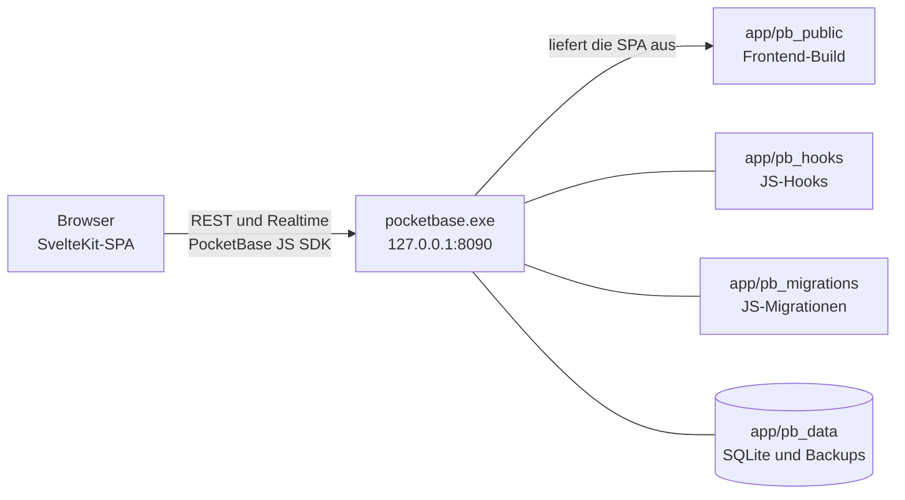

<div align="center">


<p>&nbsp;</p>

[](https://github.com/Labushuya/becauseyoulovejira/actions/workflows/ci.yml)
[](LICENSE)
[-5FA04E?style=flat-square&logo=nodedotjs&logoColor=white)](https://nodejs.org)
[](https://pocketbase.io)
[](https://svelte.dev)
[](https://www.microsoft.com/windows)
[](#roadmap)

**Ein schlankes, lokal laufendes Ticket-Dashboard im Jira-Stil, ohne dessen Prozesslast.**

</div>

---

## Was ist becauseyoulovejira?

Ein privates, lokal laufendes Ticket-Dashboard für Windows 10: Ticket-Handling im Stil von Linear oder Jira mit Keys wie `HAUS-12`, Status-Pillen, Detailpanel, Kommentaren und Verlauf, aber ohne Epics, Sprints, Story Points und Ticket-Typen ([ADR-0012](docs/adr/0012-plain-ticketing.md)). Bedient wird es im Desktop-Browser (Chrome, Firefox, Opera GX).

- **Lokal:** Keine Cloud. Der Server lauscht ausschließlich auf `127.0.0.1`.
- **Portabel:** Die komplette Installation ist der Ordner `app/`: Start per Doppelklick, Sicherung und Umzug per Ordnerkopie.
- **Ohne Internet lauffähig:** Keine externen CDNs, Schriften werden lokal ausgeliefert.

**Inhalt:** [Features](#features-nach-etappe) · [Architektur und Stack](#architektur-und-stack) · [Quickstart](#quickstart-windows) · [Betrieb](#betrieb) · [Bedienung](#bedienung) · [Entwicklung und Tests](#entwicklung-und-tests) · [Roadmap](#roadmap) · [Lizenz und Marken](#lizenz-und-marken)

---

## Features nach Etappe

| Etappe | Inhalt | Stand |
|---|---|---|
| **E0 Gerüst** | Repo, PocketBase 0.40.4 (SHA256-geprüfter Download), SvelteKit-SPA, Build- und Testskripte | fertig |
| **E1 Datenmodell, Auth, Hooks** | Datenmodell mit privaten Scopes und Nummernkreisen (`TASK-1`, `<CODE>-<NR>`), API-Regeln je Nutzer, gesperrte Selbstregistrierung, Hooks für Keys, Erledigt-Zeitpunkt und Verlauf, automatische Backups, Start-, Stopp-, Autostart- und Admin-Reset-Skripte | fertig ([Plan](docs/plan/e1.md)) |
| **E2 Liste und Detail** | Liste „Alle Tickets“ mit Standard-Reihenfolge, Abhaken mit „Rückgängig“, „Erledigte anzeigen“, Detailpanel mit Inline-Bearbeitung, Anlegen, Löschen mit Sicherheitsabfrage, Markdown (sanitisiert), Kommentare, Verlauf, Live-Aktualisierung über Realtime | fertig ([Plan und Bilanz](docs/plan/e2.md)) |
| **E3 Übersicht und Ordnung** | Seitenaufbau nach Task-Board-Vorbild ([ADR-0010](docs/adr/0010-layout-nach-task-board.md)): Kennzahlen, Filterleiste, sortierbare Tabelle, Gruppierung, Projekte mit Projektansicht, Tags, Suche. **Bereits umgesetzt (Pakete 1–8, 10 und 12 von 15):** Domänenlogik für Listenzustand in der URL, Filter, relative Fälligkeit, Sortierung und Gruppierung; Sperre für neue Tickets in archivierten Projekten; Datenzugriff und Live-Katalog für Projekte und Tags; Kopfzeile mit Zähler und „Neues Ticket“, Tabelle „Aufgaben“, relative Fälligkeitslabels, Projekt und Tags im Panel und bei der Anlage, Filterleiste mit Zustand in der Adresse, Kennzahlen-Kacheln. Suche, Sortierung, Gruppierung und Projektansicht folgen. | in Arbeit ([Plan](docs/plan/e3.md)) |
| **E4 Eingang und Kanäle** | Schnellerfassung (`c`, `Strg+K`, Kurzsyntax `Titel @CODE !Priorität`), Zwischenablage, Web-Links per Bookmarklet, `.ics`- und `.eml`-Dateien per Drag & Drop | geplant |
| **E5 Wiederkehrende Aufgaben** | Kalender- und Nach-Erledigung-Regeln (RRULE-Teilmenge), Vorschläge aus `.ics` | geplant |
| **E6 Feinschliff** | Papierkorb, Spaltenauswahl, Vollansicht, Tastaturkürzel, Hilfe, Theme-Umschalter | geplant |
| **E7 Haushalt und Mehrgeräte** | gemeinsame Tickets im Haushalt, Zugriff von mehreren Geräten über Tailscale (HTTPS, Server bleibt auf `127.0.0.1`), siehe [ADR-0001](docs/adr/0001-betriebsmodell-lokal-mehrgeraete-spaeter.md) | geplant, Start nach Freigabe |

In Prüfung, jeweils nur mit eigener ADR und Freigabe: Google Calendar, WhatsApp, Telegram, Notion ([ADR-0011](docs/adr/0011-roadmap-e3-bis-e7.md)). Später, nach ausdrücklicher Freigabe (Stufe 2, Datenmodell vorbereitet): Sub-Tickets mit Fortschritt, Abhängigkeiten mit Entsperr-Automation, Board-Ansicht, Browser-Benachrichtigungen, Anhänge.

---

## Architektur und Stack



- **Ein Prozess, eine Origin:** PocketBase liefert die gebaute SPA selbst aus und stellt API und Realtime-Abos bereit. Node.js wird nur zum Bauen und Testen gebraucht, nicht für den Betrieb.
- **Serverlogik** nur in JS-Hooks (Ticket-Keys, Erledigt-Zeitpunkt, Verlauf, Schutzregeln); mehrteilige Schreibvorgänge laufen in einer Transaktion. Reine Hilfsmodule liegen unter `app/pb_hooks/lib/` und sind ohne PocketBase testbar.
- **Schema** nur über handgeschriebene Migrationen (`--automigrate=false`); die Zugriffsregeln je Nutzer und Scope sind per Negativtests belegt.
- **Frontend** in Schichten: `web/src/lib/domain` (reine Logik), `web/src/lib/data` (Datenzugriff und Realtime über das SDK), `web/src/lib/stores` (geteilter Zustand in `.svelte.ts` mit Runes), `web/src/lib/components` und `web/src/routes`. Details: [ADR-0006](docs/adr/0006-frontend-zustand-und-datenzugriff.md), [ADR-0007](docs/adr/0007-realtime-und-sitzungspflege.md).

| Komponente | Technologie | Warum |
|---|---|---|
| **Backend** | [PocketBase 0.40.4](https://pocketbase.io) (Windows-Binary, unverändert) | Alles in einem: SQLite, Admin-UI, JS-Hooks, Realtime |
| **Frontend** | [SvelteKit 2](https://kit.svelte.dev) + [Svelte 5](https://svelte.dev) (Runes) + [TypeScript](https://www.typescriptlang.org) (strict), `adapter-static` im SPA-Modus | geringer JS-Footprint, native Reaktivität |
| **Datenbank** | [SQLite](https://www.sqlite.org) (in PocketBase) | Einzeldatei, keine separate Datenbank nötig |
| **Markdown** | markdown-it und DOMPurify | Ausgabe wird sanitisiert ([ADR-0008](docs/adr/0008-markdown-rendering-und-sanitizing.md)) |
| **Styling** | CSS-Custom-Properties, Inter und JetBrains Mono lokal über `@fontsource-variable` | offline lauffähig, Petrol als einzige Akzentfarbe |
| **Tests** | [Vitest](https://vitest.dev), [Testing Library](https://testing-library.com/docs/svelte-testing-library/intro) und jsdom | Hook-Integration gegen Wegwerf-Instanzen, Domänenlogik, Komponenten |
| **Dev-Werkzeug** | [Node.js](https://nodejs.org) ≥ 24, Windows PowerShell 5.1 | nur Build und Test |

### Repo-Struktur

```
becauseyoulovejira/
  app/                    Portabler Laufzeitordner (wird kopiert/gesichert)
    pocketbase.exe        Binary (gitignored, via scripts/fetch-pocketbase.ps1)
    pb_hooks/             *.pb.js Hooks, lib/*.js reine CommonJS-Module
    pb_migrations/        Handgeschriebene JS-Migrationen
    pb_public/            Frontend-Build (gitignored)
    pb_data/              Daten und Backups (gitignored, niemals committen)
    logs/                 Server-Ausgabe des letzten Starts (gitignored)
    start.bat             Starten (öffnet den Browser)
    start-hidden.vbs      Starten ohne Fenster (Ziel der Autostart-Verknüpfung)
    stop.bat              Beenden (nur die eigene Instanz)
    admin-zuruecksetzen.bat  Admin-Konto anlegen oder Admin-Passwort neu setzen (Notfall)
    autostart-an.bat      Autostart einrichten
    autostart-aus.bat     Autostart entfernen
    byl-control.ps1       Logik hinter den Skripten (byl-functions.ps1: testbare Funktionen)
  web/                    SvelteKit-Quellcode (Build → ../app/pb_public), Tests unter src/**/*.test.ts
  scripts/                Build-/Setup-Skripte (PowerShell)
  tests/                  Vitest-Tests (Hooks, Regeln, Login- und SPA-Integration)
  docs/                   ADRs, Etappenpläne, Test-Manifest, README-Assets
  .github/                CI-Workflow, Dependabot, Issue- und PR-Vorlagen, Sicherheitsrichtlinie
```

---

## Quickstart (Windows)

**Voraussetzungen:** Windows 10, [Node.js](https://nodejs.org) ≥ 24 (nur zum Bauen), Windows PowerShell 5.1, Git.

```powershell
git clone https://github.com/Labushuya/becauseyoulovejira.git
cd becauseyoulovejira

# 1. PocketBase laden (gepinnte Version 0.40.4, SHA256-geprüft)
powershell -ExecutionPolicy Bypass -File scripts\fetch-pocketbase.ps1

# 2. Abhängigkeiten installieren, prüfen, Frontend bauen und testen
powershell -ExecutionPolicy Bypass -File scripts\build.ps1

# 3. Starten (öffnet den Browser)
.\app\start.bat
```

`build.ps1` erwartet `node` (≥ 24) und `npm` im `PATH` und bricht sonst mit einem Hinweis ab. Beim allerersten Start legst du ein Admin- und ein App-Konto an, siehe [Erster Start](#erster-start). Danach ist `app\` eigenständig: Der Ordner lässt sich auf einen anderen Windows-Rechner kopieren und dort ohne Node.js starten.

---

## Betrieb

### Erster Start

Beim allerersten Start gibt es noch kein Konto. Zugangsdaten stehen bewusst nirgends im Repo ([ADR-0002](docs/adr/0002-erststart-und-superuser.md)); du legst zwei Konten an: ein **Admin-Konto** (PocketBase-Superuser, verwaltet den Server) und ein **App-Konto** (damit meldest du dich in der App an, ihm gehören die Tickets).

1. `app\start.bat` doppelklicken. Das Fenster meldet „Erster Start: …“, zeigt den Einrichtungslink und wartet auf eine Taste. Es öffnet sich **nur ein** Browser-Tab: die PocketBase-Einrichtung (`http://127.0.0.1:8090/_/#/pbinstall/…`), nicht die App.
2. Dort das Admin-Konto anlegen (E-Mail und Passwort frei wählbar). Der Einrichtungslink ist **30 Minuten** gültig. Ist er abgelaufen oder hat sich kein Browser geöffnet: `app\stop.bat`, dann `app\start.bat` – jeder Start ohne Admin-Konto erzeugt einen neuen Link (er steht auch in `app\logs\pocketbase.err.log` bzw. `pocketbase.out.log`).
3. Nach der Einrichtung bist du im Admin-Bereich (`http://127.0.0.1:8090/_/`). Unter **Collections → users → New record** das App-Konto anlegen: E-Mail, Passwort und Passwort-Bestätigung, dann speichern. Selbstregistrierung ist gesperrt; neue Konten entstehen nur hier.
4. `http://127.0.0.1:8090/` öffnen (oder `app\start.bat` erneut ausführen; die laufende App wird erkannt und nur der Browser geöffnet).
5. Mit dem App-Konto anmelden. Das Admin-Konto funktioniert in der App nicht (getrennte Konten, siehe [Konten verwalten](#konten-verwalten)).

Ab jetzt öffnet `start.bat` direkt die App.

**Einrichtung verpasst?** Der Tab wurde geschlossen oder übersehen, der Link ist abgelaufen, oder es hat sich kein Browser geöffnet:

- Läuft die App noch und ist der Link jünger als 30 Minuten, genügt `app\start.bat`. Es erkennt die offene Einrichtung, zeigt den Link an, öffnet ihn erneut (statt der App) und wartet auf eine Taste.
- Sonst `app\stop.bat` und danach `app\start.bat` ausführen. Jeder Start ohne Admin-Konto erzeugt einen neuen Link.
- Oder `app\admin-zuruecksetzen.bat` ausführen. Es legt das Admin-Konto direkt an, ohne Daten zu löschen, und ein offener Einrichtungslink wird damit ungültig. Danach in der Verwaltung `http://127.0.0.1:8090/_/` mit diesem Konto anmelden und mit Schritt 3 weitermachen.

Grenzen der Erkennung: `start.bat` meldet eine offene Einrichtung nur, wenn der Link aus dem aktuellen Serverlauf stammt (Log in `app\logs\`), noch nicht abgelaufen ist und noch funktioniert. Einen funktionierenden Link gibt es nur, solange kein Admin-Konto existiert. Nach erfolgreicher Einrichtung erscheint deshalb kein Hinweis mehr. Ist der Link älter als 30 Minuten, meldet `start.bat` nichts mehr, auch wenn die Einrichtung noch offen ist. Dann hilft einer der beiden letzten Wege. Antwortet der Server auf die Prüfung unerwartet, erscheint der Hinweis vorsichtshalber trotzdem.

### Starten und Beenden

| Skript | Verhalten |
|---|---|
| `app\start.bat` | Startet PocketBase ohne sichtbares Fenster mit den Daten in `app\pb_data`, wartet, bis `/api/health` antwortet (höchstens 30 s), und öffnet dann genau einmal `http://127.0.0.1:8090/`. Läuft die App schon, öffnet es nur den Browser. Ist dort die Einrichtung noch offen, öffnet es stattdessen den Einrichtungslink (siehe oben). Ist Port 8090 von einem anderen Programm belegt, bricht es mit einer Meldung ab. Bei Fehlern und Einrichtungshinweisen bleibt das Fenster offen, bis eine Taste gedrückt wird. Bei einem normalen Start schließt es sich von selbst. Details stehen in `app\logs\`. |
| `app\stop.bat` | Beendet nur die eigene Instanz (`pocketbase.exe` aus diesem Ordner, gestartet mit `serve` auf `127.0.0.1:8090` und `app\pb_data`). Andere PocketBase-Prozesse, etwa Testinstanzen, bleiben unberührt. Die Erfolgsmeldung bleibt 5 Sekunden stehen (eine Taste schließt sofort), eine Fehlermeldung bis zu einem Tastendruck. |
| `app\admin-zuruecksetzen.bat` | Legt ein Admin-Konto an oder setzt das Admin-Passwort neu, ohne Daten zu löschen. Siehe [Konten verwalten](#konten-verwalten). |
| `app\autostart-an.bat` / `app\autostart-aus.bat` | Legt die Verknüpfung `becauseyoulovejira.lnk` im Windows-Autostart-Ordner an bzw. entfernt sie. Sie startet `start-hidden.vbs`: Die App startet bei der Anmeldung still im Hintergrund, **ohne** Browser. Hinweise (Erststart) und Fehler erscheinen dann als Meldungsfenster. Nach dem Verschieben von `app\` einfach `autostart-an.bat` erneut ausführen. |

Die Skripte sind dünne Hüllen um `app\byl-control.ps1` und rufen es mit `powershell -NoProfile -ExecutionPolicy Bypass` auf; eine gesperrte Skriptausführung stört also nicht.

`stop.bat` beendet den Server hart (wie ein Absturz). Für die Daten ist das unkritisch: SQLite (WAL-Modus) behält jede abgeschlossene Änderung, eine gerade laufende wird beim nächsten Start zurückgerollt. Nur während eines laufenden Backups solltest du nicht stoppen, sonst bleibt ein unvollständiges ZIP zurück.

**Bindung:** `127.0.0.1:8090` (nur lokal, nicht im Netz erreichbar – vorerst; Mehrgerätezugriff über Tailscale ist geplant, siehe [ADR-0001](docs/adr/0001-betriebsmodell-lokal-mehrgeraete-spaeter.md))

### Konten verwalten

Es gibt zwei Arten von Konten:

- **Admin-Konto** (PocketBase-Superuser): nur für die Verwaltung unter `http://127.0.0.1:8090/_/` (Konten, Einstellungen, Backups). In der App funktioniert es nicht.
- **App-Konto** (Collection `users`): Damit meldest du dich in der App an. Ihm gehören die Tickets.

Admin- und App-Konto dürfen dieselbe E-Mail-Adresse haben. Es bleiben trotzdem zwei getrennte Konten mit eigenem Passwort; ein neues Passwort für das eine ändert das andere nicht.

| Aufgabe | So geht's |
|---|---|
| Weiteren Nutzer anlegen | In der Verwaltung `http://127.0.0.1:8090/_/` unter **Collections → users → New record** E-Mail, Passwort und Passwort-Bestätigung eintragen, dann speichern. Selbstregistrierung ist gesperrt; neue App-Konten entstehen nur hier. |
| Passwort eines App-Kontos ändern | In der Verwaltung unter **Collections → users** das Konto öffnen, neues Passwort und Bestätigung eintragen, speichern. Danach das neue Passwort der betroffenen Person mitteilen. |
| Admin-Passwort vergessen, Admin-Konto fehlt oder Einrichtung verpasst | `app\admin-zuruecksetzen.bat` doppelklicken (siehe unten). |

**`admin-zuruecksetzen.bat`** fragt die E-Mail-Adresse des Admin-Kontos ab und zweimal verdeckt das neue Passwort (mindestens 10 Zeichen, keine Anführungszeichen `"`).

- Gibt es zu der E-Mail schon ein Admin-Konto, bekommt es das neue Passwort. Sonst wird ein neues Admin-Konto angelegt.
- Tickets, App-Konten und Einstellungen bleiben unverändert.
- Das Skript funktioniert auch, während die App läuft. Meldet es eine gesperrte Datenbank, erst `stop.bat` ausführen und es dann erneut versuchen.
- Angezeigt wird nur Erfolg oder Fehler, das Passwort nie.
- **Restrisiko:** PocketBase nimmt das Passwort nur als Programmargument an. Für den Bruchteil einer Sekunde, den der Aufruf dauert, steht es deshalb in der Kommandozeile des `pocketbase.exe`-Prozesses. Andere Programme unter deinem Windows-Konto könnten es in diesem Moment auslesen. Begründung und Abwägung: [ADR-0002](docs/adr/0002-erststart-und-superuser.md).

**Kein E-Mail-Versand:** becauseyoulovejira hat keinen Mailserver. Mail-Funktionen wie „Passwort vergessen“, E-Mail-Bestätigung, E-Mail-Änderung per Bestätigungsmail und Einmal-Codes können deshalb nicht funktionieren. Der Server weist sie ab („E-Mail-Versand ist nicht eingerichtet …“), statt Erfolg vorzutäuschen. Ohne diese Sperre würde PocketBase „Mail verschickt“ melden, obwohl nie eine ankommt.

- Der Link **„Forgotten password“** auf der Anmeldeseite der Verwaltung gehört fest zur PocketBase-Oberfläche und bleibt sichtbar. Er ist aber wirkungslos und führt nur zu dieser Fehlermeldung. Ein vergessenes Admin-Passwort setzt `admin-zuruecksetzen.bat` neu, ein App-Passwort die Verwaltung (siehe Tabelle).
- Warnmails bei Anmeldungen von neuen Geräten sind aus demselben Grund abgeschaltet.

### Backup und Wiederherstellung

Details und Begründung: [ADR-0003](docs/adr/0003-pb-data-und-backups.md).

- **Automatisch:** Alle 4 Stunden zur vollen Stunde (Cron in **UTC**, `0 */4 * * *`), solange der Server läuft. Die letzten **12** automatischen Backups werden aufbewahrt, als ZIP in `app\pb_data\backups\`. Ein Backup ist im laufenden Betrieb konsistent.
- **Manuell:** Im Admin-Bereich `http://127.0.0.1:8090/_/` unter **Settings → Backups → Initialize new backup**, etwa vor Updates. Dort lassen sich Backups auch herunterladen.
- **Wichtig:** Die Backups liegen auf derselben Platte wie die Daten. Kopiere `app\pb_data\backups\` regelmäßig zusätzlich an einen anderen Ort (externe Platte, Cloud-Ordner).
- **Umzug:** `stop.bat`, dann den ganzen Ordner `app\` kopieren; die Backups wandern mit.

**Wiederherstellen (nur manuell):** Die Wiederherstellung über das Admin-UI unterstützt PocketBase unter Windows nicht. Manuelle Schritte, PowerShell im Ordner `app` (Datum und Backup-Namen anpassen):

```powershell
# 1. Server beenden
.\stop.bat

# 2. Aktuelle Daten beiseitelegen (nichts wird gelöscht)
Rename-Item -LiteralPath .\pb_data -NewName pb_data.vor-restore-2026-09-24

# 3. Backup-ZIP in ein neues pb_data entpacken
Expand-Archive -LiteralPath .\pb_data.vor-restore-2026-09-24\backups\<backup>.zip -DestinationPath .\pb_data

# 4. Ältere Backups wieder mitnehmen
Copy-Item -LiteralPath .\pb_data.vor-restore-2026-09-24\backups -Destination .\pb_data -Recurse

# 5. Wieder starten
.\start.bat
```

Danach anmelden und die Daten prüfen; es gelten die Konten und Passwörter zum Zeitpunkt des Backups. Erst wenn alles stimmt, `pb_data.vor-restore-…` löschen. Schritt 3 ist durch den Integrationstest `tests/integration/backup-restore.test.mjs` belegt (Backup per API, `Expand-Archive` in einen neuen Datenordner, Start, Ticket, Key und Login vorhanden).

---

## Bedienung

### Kopfzeile und Tabelle „Aufgaben“

- Die **Kopfzeile** zeigt neben dem App-Namen die Zahl der nicht erledigten Tickets und rechts den Knopf **„Neues Ticket“**.
- Darunter stehen alle **nicht erledigten** Tickets in der Tabelle „Aufgaben“ (mit ihrer Anzahl). Oben die überfälligen und bald fälligen (bis 7 Tage im Voraus) nach Datum, danach die übrigen nach Priorität (Dringend, Hoch, Mittel, Niedrig); bei gleicher Priorität zuerst die mit Fälligkeit, dann die neuesten.
- Spalten: Key, Priorität, Status, Titel (mit Symbol für wiederkehrende Tickets), Projekt, Tags, Fällig (relativ: „seit 3 Tagen überfällig“, „gestern“, „heute“, „morgen“, „in 4 Tagen“, ab 8 Tagen das Datum; das Datum steht immer im Tooltip, erledigte zeigen nur das Datum), Erstellt und die Aktionen. Ist die Tabelle breiter als der Platz, etwa neben dem Panel, lässt sie sich waagerecht scrollen.
- **„Neues Ticket“** öffnet rechts das Anlageformular: Titel (Pflicht), Status, Priorität, Fälligkeit, Projekt, Tags und Beschreibung. Ist die Liste nach einem Projekt gefiltert (`?projekt=<id>`), ist es vorausgewählt. „Anlegen“ oder `Strg+Enter` legt an, den Key vergibt der Server (`TASK-1`, `TASK-2` …).

### Kennzahlen und Filter

- Die **Kennzahlen** oben zählen immer alle nicht erledigten Tickets, unabhängig von den Filtern: **Nicht erledigt**, **In Arbeit**, **Heute fällig**, **Überfällig** und **Dringend**. Ein Klick auf eine Kachel setzt nur ihren Filter und lässt die übrigen stehen, ein zweiter Klick nimmt ihn wieder heraus; die gewählte Kachel ist hinterlegt und hat ein Häkchen. „Nicht erledigt“ setzt alle Filter zurück.
- Die **Filterleiste** über der Tabelle hat die Gruppen **Status**, **Priorität** und **Fällig** (Überfällig, Heute, Bald = morgen bis in 7 Tagen, Ohne Datum) sowie die Auswahlen **Projekt** (mit „Ohne Projekt“, archivierte unter „Archiviert“) und **Tag**. Je Gruppe gilt ein Wert, „Alle“ ist der Ausgangswert; die Gruppen wirken zusammen (UND).
- Die Filter stehen in der Adresse (`?status=open&prio=urgent`). Neuladen, Zurück, Vor und Lesezeichen behalten sie, und das Öffnen eines Tickets auch. **„Zurücksetzen“** leert alle Filter, Sortierung, Gruppierung und „Erledigte anzeigen“ bleiben.
- Die Zahl neben „Aufgaben“ zählt die gefilterten Tickets; die Zahl in der Kopfzeile zählt weiter alle nicht erledigten. Passt nichts, steht dort „Keine Tickets für diese Filter.“ mit „Filter zurücksetzen“.
- Der Status **„Erledigt“** zeigt nur den Abschnitt „Erledigt“. Bei einem anderen Status sind erledigte Tickets ausgeblendet, und „Erledigte anzeigen“ ist gesperrt.

### Abhaken und „Erledigte anzeigen“

- Das Kästchen in der Spalte „Aktionen“ setzt ein Ticket auf **Erledigt**. Die Zeile bleibt 5 Sekunden durchgestrichen mit **„Rückgängig“** stehen (stellt den vorherigen Status wieder her) und verschwindet dann.
- Der Schalter **„Erledigte anzeigen“** blendet unter den offenen Tickets den Abschnitt „Erledigt“ ein: zuletzt erledigte zuerst, 50 auf einmal, mehr über „Weitere laden“. Der Schalter steht in der Adresse (`?erledigte=1`) und übersteht Neuladen und Zurück.
- Wer bei einem erledigten Ticket das Häkchen entfernt, setzt es auf **Offen**.

### Detailpanel

- Ein Klick auf eine Zeile öffnet das Ticket rechts im Panel (auf schmalen Bildschirmen über der Liste). Die Adresse `/tickets/<id>` öffnet nach dem Neuladen dasselbe Ticket.
- **Titel** („Titel bearbeiten“) und **Fälligkeit** speichern mit Enter oder beim Verlassen des Felds, Escape verwirft. **Status**, **Priorität** und **Projekt** speichern sofort bei der Auswahl. Ein anderes Projekt gibt dem Ticket einen neuen Key (`HAUS-4`, ohne Projekt wieder `TASK-n`); die Adresse bleibt gleich, der alte Key steht im Verlauf. Archivierte Projekte sind nicht wählbar. Bis zur Projektansicht (E3, Paket 14) werden Projekte in der Verwaltung unter `/_/` angelegt.
- **Tags:** Im Feld „Tags“ tippen, mit den Pfeiltasten einen Vorschlag wählen und Enter drücken; die letzte Option legt einen neuen Tag an („„Steuer“ als neuen Tag anlegen“). Einen Namen, den es in anderer Schreibweise schon gibt, nimmt die App wieder. Jede Änderung speichert sofort; ein Chip verschwindet über „Tag … entfernen“. Escape schließt die Vorschläge, ein zweites Escape leert das Feld. Die **Beschreibung** (Markdown) hat „Bearbeiten“, eine Vorschau und „Speichern“ (`Strg+Enter`).
- „Schließen“ oder Escape führt zurück zur Liste. Ist noch eine Beschreibung, ein Kommentar oder ein getippter Tag-Name ungespeichert, fragt die App vorher „Änderungen verwerfen?“.

### Kommentare und Verlauf

- Unter den Feldern stehen zwei Reiter. **Kommentare:** älteste oben, das Eingabefeld unten (Markdown mit Vorschau, `Strg+Enter` sendet). Eigene Kommentare lassen sich bearbeiten und nach einer Rückfrage löschen; geänderte tragen den Hinweis „bearbeitet“.
- **Verlauf:** jede Änderung mit Zeitpunkt, Urheber („Du“ oder „System“) und Inhalt, die neueste oben. Bei geänderten Beschreibungen lassen sich alter und neuer Text aufklappen.

### Löschen

- **„Löschen …“** oben im Panel fragt nach, bevor etwas passiert. Das Löschen ist **endgültig** und entfernt auch alle Kommentare und den gesamten Verlauf des Tickets. Wiederherstellen lässt es sich nur aus einem Backup (siehe [Backup und Wiederherstellung](#backup-und-wiederherstellung)).

### Live-Aktualisierung

- Änderungen aus einem anderen Tab oder Browserfenster erscheinen ohne Neuladen in der Liste, im offenen Panel, in den Kommentaren und im Verlauf. Wird das offene Ticket woanders gelöscht, zeigt das Panel „Dieses Ticket wurde gelöscht.“. Eine angefangene Eingabe wird dabei nicht überschrieben.

### Tastatur

| Taste | Wirkung |
|---|---|
| `Tab` / `Umschalt+Tab` | durch Liste, Häkchen, Panel und Knöpfe |
| `Enter` | Zeile öffnen; im Titel- oder Datumsfeld speichern |
| `Leertaste` | Häkchen setzen oder entfernen |
| `Escape` | im Titel- oder Datumsfeld: Eingabe verwerfen; außerhalb von Eingabefeldern: Panel schließen; im Formular „Neues Ticket“ (nach Rückfrage) und im Löschdialog: abbrechen |
| `Strg+Enter` | Beschreibung speichern, Kommentar senden oder speichern, neues Ticket anlegen |
| `Pfeil links/rechts`, `Pos1`, `Ende` | zwischen den Reitern „Kommentare“ und „Verlauf“ wechseln |

Die Schnellerfassung per `c` und `Strg+K` folgt in E4, weitere Tastaturkürzel in E6.


---

## Entwicklung und Tests

Qualitäts-Gates (alle über den Root, `scripts\build.ps1` führt sie in dieser Reihenfolge aus):

```powershell
npm run check   # svelte-check / TypeScript
npm run lint    # Prettier + ESLint
npm run build   # Frontend-Build nach app/pb_public
npm test        # Vitest: Unit- und Integrationstests, danach die web-Tests
```

Die CI ([`.github/workflows/ci.yml`](.github/workflows/ci.yml)) läuft bei jedem Push und Pull Request auf `main` auf einem Windows-Runner: Node.js 24, `scripts\fetch-pocketbase.ps1`, dann `scripts\build.ps1`. Dependabot hält npm-Pakete und Actions aktuell; Major-Sprünge von `typescript` und `@types/node` schlägt er nicht vor, sie werden bewusst separat geprüft.

### Tests

| Ort | Inhalt |
|---|---|
| `tests/unit/` | reine Logik ohne PocketBase: Hook-Module aus `app/pb_hooks/lib`, Start-/Stopp- und Admin-Reset-Logik (`app/byl-functions.ps1` mit gefälschten Prozessen, Sockets, Log-Texten und Eingaben) und statische Prüfungen der Skripte |
| `tests/integration/` | gegen Wegwerf-PocketBase-Instanzen: Migrationen, API-Regeln, Hooks, Login, gesperrte Mail-Abläufe, Admin-Reset, SPA-Fallback, Backup-Wiederherstellung, Datenzugriff und Realtime des Frontends (`web/src/lib/data`) |
| `web/src/**/*.test.ts` | Frontend: Domänenlogik, Stores, Unit- und Komponententests (jsdom) |

```powershell
npm run test:unit          # nur reine Logik, ohne PocketBase
npm run test:integration   # gegen eine Wegwerf-PocketBase-Instanz
npm run test:web           # Frontend: Unit- und Komponententests (jsdom)
```

**Test-Manifest:** Alle Testfälle stehen in [`docs/test-manifest.html`](docs/test-manifest.html) (lokal im Browser öffnen, funktioniert offline): automatisierte Tests bereichsweise mit Verweis auf die Testdateien, die manuellen Prüfpunkte aus den Plänen zum Abhaken und die geplanten Pakete. Jedes Arbeitspaket pflegt es mit; `tests/unit/test-manifest.test.mjs` prüft, dass es zu den Testdateien passt.

`npm test` im Root führt erst die Root-Tests (Unit und Integration) und danach die web-Tests aus. **Vorher muss der Frontend-Build existieren** (`npm run build` nach `app/pb_public`), sonst schlägt der SPA-Fallback-Test mit einem Hinweis fehl. Die Integrationstests brauchen außerdem `app/pocketbase.exe` (Quickstart, Schritt 1). Die Start-Skripte selbst werden von den Tests nie ausgeführt; die Tests der Start-Logik rufen nur die Funktionen in Windows PowerShell auf (`-NoProfile -ExecutionPolicy Bypass`).

Pro Lauf startet ein Vitest-`globalSetup` eine eigene PocketBase-Instanz in einem frischen Temp-Ordner (`%TEMP%\byl-test-*`), mit zufälligem Superuser und auf einem freien Port (nie 8090). Danach beendet es die Instanz und löscht den Ordner, auch bei fehlschlagenden Tests oder Strg+C. Eine laufende Produktivinstanz und `app/pb_data` bleiben unberührt. Der SPA-Fallback-Test startet nach demselben Muster eine zweite Instanz mit dem Frontend-Build als `publicDir`. Details: [ADR-0004](docs/adr/0004-teststrategie-hooks-migrationen.md).

Für den Vite-Dev-Server (`npm --prefix web run dev`) leitet `web/vite.config.ts` die Pfade `/api` und `/_/` an die laufende Instanz auf `127.0.0.1:8090` weiter; im Betrieb liefert PocketBase die App selbst aus (gleiche Origin).

**Beiträge:** Jede Änderung läuft über einen kurzlebigen Branch (`feat/…`, `fix/…`, `chore/…`) und einen Pull Request in `main`. Gemergt wird nur bei grüner CI, per Squash-Merge mit einem Titel nach Conventional Commits (`feat:`, `fix:`, `docs:`, `test:`, `refactor:`, `chore:`, `ci:`); direkte Pushes auf `main` gibt es nicht. Die [PR-Vorlage](.github/pull_request_template.md) enthält die Checkliste. Sicherheitslücken bitte privat melden, siehe [SECURITY.md](.github/SECURITY.md).

---

## Roadmap

- [x] **E0:** Gerüst (Repo, PocketBase, SvelteKit, README)
- [x] **E1:** Datenmodell, Authentifizierung, Hooks, Start-/Stopp-Skripte – [docs/plan/e1.md](docs/plan/e1.md), [ADR-0002](docs/adr/0002-erststart-und-superuser.md) bis [ADR-0005](docs/adr/0005-zeitzone-europe-berlin.md)
- [x] **E2:** Listen-View, Detail-View, CRUD, Kommentare, Verlauf, Realtime – [docs/plan/e2.md](docs/plan/e2.md), [ADR-0006](docs/adr/0006-frontend-zustand-und-datenzugriff.md) bis [ADR-0009](docs/adr/0009-fehlerfarbe.md)
- [ ] **E3 Übersicht & Ordnung** (in Arbeit, Pakete 1–8, 10 und 12 von 15): Task-Board-Layout ([ADR-0010](docs/adr/0010-layout-nach-task-board.md)), Projekte mit Projektansicht, Tags, Filter, Suche, Sortierung, Gruppierung ([ADR-0013](docs/adr/0013-filter-suche-sortierung-gruppierung.md)) – [docs/plan/e3.md](docs/plan/e3.md)
- [ ] **E4 Eingang & Kanäle:** Schnellerfassung und Zwischenablage, Web-Links (Bookmarklet), `.ics`, `.eml` per Drag & Drop; in Prüfung: Google Calendar, WhatsApp, Telegram, Notion
- [ ] **E5 Wiederkehrende Aufgaben:** Kalender- und Nach-Erledigung-Regeln (RRULE-Teilmenge), Vorschläge aus `.ics`-RRULE
- [ ] **E6 Feinschliff:** Papierkorb, Spalten, Vollansicht, Tastatur, Hilfe, Theme-Umschalter
- [ ] **E7 Haushalt & Mehrgeräte:** gemeinsame Tickets im Haushalt, Zugriff über Tailscale (`tailscale serve` mit HTTPS, Superuser nur lokal), ohne Datenmigration – [ADR-0001](docs/adr/0001-betriebsmodell-lokal-mehrgeraete-spaeter.md)

Etappenfolge und Begründung: [ADR-0011](docs/adr/0011-roadmap-e3-bis-e7.md). Ohne Ticket-Typen, Epics, Sprints und Story Points: [ADR-0012](docs/adr/0012-plain-ticketing.md). Alle Architekturentscheidungen: [docs/adr/](docs/adr/README.md); Umsetzungspläne: [docs/plan/](docs/plan/).

---

## Lizenz und Marken

[MIT](LICENSE) © 2026 [Labushuya](https://github.com/Labushuya)

Jira und Atlassian sind Marken der Atlassian Pty Ltd. becauseyoulovejira ist ein unabhängiges Projekt, steht in keiner Verbindung zu Atlassian und wird von Atlassian weder unterstützt noch gesponsert.

---

<div align="center">

*Privat · Lokal · Portabel*

</div>
